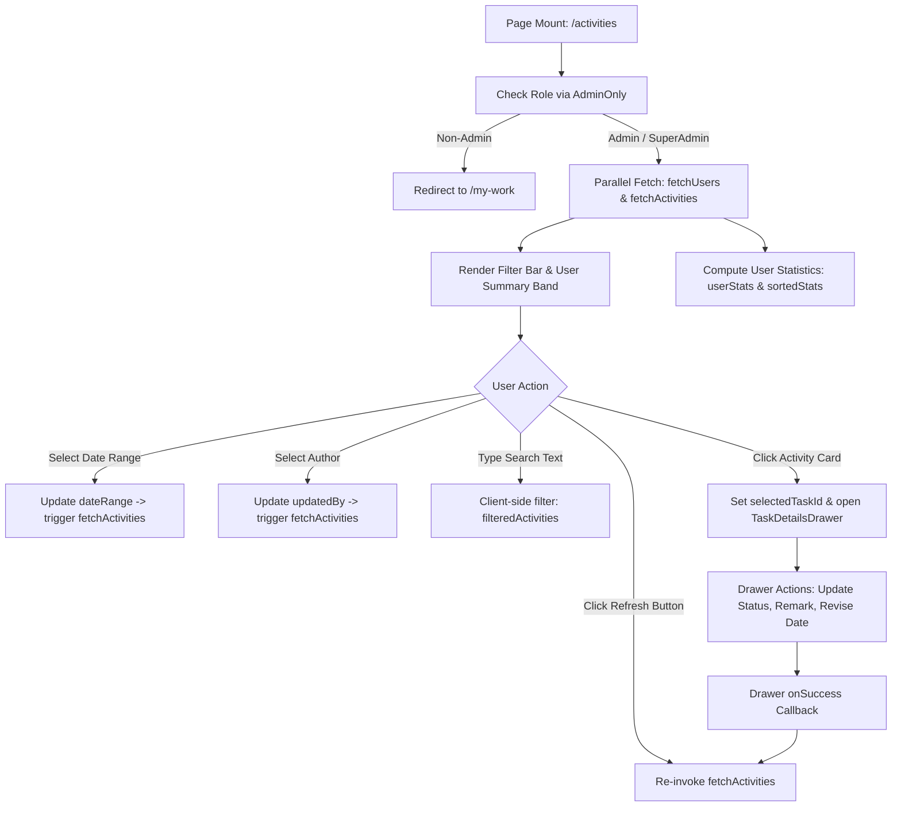

# Activities ("Audit Log") Page — UI Documentation

> Source: [`Activities.jsx`](file:///c:/Users/91995/Desktop/D-table_analytic/nia-infra-hide-pms-mm/nia-infra-hide-pms-mm/Frontend/src/pages/Activities.jsx)  
> Component: `Activities`  
> Local Documentation: [`Frontend/src/pages/Activities.md`](file:///c:/Users/91995/Desktop/D-table_analytic/nia-infra-hide-pms-mm/nia-infra-hide-pms-mm/Frontend/src/pages/Activities.md)  
> Primary Route: `/activities`  
> Sidebar Entry: `SecondarySidebar.jsx` → `Activities` (`Activity` icon, `restricted: true`)  
> Access Restriction: **ADMIN / SUPERADMIN Role Only** (Guarded via `<AdminOnly>` in `App.jsx`)

---

## Overview

The **Activities** page (`Activities.jsx`) operates as the centralized administrative audit log and forensic timeline for the entire PMS/IMS enterprise application. It aggregates all system-wide task mutations, status transitions, creation events, subtask dispatches, and qualitative remarks into a unified chronological ledger.

Originally commissioned as part of the core management control suite (reference: *Issues PDF #5 — Activities is an audit log for management*), this interface gives project directors, CEOs, managing directors, and system administrators end-to-end visibility into operational velocity and accountability across all departments and job sites.

```
┌──────────────────────────────────────────────────────────────────────────────────────────────────┐
│                                ACTIVITIES CORE CAPABILITIES                                     │
├───────────────────────────────┬──────────────────────────────────┬───────────────────────────────┤
│  1. Forensic Audit Trail      │  2. Top Contributor Metrics      │  3. Deep-Link Inspection      │
│  Immutable chronological      │  Real-time aggregation cards     │  One-tap card click opens     │
│  history of all task actions, │  surfacing the top 5 most        │  the full TaskDetailsDrawer   │
│  revisions, and remarks.      │  active contributors.            │  for instant verification.    │
└───────────────────────────────┴──────────────────────────────────┴───────────────────────────────┘
```

### Role-Based Access Scoping

| User Role | Access Level | UI / Routing Behavior |
|---|---|---|
| **ADMIN / SUPERADMIN** | **Full Audit Authority** | Unrestricted access to inspect, filter by team member, date range, search titles/descriptions, and open task drawers across the enterprise. |
| **Standard User / Supervisor / PC** | **Access Denied (Gated)** | Blocked by `<AdminOnly>` route wrapper in `App.jsx`. Automatically redirected to `/my-work` (`replace: true`). Hidden from sidebar navigation. |

---

## Page Layout & Component Hierarchy

The page is structured within an ergonomic vertical layout container (`p-6 bg-(--bg-primary) min-h-screen`) constrained to a maximum width of `max-w-7xl mx-auto space-y-6`:

```
┌────────────────────────────────────────────────────────────────────────────────────────────────────────┐
│  1. MULTI-FACTOR FILTER BAR                                                                            │
│     [ Date Range: This Month ▾ ]   [ Updated By: All ▾ ]   [ 🔍 Search activities... ]   [ ↺ Refresh ] │
├────────────────────────────────────────────────────────────────────────────────────────────────────────┤
│  2. TOP CONTRIBUTOR SUMMARY CARDS (Top 5 Active Users)                                                 │
│     ┌──────────────────┐  ┌──────────────────┐  ┌──────────────────┐  ┌──────────────────┐             │
│     │ (SS)  24         │  │ (RK)  18         │  │ (AP)  14         │  │ (MG)  9          │  ...        │
│     │       Suresh     │  │       Rahul      │  │       Amit       │  │       Manoj      │             │
│     └──────────────────┘  └──────────────────┘  └──────────────────┘  └──────────────────┘             │
├────────────────────────────────────────────────────────────────────────────────────────────────────────┤
│  3. ACTIVITY FEED LEDGER (Chronological Stream)                                                        │
│                                                                                                        │
│    ┌──────────────────────────────────────────────────────────────────────────────────────────────────┐│
│    │ [ ⊕ ]  Title: Foundation Reinforcement Inspection                                                ││
│    │        Rebar spacing checked and approved for Tower A slab 2.                                    ││
│    │        [T-4 ➔ T-12]  ·  (SS) Suresh Sharma (SITE ENG)  ·  Sep 14, 2026, 11:15 AM   [ ↗ Open ]   ││
│    └──────────────────────────────────────────────────────────────────────────────────────────────────┘│
│    ┌──────────────────────────────────────────────────────────────────────────────────────────────────┐│
│    │ [  ✓ ] Title: Status Changed: In Progress ➔ Completed                                            ││
│    │        Completed pressure testing of chilled water risers.                                       ││
│    │        [T-9 ➔ T-31]  ·  (AP) Amit Patel (MEP LEAD)     ·  Sep 14, 2026, 10:42 AM   [ ↗ Open ]   ││
│    └──────────────────────────────────────────────────────────────────────────────────────────────────┘│
│    ┌──────────────────────────────────────────────────────────────────────────────────────────────────┐│
│    │ [ 💬 ] Title: Remark Added                                                                       ││
│    │        Awaiting consultant site inspection before concreting clearance.                          ││
│    │        [T-1 ➔ T-18]  ·  (RK) Rahul Kumar (PROJECT MGR)  ·  Sep 14, 2026, 09:30 AM   [ ↗ Open ]   ││
│    └──────────────────────────────────────────────────────────────────────────────────────────────────┘│
├────────────────────────────────────────────────────────────────────────────────────────────────────────┤
│  4. SLIDE-OVER INSPECTION DRAWER (TaskDetailsDrawer)                                                   │
│     Triggered by clicking any activity card; slides over from the right side for full task governance. │
└────────────────────────────────────────────────────────────────────────────────────────────────────────┘
```

---

## 1. Multi-Factor Filter & Action Bar

Positioned at the top right of the page container (`flex flex-wrap items-center justify-end gap-3 px-4`), the filter bar delivers swift temporal and author-based scoping:

```
┌────────────────────────────────────────────────────────────────────────────────────────────────────────┐
│ [ Date Range ▾ ]             [ Updated By ▾ ]             [ 🔍 Search... ]              [ ↺ Refresh ]  │
└────────────────────────────────────────────────────────────────────────────────────────────────────────┘
```

### Component Breakdown & Controls

| Element | Visual Styling / Classes | Technical Implementation & Behavior |
|---|---|---|
| **Date Range Dropdown** | `h-10 pl-3 pr-8 bg-white border border-emerald-500/30 rounded-lg text-xs font-bold text-slate-700 outline-none appearance-none cursor-pointer shadow-sm min-w-[120px]` | Segmented dropdown controlled by `dateRange` state. Options: **This Month** (default), **Today**, **This Week**, **All Time**. Automatically triggers `fetchActivities()` on selection change. |
| **Date Range Label** | `text-[10px] font-bold text-slate-400 uppercase tracking-widest ml-1` | Micro-label: `"DATE RANGE"`. |
| **Updated By Dropdown** | `h-10 pl-3 pr-8 bg-white border border-emerald-500/30 rounded-lg text-xs font-bold text-slate-700 outline-none appearance-none cursor-pointer shadow-sm min-w-[120px]` | Populated asynchronously via `teamService.getUsers()`. Displays full staff names (`u.firstName u.lastName`). Default: `'Updated By'` (all users). Selection updates `updatedBy` state and triggers refetch. |
| **Updated By Label** | `text-[10px] font-bold text-slate-400 uppercase tracking-widest ml-1` | Micro-label: `"UPDATED BY"`. |
| **Search Bar Input** | `w-full h-10 pl-10 pr-4 bg-white border border-slate-200 rounded-lg text-xs font-bold outline-none focus:ring-2 focus:ring-emerald-500/20` | Real-time text search. Employs left-aligned `<Search size={16} className="text-slate-400" />`. Searches across activity title, description, and author full name. |
| **Search Label** | `text-[10px] font-bold text-slate-400 uppercase tracking-widest invisible` | Invisible spacer ensuring pixel-perfect baseline alignment with the dropdowns. |
| **Refresh Button** | `h-10 w-10 mt-5 bg-[#1E4C92] text-white rounded-lg flex items-center justify-center hover:bg-[#163a6a] transition-all active:scale-95 shadow-sm self-end` | Corporate navy-blue button featuring `<RotateCcw size={18} strokeWidth={3} />`. Re-invokes `fetchActivities()` immediately without clearing active filter values. |

### Temporal Filter Logic

When `dateRange` changes, `fetchActivities` converts the human-readable selection into ISO-8601 UTC timestamps:

```javascript
const now = new Date();
if (dateRange === 'Today') {
    filters.startDate = new Date(now.setHours(0, 0, 0, 0)).toISOString();
} else if (dateRange === 'This Week') {
    const start = new Date(now.setDate(now.getDate() - now.getDay()));
    filters.startDate = start.toISOString();
} else if (dateRange === 'This Month') {
    filters.startDate = new Date(now.getFullYear(), now.getMonth(), 1).toISOString();
}
// 'All Time' transmits undefined startDate, pulling the global history
```

---

## 2. Top Contributor Summary Cards

Directly below the filter bar, an aggregated summary band highlights the top 5 contributors based on total activity volume within the currently filtered dataset.

```
┌──────────────────────────┐  ┌──────────────────────────┐  ┌──────────────────────────┐
│  (SS)   24               │  │  (RK)   18               │  │  (AP)   14               │
│         Suresh           │  │         Rahul            │  │         Amit             │
└──────────────────────────┘  └──────────────────────────┘  └──────────────────────────┘
```

### Card Architecture & Metrics Computation

```javascript
// Aggregates activity counts per author from the fetched collection
const userStats = activities.reduce((acc, act) => {
    if (act.user) {
        const uid = act.user.userId || act.user.id;
        if (!acc[uid]) acc[uid] = { user: act.user, count: 0 };
        acc[uid].count++;
    }
    return acc;
}, {});

// Sorts descending by volume and isolates top 5
const sortedStats = Object.values(userStats).sort((a, b) => b.count - a.count);
```

### Visual Specifications

- **Container Grid / Flex**: `flex flex-wrap justify-center gap-4 py-2`
- **Card Shell**: `bg-white rounded-xl shadow-sm border border-emerald-100 p-4 flex items-center gap-4 min-w-[180px] relative`
- **Contributor Avatar**:
  - Circle: `w-12 h-12 rounded-full flex items-center justify-center text-sm font-black`
  - Color Palette Alternation:
    - Even index (`i % 2 === 0`): `bg-cyan-400 text-white`
    - Odd index: `bg-red-500 text-white`
  - Overlaid Status Pip: `absolute -top-1 -right-1 bg-white rounded-md shadow-sm p-0.5 border border-slate-100` housing `<PlusCircle size={10} className="text-slate-800" strokeWidth={3} />`
- **Count Metric**: `text-xl font-black text-slate-800 leading-none`
- **First Name**: `text-xs font-bold text-slate-500 mt-1`

---

## 3. The Activity Feed Ledger

The primary workspace is a chronological feed (`space-y-3 pb-20`) rendering individual activity events.

### Activity Event Card Anatomy

```
┌────────────────────────────────────────────────────────────────────────────────────────────────────────┐
│ [ ⊕ ]  Title: Foundation Rebar Inspection                                                              │
│        Rebar spacing checked and approved for Tower A slab 2.                                          │
│        [T-4 ➔ T-12]  ·  (SS) Suresh Sharma (SITE ENG)  ·  Sep 14, 2026, 11:15 AM           [ ↗ Open ]  │
└────────────────────────────────────────────────────────────────────────────────────────────────────────┘
```

```
┌────┬─────────────────────────────────────────────────┬──────────────┬────────────────────────┬─────────┐
│Icon│ Title & Description                             │ Task Flow    │ Author & Timestamp     │ Open    │
├────┼─────────────────────────────────────────────────┼──────────────┼────────────────────────┼─────────┤
│ ⊕  │ Title: Foundation Rebar Inspection              │ [T-4 ➔ T-12] │ (SS) Suresh Sharma     │ [ ↗ ]   │
│    │ Rebar spacing checked and approved for Tower A  │              │ SITE ENG · 11:15 AM    │         │
└────┴─────────────────────────────────────────────────┴──────────────┴────────────────────────┴─────────┘
```

### Component Details

#### 1. Activity Type Icon Indicator
Housed in `p-2 border border-slate-100 rounded-full bg-slate-50` with dynamic icon mapping:

| Event Type (`act.type`) | Icon Component | Visual Color | Interpretation |
|---|---|---|---|
| `task_created` | `<PlusCircle size={20} />` | `text-red-500` (Crimson) | New task delegation authored. |
| `subtask_created` | `<PlusCircle size={20} />` | `text-emerald-500` (Emerald) | Subtask checklist item created. |
| `status_change` | `<CheckCircle2 size={20} />` | `text-red-500` (Crimson) | Task lifecycle status changed (e.g. In Progress → Completed). |
| `remark` | `<MessageSquare size={20} />` | `text-blue-500` (Blue) | Operational note, remark, or discussion comment added. |
| *default / other* | `<Clock size={20} />` | `text-slate-400` (Slate) | General system log, revision, or deadline update. |

#### 2. Title & Description Block
- **Container**: `flex-1 min-w-0`
- **Title Row**: `<span className="text-sm font-bold text-slate-500">Title:</span> <span className="text-sm font-black text-slate-800 truncate">{act.title}</span>`
- **Description Row**: `<span className="text-xs font-bold text-slate-400 leading-relaxed truncate">{act.description}</span>`

#### 3. Task Relation Flow Pill
- **Container**: `hidden sm:flex items-center gap-2 px-3`
- **Visuals**: Origin tag `T-X` connected to Destination tag `T-Y` separated by `<ArrowRight size={14} className="text-slate-400" />`
- **Pill Token**: `px-2 py-0.5 bg-slate-200 text-slate-600 rounded-lg text-[10px] font-bold`

#### 4. Author Identity Pill
- **Container**: `flex items-center gap-2 bg-slate-50 px-2 py-1 rounded-lg`
- **Avatar Circle**: `w-8 h-8 rounded-full flex items-center justify-center text-[10px] font-black text-white`
  - Custom brand tint: `getInitials(act.user) === 'SS' ? 'bg-cyan-400' : 'bg-red-500'`
- **Full Name**: `text-[11px] font-black text-slate-700 leading-none` (`{act.user?.firstName} {act.user?.lastName}`)
- **Designation Tag**: `text-[9px] font-bold text-slate-400 mt-1 uppercase` (`{act.user?.designation || 'Staff'}`)

#### 5. Formatted Timestamp
- **Container**: `text-right hidden sm:block`
- **Display**: `text-xs font-bold text-slate-500 block`
- **Format**: `Sep 14, 2026, 11:15 AM` (via `Intl.DateTimeFormat` with US locale settings).

#### 6. Deep-Link Trigger
- **Button**: `p-2 text-[#1E4C92] hover:bg-emerald-50 rounded-lg transition-all`
- **Icon**: `<ExternalLink size={18} />`
- **Action**: Card click or button click invokes `setSelectedTaskId(act.relatedId)` and sets `showDetails = true`.

---

## 4. Empty & Loading States

The interface handles pending network requests and zero-result filter queries with high visual fidelity:

```
┌────────────────────────────────────────────────────────┐
│                                                        │
│                    [ ↺ Spinner ]                       │
│               LOADING ACTIVITIES...                    │
│                                                        │
└────────────────────────────────────────────────────────┘
```

### Loading State
- **Card**: `bg-white/50 rounded-2xl p-20 flex flex-col items-center justify-center gap-4`
- **Spinner**: `w-10 h-10 border-4 border-[#1E4C92] border-t-transparent rounded-full animate-spin`
- **Label**: `text-sm font-bold text-slate-400 uppercase tracking-widest`: `"Loading Activities..."`

```
┌────────────────────────────────────────────────────────┐
│                                                        │
│                     [ ⚠️ Alert ]                       │
│                  No Activities Found                   │
│         Try adjusting your filters or date range       │
│                                                        │
└────────────────────────────────────────────────────────┘
```

### Empty State
- **Card**: `bg-white/50 rounded-2xl p-20 flex flex-col items-center justify-center text-center`
- **Icon**: `<AlertCircle size={40} className="text-slate-300 mb-4" />`
- **Heading**: `text-lg font-black text-slate-700`: `"No Activities Found"`
- **Instruction**: `text-sm text-slate-400 mt-1`: `"Try adjusting your filters or date range"`

---

## 5. Slide-Over Inspection Drawer (`TaskDetailsDrawer`)

Clicking any row in the activity ledger surfaces the complete task governance drawer for the referenced task (`act.relatedId`):

```
┌───────────────────────────────────────────────────────┬────────────────────────────┐
│                                                       │ TASK DETAILS DRAWER        │
│                                                       │ [ ✕ Close ]                │
│                                                       ├────────────────────────────┤
│                                                       │ DEL-1042                   │
│                                                       │ Foundation Rebar Check     │
│                                                       │                            │
│                 MAIN ACTIVITIES PAGE                  │ Status: [ IN PROGRESS  ▾ ] │
│                 (Background backdrop)                 │ Due: 18 Sep 2026           │
│                                                       │ Priority: High             │
│                                                       ├────────────────────────────┤
│                                                       │ • Subtasks Checklist       │
│                                                       │ • Activity & Audio Remarks │
│                                                       │ • Date Revision History    │
│                                                       │ • Attachments & Photos     │
│                                                       │ • Dependency Map           │
└───────────────────────────────────────────────────────┴────────────────────────────┘
```

### Drawer Capabilities

- **State Binding**: `isOpen={showDetails}`, `taskId={selectedTaskId}`
- **Close Handler**: `onClose={() => setShowDetails(false)}`
- **Mutation Synchronization**: `onSuccess={fetchActivities}` ensures any revision (status change, date extension, remark) executed inside the drawer triggers an immediate refresh of the activities feed.
- **Audit Traceability**: Allows leadership to verify context before approving revisions or addressing roadblocks.

---

## 6. Data Architecture & Backend Schema

The activities feed interfaces with the Fastify backend at `GET /api/activities` mapped via `backend/src/routes/activity.js` and `backend/src/controllers/activityController.js`.

### Drizzle Database Schema (`activities` table in `schema.js`)

```typescript
export const activities = pgTable('activities', {
  id: uuid('id').primaryKey().defaultRandom(),
  type: varchar('type', { length: 50 }).notNull(), // task_created, subtask_created, status_change, remark, deleted, restored
  title: varchar('title', { length: 255 }).notNull(),
  description: text('description'),
  userId: uuid('user_id').references(() => users.userId).notNull(),
  relatedId: uuid('related_id'), // delegationId / taskId
  relatedType: varchar('related_type', { length: 50 }), // task, group, holiday
  metadata: jsonb('metadata'), // old/new status values, audit payload
  createdAt: timestamp('created_at').defaultNow().notNull(),
});
```

### Joined User Projection

Every activity event joins with the `users` table on `activities.userId === users.userId`:

```json
{
  "id": "c62b0833-8a3c-4cf2-8cb2-20c2d38515fa",
  "type": "status_change",
  "title": "Task Status Updated",
  "description": "Status changed from PENDING to IN PROGRESS",
  "userId": "e43b1718-1c49-41fa-8659-c29ef4021703",
  "relatedId": "b18b4885-3ecb-43e6-ae23-c90a1ebf10b2",
  "relatedType": "task",
  "metadata": { "oldStatus": "PENDING", "newStatus": "IN PROGRESS" },
  "createdAt": "2026-09-14T05:42:10.000Z",
  "user": {
    "userId": "e43b1718-1c49-41fa-8659-c29ef4021703",
    "firstName": "Rahul",
    "lastName": "Sharma",
    "designation": "Site Engineer",
    "profilePhotoUrl": null
  }
}
```

---

## 7. Design System Tokens & Styling Matrix

| UI Component | Token / CSS Class | Value / Hex Code |
|---|---|---|
| **Page Background** | `bg-(--bg-primary)` | CSS Variable (`#F8FAFC` in light mode) |
| **Primary Navy Theme** | `bg-[#1E4C92]`, `text-[#1E4C92]` | `#1E4C92` (Corporate Deep Blue) |
| **Hover Navy Theme** | `hover:bg-[#163a6a]` | `#163a6a` (Dark Slate Blue) |
| **Emerald Highlights** | `border-emerald-500/30`, `hover:bg-emerald-50` | `#10B981` (Accent Emerald) |
| **Avatar Cyan** | `bg-cyan-400` | `#22D3EE` |
| **Avatar / Alert Red** | `bg-red-500`, `text-red-500` | `#EF4444` |
| **Remarks Blue** | `text-blue-500` | `#3B82F6` |
| **Primary Typography** | `text-slate-800 font-black` | `#1E293B`, Weight 900 |
| **Secondary Typography** | `text-slate-500 font-bold` | `#64748B`, Weight 700 |
| **Muted Metadata** | `text-slate-400 font-medium` | `#94A3B8`, Weight 500 |
| **Card Borders** | `border-white`, `border-emerald-100` | `#FFFFFF`, `#D1FAE5` |
| **Card Shadow** | `shadow-sm hover:shadow-md transition-all` | Standard elevation scale |

---

## 8. Interactive State Flowchart



---

## 9. Responsive Layout Specifications

| Breakpoint | Width Range | Layout Adjustments |
|---|---|---|
| **Desktop** | `>= 1024px` | Full horizontal filter bar; 5-column user summary cards centered; task flow pills `[T-X ➔ T-Y]` visible; complete user designation and timestamp displayed. |
| **Tablet** | `768px - 1023px` | Filter bar wraps into 2 rows; user summary cards wrap cleanly in 2-3 columns; author designation hides; timestamp remains visible. |
| **Mobile** | `< 768px` | Filters stack vertically with 100% width; user summary cards scroll horizontally or stack; task flow pill hidden (`hidden sm:flex`); timestamp hidden (`hidden sm:block`); touch target size kept `>= 40px`. |

---

## 10. Architectural Recommendations & Roadmap

1. **Replace Simulated Flow Badge**:
   - Currently, cards display randomized placeholders: `T-{Math.floor(Math.random() * 20)} -> T-{Math.floor(Math.random() * 50)}`.
   - *Recommendation*: Bind directly to `act.metadata?.taskUid` (e.g. `DEL-1042` or `CHK-204`) or subtask sequence number.
2. **Support Real Profile Images**:
   - The avatar fallback computes initials (`getInitials(act.user)`).
   - *Recommendation*: If `act.user?.profilePhotoUrl` is present, render `` with initials fallback on error.
3. **Server-Side Pagination & Infinite Scroll**:
   - Currently fetches with a fixed query limit of 100 entries.
   - *Recommendation*: Implement cursor-based infinite scroll (`limit=50, cursor=createdAt`) to streamline long-range forensic audits.
4. **Activity Type Dropdown Filter**:
   - Expand the filter bar with an "Activity Type" dropdown (Task Created, Status Change, Remark, Subtask Created) for precision filtering.
