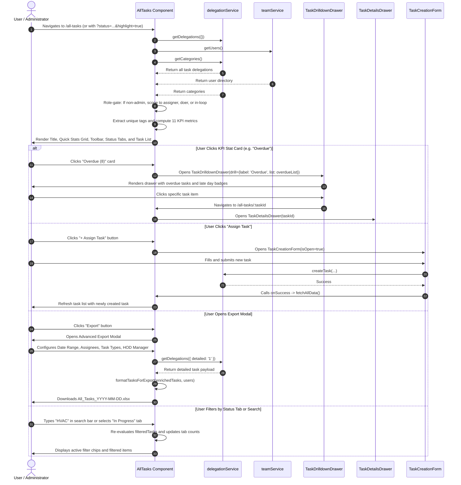

# All Tasks Page — UI Documentation

> Source: [`AllTasks.jsx`](file:///c:/Users/91995/Desktop/D-table_analytic/nia-infra-hide-pms-mm/nia-infra-hide-pms-mm/Frontend/src/pages/AllTasks.jsx)  
> Component: `AllTasks`  
> Primary Route: `/all-tasks`  
> Deep Linking Route: `/all-tasks/:taskId`  
> Query Parameters: `?status=...&doerId=...&groupId=...&tag=...&category=...&highlight=true`  
> Sidebar Entry: `SecondarySidebar.jsx` → `All Tasks` (`ClipboardList` icon)  
> Group Navigation: `PrimarySidebar.jsx` → `Tasks` (`CheckSquare` icon)

---

## Overview

The **All Tasks** page (`AllTasks.jsx`) serves as the comprehensive enterprise repository and surveillance command center for every task across the organization. It provides holistic visibility across all delegations, assignees, doers, and task lifecycles, enabling executives, administrators, project managers, and team members to track, filter, inspect, and export task execution.

Unlike localized perspectives such as **My Work** (`MyDay.jsx` — strictly the active user's execution docket) or **Delegated Tasks** (`DelegatedTasks.jsx` — strictly tasks delegated by the active user), **All Tasks** provides a global oversight canvas with granular role-based scoping and administrative controls.

### Role-Based Access Scoping

| User Role | Visible Task Scope | Functional Capabilities |
|---|---|---|
| **ADMIN / SUPERADMIN** | **Global Organization-Wide Scope**: Retrieves every single task in the database across all departments and members (`tasks = taskRes.data`). | Full audit visibility, universal KPI metrics across all employees, multi-member Excel exports, and cross-department drilldowns. |
| **Standard User / Employee** | **Scoped Personal Visibility**: Filtered to tasks where the current user is directly involved:<br>• `t.assignerId === currentUserId` (tasks assigned by the user)<br>• `t.doerId === currentUserId` (tasks assigned to the user)<br>• `t.inLoopIds.includes(currentUserId)` (tasks where the user is an in-loop observer) | Personal enterprise overview, localized KPI statistics, targeted search, and customized report exports. |

### Core Objectives & Architectural Highlights

1. **Enterprise Repository & Unified Surveillance**: Consolidates repetitive checklists and one-time delegations into a cohesive searchable stream with assigner/doer hierarchy breadcrumbs.
2. **11-Metric Quick Stats Grid with Interactive Drawer Drilldown**:
   - Above-the-fold grid of 11 status tiles mirroring the Executive Dashboard for statistical consistency across screens.
   - Every metric card is interactive; tapping any card opens [`TaskDrilldownDrawer`](file:///c:/Users/91995/Desktop/D-table_analytic/nia-infra-hide-pms-mm/nia-infra-hide-pms-mm/Frontend/src/components/delegation/TaskDrilldownDrawer.jsx) listing the exact tasks behind the count.
3. **Tri-Modal Visualization Engine**:
   - **List View (Default)**: High-density interactive cards featuring expand/collapse accordions, doer avatars, frequency badges, sanitized HTML previews, dynamic tags, attachment indicators, and quick-action triggers.
   - **Kanban Board View**: Columnar lifecycle board powered by [`TaskKanbanView`](file:///c:/Users/91995/Desktop/D-table_analytic/nia-infra-hide-pms-mm/nia-infra-hide-pms-mm/Frontend/src/components/delegation/TaskKanbanView.jsx).
   - **Calendar Schedule View**: Hourly agenda time-grid powered by [`TaskCalendarView`](file:///c:/Users/91995/Desktop/D-table_analytic/nia-infra-hide-pms-mm/nia-infra-hide-pms-mm/Frontend/src/components/delegation/TaskCalendarView.jsx).
4. **Dashboard Drilldown Deep Linking & Highlight Animation**:
   - Ingests URL search parameters (`status`, `doerId`, `groupId`, `tag`, `category`, `highlight`).
   - When navigated from the Executive Dashboard (`highlight=true`), tasks glow with a 3-second pulsing indigo halo (`ring-2 ring-[#1E4C92] shadow-[0_0_20px_rgba(30,76,146,0.3)]`) and an animated top banner `"From Dashboard Filter"`.
5. **Assigner Verification Callout Ring**:
   - Tasks in `Awaiting Verification` where the current user is the assigner (`task.assignerId === currentUserId`) are automatically highlighted with an active blue ring and tint (`ring-2 ring-blue-500 shadow-[0_0_15px_rgba(59,130,246,0.2)] bg-blue-50/10`) to urgently prompt sign-off.
6. **Advanced Multi-Criteria Excel Export Modal**:
   - Custom modal dialog supporting multi-user assignment filtering, repetitive vs. one-time categorization, and **Reporting Manager (HOD) organizational hierarchy scoping**.
   - Enriches raw task records with comprehensive delegation details via `delegationService.getDelegations({ detailed: '1' })`.
7. **Task Creation & Deep Link Inspection Modals**:
   - Primary `"Assign Task"` button opens [`TaskCreationForm`](file:///c:/Users/91995/Desktop/D-table_analytic/nia-infra-hide-pms-mm/nia-infra-hide-pms-mm/Frontend/src/components/delegation/TaskCreationForm.jsx).
   - Direct URL path `/all-tasks/:taskId` automatically triggers [`TaskDetailsDrawer`](file:///c:/Users/91995/Desktop/D-table_analytic/nia-infra-hide-pms-mm/nia-infra-hide-pms-mm/Frontend/src/components/delegation/TaskDetailsDrawer.jsx) on mount (`hideFollowUp` mode).

---

## Page Layout & Component Hierarchy

```
┌────────────────────────────────────────────────────────────────────────────────────────────────────────┐
│  1. HEADER & PRIMARY ACTIONS                                                                           │
│     [🪟] All Tasks                                                                    [+ Assign Task]  │
│          Every task across all users                                                                   │
├────────────────────────────────────────────────────────────────────────────────────────────────────────┤
│  2. QUICK STATS GRID (11 KPI Metric Cards — Interactive Drilldown)                                     │
│     ┌────────────┐ ┌────────────┐ ┌────────────┐ ┌────────────┐ ┌────────────┐ ┌────────────┐          │
│     │  ● TOTAL   │ │ ● OVERDUE  │ │ ○ PENDING  │ │● ACCEPTED  │ │● DEPENDENT │ │ ● BLOCKED  │          │
│     │    142     │ │     8      │ │     14     │ │     19     │ │     7      │ │     3      │          │
│     ├────────────┤ ├────────────┤ ├────────────┤ ├────────────┤ ├────────────┤ └────────────┘          │
│     │●IN PROGRESS│ │●VERIFYING  │ │● COMPLETED │ │  ● IN TIME │ │ ● DELAYED  │                         │
│     │     38     │ │     12     │ │     44     │ │     36     │ │     16     │                         │
│     └────────────┘ └────────────┘ └────────────┘ └────────────┘ └────────────┘                         │
├────────────────────────────────────────────────────────────────────────────────────────────────────────┤
│  3. TOOLBAR & MULTI-FACTOR FILTER CONTROLS                                                             │
│     [ Date Range ▾ ] [ Start / End ] [ ⊶ Filter (N) ] [ 🔍 Search all tasks... ] [↺] [⤓ Export] [𝄜 ⊞ 📅] │
│     ───────────────────────────────────────────────────────────────────────────────────────────────    │
│     ▼ Popover Filter Panel:                                                                            │
│       [ Assigned To ▾ ] [ Assigned By ▾ ] [ Priority ▾ ] [ Category ▾ ] [ Tag ▾ ] [ Verification ▾ ]   │
├────────────────────────────────────────────────────────────────────────────────────────────────────────┤
│  4. STATUS NAVIGATION TABS                                                                             │
│     ALL — 142   ● OVERDUE — 8   ○ PENDING — 14   ● IN PROGRESS — 38   ● VERIFICATION — 12   ● DONE — 44│
│                                                  ═════════════════ (Active Indicator: #1E4C92 Bar)     │
├────────────────────────────────────────────────────────────────────────────────────────────────────────┤
│  5. ACTIVE FILTER CHIPS                                                                                │
│     [ Assigned To: Rahul Sharma ✕ ]   [ Priority: Urgent ✕ ]   [ Category: MEP ✕ ]   [ Tag: Safety ✕ ] │
├────────────────────────────────────────────────────────────────────────────────────────────────────────┤
│  6. CONTENT CONTAINER (One of 3 Selected View Modes)                                                   │
│                                                                                                        │
│    ├─ 6A. List View (Default)                                                                          │
│    │  ┌──────────────────────────────────────────────────────────────────────────────────────────────┐│
│    │  │ [Dashboard Highlight Banner (If URL highlight=true): ● From Dashboard Filter]                ││
│    │  │ [☐] (RS)  HVAC Duct Pressure Test - Tower B  [🎙️] [📎]                                        ││
│    │  │           By Amit Kumar → To Rahul Sharma → MEP Lead                                         ││
│    │  │           [IN PROGRESS] [🔁 DAILY] 📅 18 Sep ● High 2h ago                               [⋮] ││
│    │  ├──────────────────────────────────────────────────────────────────────────────────────────────┤│
│    │  │  ▼ EXPANDED DETAILS ACCORDION:                                                               ││
│    │  │  🕒 Due: 18 Sep 2026, 05:00 PM   👤 By: Amit Kumar   👤 To: Rahul Sharma   📁 MEP   🚩 High   ││
│    │  │  │ Check pressure gauge calibration before filling compressor line...                       ││
│    │  │  [ 🏷️ MECHANICAL ]  [ 🏷️ SAFETY ]                                                            ││
│    │  │  [ 📋 VIEW DETAILS ]                                                                         ││
│    │  └──────────────────────────────────────────────────────────────────────────────────────────────┘│
│    │                                                                                                   │
│    ├─ 6B. Kanban Board View (`TaskKanbanView`)                                                         │
│    │  ┌───────────────┐ ┌───────────────┐ ┌───────────────┐ ┌───────────────┐                          │
│    │  │  Pending (14) │ │Need Revision(2│ │In Progress (38│ │ Completed (44 │                          │
│    │  │  [Task Card]  │ │               │ │  [Task Card]  │ │  [Task Card]  │                          │
│    │  └───────────────┘ └───────────────┘ └───────────────┘ └───────────────┘                          │
│    │                                                                                                   │
│    └─ 6C. Calendar Schedule View (`TaskCalendarView`)                                                  │
│       [ < Today > ]  [ Day | Week | Month ]  Sep 14 - Sep 20, 2026                                      │
│       [ 08:00 AM - 10:00 PM Time Grid with Scheduled Task Blocks ]                                     │
├────────────────────────────────────────────────────────────────────────────────────────────────────────┤
│  7. MODALS, SLIDE-OVERS & DRAWERS                                                                      │
│     ├─ TaskCreationForm Drawer (Triggered by [+ Assign Task])                                          │
│     ├─ TaskDrilldownDrawer (Triggered by Clicking Any KPI Quick Stat Card)                             │
│     ├─ Advanced Export Modal (Triggered by [⤓ Export])                                                 │
│     └─ TaskDetailsDrawer (Triggered by Row Click, [⋮] Button, [View Details], or URL `/all-tasks/:id`) │
└────────────────────────────────────────────────────────────────────────────────────────────────────────┘
```

---

## 1. Header & Primary Actions

The page header establishes the visual theme and hosts the primary creation CTA:

```
┌────────────────────────────────────────────────────────────────────────────────────┐
│ [🪟] All Tasks                                                     [+ Assign Task] │
│      Every task across all users                                                   │
└────────────────────────────────────────────────────────────────────────────────────┘
```

### Component Specifications

| Element | DOM / Tailwind Classes | Functional Description |
|---|---|---|
| **Header Icon Badge** | `w-10 h-10 bg-[#1E4C92] rounded-xl flex items-center justify-center shadow-lg shadow-[#1E4C92]/30` | Displays Lucide `LayoutGrid` icon (size 22, text-white, strokeWidth 2.5), symbolizing the master task repository. |
| **Page Title** | `h1` `text-2xl font-black text-slate-800 leading-none` | Static title: `"All Tasks"`. |
| **Subtitle** | `p` `text-xs font-bold text-slate-400 mt-0.5` | Explanatory caption: `"Every task across all users"`. |
| **"Assign Task" CTA** | `<button>` `flex items-center gap-2 px-5 h-10 bg-[#1E4C92] hover:bg-[#163a6a] text-white rounded-lg font-bold text-sm transition-all active:scale-95 shadow-sm` | Contains Lucide `CheckSquare` (size 16, strokeWidth 3). Tapping sets `showTaskDrawer = true`, opening [`TaskCreationForm`](file:///c:/Users/91995/Desktop/D-table_analytic/nia-infra-hide-pms-mm/nia-infra-hide-pms-mm/Frontend/src/components/delegation/TaskCreationForm.jsx). On task creation, triggers `fetchAllData()` to reload the live task list. |

---

## 2. Quick Stats Grid (11 KPI Metric Cards)

Positioned directly beneath the header, an adaptive CSS grid displays 11 high-level metric cards (`grid grid-cols-2 sm:grid-cols-3 md:grid-cols-4 lg:grid-cols-6 gap-3 mb-8`).

> **Architectural Alignment**: The metric formulas and categorization identically mirror the Executive Dashboard (`Dashboard.jsx`), guaranteeing that managers see identical counts whether auditing the executive overview or drilling into the granular task list.

```
┌────────────┐ ┌────────────┐ ┌────────────┐ ┌────────────┐ ┌────────────┐ ┌────────────┐
│  ● TOTAL   │ │ ● OVERDUE  │ │ ○ PENDING  │ │● ACCEPTED  │ │● DEPENDENT │ │ ● BLOCKED  │
│    142     │ │     8      │ │     14     │ │     19     │ │     7      │ │     3      │
├────────────┤ ├────────────┤ ├────────────┤ ├────────────┤ ├────────────┤ └────────────┘
│●IN PROGRESS│ │●VERIFYING  │ │● COMPLETED │ │  ● IN TIME │ │ ● DELAYED  │
│     38     │ │     12     │ │     44     │ │     36     │ │     16     │
└────────────┘ └────────────┘ └────────────┘ └────────────┘ └────────────┘
```

### KPI Metric Card Specifications

| Metric Card | Dot Indicator Style | Card Background & Text | Computation & Filtering Logic | Tooltip / Description |
|---|---|---|---|---|
| **Total** | `w-3 h-3 rounded-full bg-slate-400` | `bg-white text-slate-700` | `tasks.length` (unfiltered scoped master task set). | *"Every task across all users."* |
| **Overdue** | `w-3 h-3 rounded-full bg-red-500` | `bg-red-50 text-red-600` | `baseFilteredTasks.filter(isOverdue)` — open tasks where `dueDate < Date.now()` and status is not `Completed` or `Awaiting Verification`. | *"Past their due date and not yet completed."* |
| **Pending** | `w-3 h-3 rounded-full border-2 border-slate-400` | `bg-slate-50 text-slate-600` | `byStatus('Pending')` — assigned tasks waiting for doer acknowledgment. | *"Assigned but not yet accepted."* |
| **Accepted** | `w-3 h-3 rounded-full bg-cyan-500` | `bg-cyan-50 text-cyan-600` | `byStatus('Accepted')` — acknowledged by doer, work not yet initiated. | *"Accepted by the doer, work not started."* |
| **Dependent on Others** | `w-3 h-3 rounded-full bg-amber-500` | `bg-amber-50 text-amber-600` | `byStatus('Dependent on Others')` — paused waiting for third-party input or predecessor tasks. | *"Waiting on another person or team."* |
| **Blocked** | `w-3 h-3 rounded-full bg-orange-600` | `bg-orange-50 text-orange-700` | `baseFilteredTasks.filter(isBlockedSummary)` — evaluates side-flag `t.blockedByDetails.summary` or `reason`. | *"Flagged blocked by a person, vendor or dependency."* |
| **In Progress** | `w-3 h-3 rounded-full bg-orange-500` | `bg-orange-50 text-orange-600` | `byStatus('In Progress')` — currently being actively executed. | *"Actively being worked on."* |
| **Verification** | `w-3 h-3 rounded-full bg-blue-500` | `bg-blue-50 text-blue-600` | `byStatus('Awaiting Verification')` — submitted by doer, awaiting assigner signoff. | *"Submitted and awaiting the assigner’s approval."* |
| **Completed** | `w-3 h-3 rounded-full bg-emerald-500` | `bg-emerald-50 text-emerald-600` | `byStatus('Completed')` — verified and closed out. | *"Finished and approved."* |
| **In Time** | `w-3 h-3 rounded-full bg-teal-500` | `bg-teal-50 text-teal-600` | `tasks.filter(t => t.status === 'Completed' && (!t.dueDate || new Date(t.dueDate) >= new Date(t.updatedAt)))` | *"Completed on or before the due date."* |
| **Delayed** | `w-3 h-3 rounded-full bg-rose-500` | `bg-rose-50 text-rose-600` | `tasks.filter(t => t.status !== 'Completed' && t.dueDate && new Date(t.dueDate) < new Date())` | *"Still open and past the due date."* |

### Interactive Drilldown Drawer (`TaskDrilldownDrawer`)

Clicking any of the 11 KPI cards activates the drilldown drawer:
```javascript
onClick={() => setKpiDrill({ label: s.label, description: s.desc, list: s.list })}
```
- Passes the filtered subset `list` directly to [`TaskDrilldownDrawer`](file:///c:/Users/91995/Desktop/D-table_analytic/nia-infra-hide-pms-mm/nia-infra-hide-pms-mm/Frontend/src/components/delegation/TaskDrilldownDrawer.jsx).
- Displays drawer title `${drill.label} — ${list.length}` and subtitle `${drill.description}`.
- Lists each task item with late-days calculation (`${late}d late` in red badge), owner name, task code, status and priority badges.
- Clicking any item inside the drawer invokes `navigate('/all-tasks/${t.id}')`, seamlessly opening [`TaskDetailsDrawer`](file:///c:/Users/91995/Desktop/D-table_analytic/nia-infra-hide-pms-mm/nia-infra-hide-pms-mm/Frontend/src/components/delegation/TaskDetailsDrawer.jsx).

---

## 3. Toolbar & Multi-Factor Filtering System

A multi-control toolbar wrapped in `flex flex-wrap items-end gap-3 mb-8`:

```
┌────────────┐ ┌────────────┐ ┌────────────┐ ┌────────────┐ ┌─────────────┐ ┌───┐ ┌──────────┐ ┌─────┐
│ Date Range │ │ Start Date │ │  End Date  │ │ Filter (N) │ │Search all...│ │ ↺ │ │ ⤓ Export │ │𝄜 ⊞ 📅│
└────────────┘ └────────────┘ └────────────┘ └────────────┘ └─────────────┘ └───┘ └──────────┘ └─────┘
```

### Toolbar Controls

| Control | Type / Component | Visual Styles | Functional Behavior |
|---|---|---|---|
| **Date Range Selector** | `<select>` + `ChevronDown` | `h-11 bg-white border border-[#1E4C92] rounded-lg pl-3 pr-8 text-sm font-bold text-slate-700 shadow-sm` | Evaluates task dates (`dueDate || createdAt`) via `getDateRangeFilter`. Options: `All Time`, `Today`, `Yesterday`, `This Week`, `Last Week`, `This Month`, `Last Month`, `This Year`, `Custom`. |
| **Custom Start & End** | Grouped Date Inputs | Two `h-11 border border-[#1E4C92] rounded-lg px-2.5 flex items-center gap-1.5 bg-white min-w-[130px]` with `CalendarIcon` | Rendered only when `dateRange === 'Custom'`. Filters task date between `[customStartDate, customEndDate 23:59:59]`. |
| **Filter Popover Toggle** | Button + Badge | `h-11 px-5 rounded-lg font-bold text-sm bg-[#1E4C92]` (toggles to `bg-slate-800` when open). Includes count badge `bg-white text-[#1E4C92]` | Toggles floating popover panel. Badge reflects count of active non-default filters (`activeFilterCount`). |
| **Search Input** | Text Field with `Search` icon | `h-11 pl-10 pr-4 bg-white border border-slate-200 rounded-lg text-sm font-bold outline-none focus:ring-2 focus:ring-emerald-500/20 max-w-sm flex-1` | Live substring filter against `task.taskTitle` (case-insensitive). |
| **Reset Filters** | Icon Button | `h-11 w-11 flex items-center justify-center bg-[#1E4C92] hover:bg-[#163a6a] text-white rounded-lg transition-all shadow-sm` with `RotateCcw` | Calls `handleClearFilters()`, reverting search, date range, custom dates, status tab, priority, category, assignees, tags, and verification. |
| **Export to Excel** | Button | `h-11 px-4 rounded-lg font-bold text-sm bg-[#1E4C92] hover:bg-[#163a6a] text-white active:scale-95 shadow-sm` with `FileUp` | Opens the **Advanced Export Modal** (`setShowExportModal(true)`). |
| **View Mode Switcher** | Segmented Button Group | `h-11 bg-white rounded-lg p-1 border border-slate-200 flex items-center` | Switches active view mode between `List` (`List` icon), `Kanban` (`Layout` icon), and `Calendar` (`CalendarIcon`). Active mode receives `bg-[#1E4C92] text-white shadow-sm`. |

---

### Filter Flyout Popover Panel

Clicking the **Filter** button opens an absolute popover anchored beneath the button (`animate-in slide-in-from-top-2 duration-200`):

```
┌──────────────────────────────────────────────┐
│  FILTERS                         Clear All   │
├──────────────────────────────────────────────┤
│  ASSIGNED TO                                 │
│  [ All Members / Dynamic user list ]         │
│                                              │
│  ASSIGNED BY                                 │
│  [ Anyone / Dynamic user list ]              │
│                                              │
│  PRIORITY                                    │
│  [ All Priority / Urgent / High / Med / Low ]│
│                                              │
│  CATEGORY                                    │
│  [ All Categories / Dynamic category list ]  │
│                                              │
│  TAG                                         │
│  [ All Tags / Dynamic unique tag list ]      │
│                                              │
│  VERIFICATION                                │
│  [ All Tasks / Verification Required / None ]│
└──────────────────────────────────────────────┘
```

- **Outside Click Dismissal**: A React `useRef(null)` (`filterPanelRef`) attached to a window `mousedown` listener automatically closes the popover when clicking anywhere outside.
- **Dynamic Tag Discovery**: Tags in the dropdown are automatically extracted and deduplicated on load from all tasks (`allTags`).
- **Dynamic User Population**: `Assigned To` and `Assigned By` menus are populated from `teamService.getUsers()`.
- **Badge Counter**: The trigger button shows a circular badge reflecting `activeFilterCount` counting active selections across `priority`, `category`, `assignedTo`, `assignedBy`, and `tagFilter`.

---

## 4. Advanced Excel Export Modal

Clicking the **Export** button in the toolbar opens a specialized modal overlay dialog (`fixed inset-0 bg-black/40 flex items-center justify-center z-50` with `bg-white rounded-lg w-full max-w-md p-6 relative max-h-[90vh] overflow-y-auto`):

```
┌────────────────────────────────────────────────────────┐
│ Export Tasks                                       [✕] │
├────────────────────────────────────────────────────────┤
│ DATE RANGE                                             │
│ [ All Time ▾ ]  (or Custom Start / End Dates)          │
│                                                        │
│ ASSIGNED TO                                            │
│ [x] Select All                                         │
│ [x] Amit Kumar   [ ] Rahul Sharma   [x] Vikram Patil   │
│                                                        │
│ ASSIGNED BY                                            │
│ [x] Select All                                         │
│ [x] Priya Nair   [ ] Rajesh Gupta                      │
│                                                        │
│ TASK TYPE                                              │
│ [x] Select All                                         │
│ [x] Repetitive Tasks   [x] One-time Tasks              │
│                                                        │
│ REPORTING MANAGER (HOD)                                │
│ [ All Managers ▾ ]                                     │
│ (Exports tasks assigned to members reporting to HOD)   │
├────────────────────────────────────────────────────────┤
│                        [ Export Tasks (24) ]  [Cancel] │
└────────────────────────────────────────────────────────┘
```

### Export Configuration & Scoping Engine

1. **Date Range Scoping**: Predefined ranges (`All Time`, `Today`, `Yesterday`, `This Week`, etc.) or custom date bounds.
2. **Assignee Multi-Select Checkboxes**:
   - `Assigned To`: Multi-checkbox list of all team members with "Select All" toggle.
   - `Assigned By`: Multi-checkbox list of delegators with "Select All" toggle.
3. **Task Type Filtering**:
   - **Repetitive Tasks**: Filtered by `!!t.frequency` (joined from `checklistMaster`).
   - **One-Time Tasks**: Filtered by `!t.frequency`.
4. **Reporting Manager (HOD) Filtering**:
   - Selects a specific manager; automatically derives `subordinateIds` via `users.filter(u => u.reportingManagerId === hod)` and filters tasks assigned to those reportees.
   - Dropdown displays subordinate counts: e.g., `Rajesh Gupta (4 reportees)`.
5. **Real-Time Export Count Calculation**:
   - The export submit button dynamically recalculates and displays the exact count of matching tasks: `Export Tasks (${count})`.
6. **Detailed Data Fetch & Export Pipeline**:
   - On confirmation, calls `delegationService.getDelegations({ detailed: '1' })` to retrieve enriched task history, checklists, and metadata.
   - Maps and formats data using `formatTasksForExport(enriched, users)`.
   - Downloads formatted spreadsheet titled `All_Tasks_YYYY-MM-DD.xlsx` via `exportToExcel`.

---

## 5. Status Navigation Tab Strip

Centered horizontal tab bar with responsive overflow scrolling (`flex justify-center mb-8 border-b border-white/20 relative`):

```
┌────────────────────────────────────────────────────────────────────────────────────────────────────────┐
│  ALL — 142   ● OVERDUE — 8   ○ PENDING — 14   ● IN PROGRESS — 38   ● VERIFICATION — 12   ● DONE — 44  │
│                                               ═════════════════ (Active Indicator: #1E4C92 Bar)        │
└────────────────────────────────────────────────────────────────────────────────────────────────────────┘
```

### Tab Configuration & Dynamic Calculation

| Tab Key | Display Label | Dot Indicator | Filter & Derivation Logic |
|---|---|---|---|
| `All` | **ALL** | `bg-slate-400` | Count of all scoped tasks matching secondary toolbar filters (`baseFilteredTasks.length`). |
| `Overdue` | **OVERDUE** | `bg-red-500` | **Dynamic computation**: Task has `dueDate`, is NOT in `['Completed', 'Awaiting Verification']`, and `new Date(dueDate).getTime() < Date.now()`. |
| `Pending` | **PENDING** | `border-2 border-slate-400 bg-transparent` | Explicit stored status: `t.status === 'Pending'`. |
| `In Progress` | **IN PROGRESS** | `bg-orange-500` | Explicit stored status: `t.status === 'In Progress'`. |
| `Awaiting Verification` | **VERIFICATION** | `bg-blue-500` | Tasks submitted by the doer awaiting delegator signoff: `t.status === 'Awaiting Verification'`. |
| `Completed` | **COMPLETED** | `bg-emerald-500` | Explicit stored status: `t.status === 'Completed'`. |

- **Active State**: Active tab receives `text-slate-800` and displays an animated bottom pill bar `absolute bottom-0 left-0 right-0 h-1 bg-[#1E4C92] rounded-t-full`.
- **Real-Time Reactive Counts**: Tab counters dynamically update as search strings, date ranges, or popover filters change (`getStatusCount(tab.key)`).

---

## 6. Active Filter Chips Bar

When any non-status filter is active (`activeFilterCount > 0`), removable pill chips appear directly above the task container:

```
[ Assigned To: Rahul Sharma ✕ ]   [ Assigned By: Amit Kumar ✕ ]   [ Priority: Urgent ✕ ]   [ Category: Safety ✕ ]   [ Tag: Civil ✕ ]   [ Verification: Required ✕ ]
```

- **Pill Style**: `bg-white border border-[#1E4C92]/40 text-[#1E4C92] rounded-full text-[11px] font-bold px-3 py-1 flex items-center gap-1.5`.
- **Targeted Removal**: Tapping the `X` button on any chip clears that specific filter and re-triggers task evaluation without resetting the rest of the workspace.

---

## 7. Content Views

Tasks render within a responsive container (`max-w-7xl mx-auto space-y-3 pb-20`) in one of three view modes:

### 7A. List View (Default)

The List View renders high-density task rows with collapsible accordion details:

```
┌────────────────────────────────────────────────────────────────────────────────────────────────────────┐
│ [Dashboard Highlight Banner (If URL highlight=true): ● From Dashboard Filter]                          │
├────────────────────────────────────────────────────────────────────────────────────────────────────────┤
│ [☐] (RS)  HVAC Duct Pressure Test - Tower B  [🎙️] [📎]                                                  │
│           By Amit Kumar → To Rahul Sharma → MEP Lead                                                   │
│           [IN PROGRESS] [🔁 DAILY] 📅 18 Sep ● High 2h ago                                         [⋮] │
├────────────────────────────────────────────────────────────────────────────────────────────────────────┤
│  ▼ EXPANDED DETAILS ACCORDION                                                                          │
│  🕒 Due: 18 Sep 2026, 05:00 PM   👤 By: Amit Kumar   👤 To: Rahul Sharma   📁 MEP   🚩 High            │
│  │ Check pressure gauge calibration before filling compressor line across Grid 4-8...                  │
│  [ 🏷️ MECHANICAL ]  [ 🏷️ SAFETY ]                                                                       │
│  [ 📋 VIEW DETAILS ]                                                                                   │
└────────────────────────────────────────────────────────────────────────────────────────────────────────┘
```

#### Special Card State Highlights

1. **Dashboard Drilldown Highlight**:
   - Triggered when URL parameter `highlight=true` is passed from dashboard navigation.
   - Adds glowing halo `ring-2 ring-[#1E4C92] shadow-[0_0_20px_rgba(30,76,146,0.3)]`.
   - Displays top banner with animated pulsing dot (`w-2 h-2 bg-[#1E4C92] rounded-full animate-ping`) and caption `"From Dashboard Filter"`.
   - Automatically fades away after 3 seconds via `setTimeout`.
2. **Assigner Verification Callout Ring**:
   - Triggered when `(task.status === 'Awaiting Verification' && task.assignerId === currentUserId)`.
   - Styles card with `ring-2 ring-blue-500 shadow-[0_0_15px_rgba(59,130,246,0.2)] bg-blue-50/10` to visually cue the user that action is needed on their delegated task.
3. **Accordion Expanded State**:
   - Styles card with `ring-2 ring-[#1E4C92]/30`.

#### Collapsed Row Elements (Left → Right):

1. **Selection Checkbox**: `w-5 h-5 rounded border-slate-300 accent-[#1E4C92]` with `e.stopPropagation()`.
2. **Doer Avatar**: Circular badge `w-10 h-10 rounded-full bg-[#1E4C92]/10 text-[#1E4C92] font-bold relative shrink-0` with ring `border-2 border-[#1E4C92]/40` displaying initials `${doerFirstName[0]}${doerLastName[0]}`. Tooltip: `Assigned to {first} {last}`.
3. **Task Title & Media Icons**:
   - `task.taskTitle` in `text-base font-black text-slate-800 truncate`.
   - **Voice Note Mic Icon**: Lucide `Mic` in `text-emerald-500` if `task.voiceNoteUrl` is present.
   - **Attachment Paperclip Icon**: Lucide `Paperclip` in `text-orange-500` if `task.referenceDocs` is present.
4. **Hierarchy Breadcrumb**:
   - `By {task.assignerFirstName} {task.assignerLastName} → To {task.doerFirstName} {task.doerLastName} → {task.assigneeHierarchy}` in `text-[10px] font-bold text-slate-400` (hidden on mobile, visible on `sm`).
5. **Status Badge**:
   - **Completed**: `bg-emerald-50 text-emerald-600 border-emerald-200`
   - **Awaiting Verification**: `bg-blue-50 text-blue-600 border-blue-200`
   - **In Progress**: `bg-orange-50 text-orange-600 border-orange-200`
   - **Overdue**: `bg-red-50 text-red-600 border-red-200`
   - **Hold**: `bg-amber-50 text-amber-600 border-amber-200`
   - **Pending / Other**: `bg-slate-50 text-slate-500 border-slate-200`
6. **Frequency Badge**:
   - **Repetitive**: If `task.frequency` is present, renders purple pill `bg-purple-50 text-purple-600 border-purple-200 shadow-sm shadow-purple-500/10` with Lucide `RotateCcw` icon displaying frequency label (e.g. `DAILY`, `WEEKLY`).
   - **One-Time**: If no frequency, renders muted pill `bg-slate-50 text-slate-400 border-slate-200` with `RotateCcw` icon displaying `"One Time"`.
7. **Due Date Badge**: `📅 {day} {month}` (e.g. `📅 18 Sep`). Displays in `text-red-500` if past due and task is uncompleted; otherwise `text-slate-400`.
8. **Priority Indicator**: `● {task.priority}` (Urgent: red-500, High: orange-500, Medium: blue-500, Low: slate-400).
9. **Relative Timestamp**: `formatTimeAgo(task.createdAt)` (`"Just now"`, `"${diff}h ago"`, `"${diff}d ago"`).
10. **Options / Drawer Trigger (`⋮`)**: `MoreVertical` button that stops propagation, sets `selectedTaskId`, and opens `TaskDetailsDrawer`.

#### Expanded Accordion Content:

Clicking anywhere on the row toggles the expanded accordion (`animate-in slide-in-from-top-2 duration-300`):

- **Metadata Row**:
  - `Clock` icon: `Due: {DD MMM YYYY, hh:mm A}` (or `"No date set"`).
  - `User` icon (purple): `By: {Assigner First Last}`.
  - `User` icon (navy): `To: {Doer First Last}`.
  - `Folder` icon: `{Category}` (if present).
  - `Flag` icon: `{Priority}` (colored according to urgency).
- **Sanitized Description Preview**: Sanitized HTML snippet (`sanitizeHtml(task.description)`), clamped to 2 lines (`line-clamp-2`), with left accent line `border-l-2 border-[#1E4C92]/30 pl-3`.
- **Dynamic Tag Chips**: Parsed tags formatted with `tagLabel(tag)` and inline background/border hex tints derived from `tagColor(tag)`.
- **"View Details" Quick CTA**: Navy pill button (`px-4 py-2 bg-[#1E4C92]/10 hover:bg-[#1E4C92]/20 text-[#1E4C92] rounded-lg text-[11px] font-black uppercase tracking-widest`) with `CheckSquare` icon that opens `TaskDetailsDrawer`.

---

### 7B. Kanban Board View

Rendered via [`TaskKanbanView.jsx`](file:///c:/Users/91995/Desktop/D-table_analytic/nia-infra-hide-pms-mm/nia-infra-hide-pms-mm/Frontend/src/components/delegation/TaskKanbanView.jsx):

```
┌─────────────────┐ ┌─────────────────┐ ┌─────────────────┐ ┌─────────────────┐
│ 🔴 PENDING (14) │ │ 🔵 REVISION (2) │ │ 🟠 PROGRESS (38│ │ 🟢 COMPLETED(44 │
├─────────────────┤ ├─────────────────┤ ├─────────────────┤ ├─────────────────┤
│ ┌─────────────┐ │ │                 │ │ ┌─────────────┐ │ │ ┌─────────────┐ │
│ │ Task Title  │ │ │                 │ │ │ Task Title  │ │ │ │ Task Title  │ │
│ │ Description │ │ │                 │ │ │ Description │ │ │ │ Description │ │
│ │ [Tags]      │ │ │                 │ │ │ [Tags]      │ │ │ │ [Tags]      │ │
│ │ (RS) DueDate│ │ │                 │ │ │ (RS) DueDate│ │ │ │ (RS) DueDate│ │
│ └─────────────┘ │ │                 │ │ └─────────────┘ │ │ └─────────────┘ │
└─────────────────┘ └─────────────────┘ └─────────────────┘ └─────────────────┘
```

- **4 Lifecycle Columns**: **Pending** (`text-red-500`), **Need Revision** (`text-blue-500`), **In Progress** (`text-orange-400`), **Completed** (`text-emerald-500`).
- **Interactive Inspection**: Clicking any card invokes `onTaskClick(task)`, setting `selectedTaskId` and opening `TaskDetailsDrawer`.

---

### 7C. Calendar Schedule View

Rendered via [`TaskCalendarView.jsx`](file:///c:/Users/91995/Desktop/D-table_analytic/nia-infra-hide-pms-mm/nia-infra-hide-pms-mm/Frontend/src/components/delegation/TaskCalendarView.jsx):

```
┌────────────────────────────────────────────────────────────────────────┐
│  [ < ]  [ Today ]  [ > ]   Sep 14 - Sep 20, 2026   [ Day | Week | Month]│
├────────────────────────────────────────────────────────────────────────┤
│  TIME    │ MON 14  │ TUE 15  │ WED 16  │ THU 17  │ FRI 18  │ SAT 19  │...│
├──────────┼─────────┼─────────┼─────────┼─────────┼─────────┼─────────┤...│
│ 08:00 AM │         │ [Task]  │         │         │         │         │   │
│ 09:00 AM │ [Task]  │         │         │ [Task]  │         │         │   │
│ ...      │         │         │         │         │         │         │   │
│ 10:00 PM │         │         │         │         │         │         │   │
└────────────────────────────────────────────────────────────────────────┘
```

- **Time Scale**: Daily, Weekly, and Monthly schedule grids spanning 08:00 AM to 10:00 PM.
- **Interactive Inspection**: Clicking any scheduled block opens `TaskDetailsDrawer`.

---

### 7D. Zero & Loading States

| State | Condition | Visual Representation |
|---|---|---|
| **Loading State** | `loading === true` | Centered spinning indicator (`w-12 h-12 border-4 border-[#1E4C92] border-t-transparent rounded-full animate-spin`) with caption `"Loading All Tasks..."`. |
| **No Tasks Found** | `filteredTasks.length === 0` | Rounded dashed container (`border-2 border-dashed border-white/60 rounded-3xl p-20`) with circular `CheckSquare` graphic, heading `"No Tasks Found"`, subtitle `"Try changing your filters or date range"`, and a `"Clear Filters"` button (`bg-[#1E4C92]`). |

---

## 8. Modals, Drawers & Deep-Linking

### 1. Task Creation Drawer (`TaskCreationForm`)
- **Trigger**: Click `[+ Assign Task]` button in header.
- **Component**: [`TaskCreationForm.jsx`](file:///c:/Users/91995/Desktop/D-table_analytic/nia-infra-hide-pms-mm/nia-infra-hide-pms-mm/Frontend/src/components/delegation/TaskCreationForm.jsx).
- **Props**: `isOpen={showTaskDrawer}`, `onClose={() => setShowTaskDrawer(false)}`, `onSuccess={fetchAllData}`.
- **Capability**: Enables rapid task delegation with rich title, descriptions, multi-doer allocation, checklist items, attachments, priority, category, tags, and recurrence scheduling.

### 2. Task Details Drawer (`TaskDetailsDrawer`)
- **Trigger**: Click task row, `[⋮]` menu button, `[View Details]` CTA, drilldown card, or navigate via URL `/all-tasks/:taskId`.
- **Component**: [`TaskDetailsDrawer.jsx`](file:///c:/Users/91995/Desktop/D-table_analytic/nia-infra-hide-pms-mm/nia-infra-hide-pms-mm/Frontend/src/components/delegation/TaskDetailsDrawer.jsx).
- **Props**: `isOpen={showDetails}`, `taskId={selectedTaskId}`, `onClose={() => setShowDetails(false)}`, `onSuccess={fetchAllData}`, `hideFollowUp={true}`.
- **Deep Linking**: The component watches `useParams().taskId`. On mount or route change:
  ```javascript
  if (urlTaskId) {
      setSelectedTaskId(urlTaskId);
      setShowDetails(true);
  }
  ```

### 3. KPI Drilldown Drawer (`TaskDrilldownDrawer`)
- **Trigger**: Click any of the 11 Quick Stat cards.
- **Component**: [`TaskDrilldownDrawer.jsx`](file:///c:/Users/91995/Desktop/D-table_analytic/nia-infra-hide-pms-mm/nia-infra-hide-pms-mm/Frontend/src/components/delegation/TaskDrilldownDrawer.jsx).
- **Props**: `drill={kpiDrill}`, `onClose={() => setKpiDrill(null)}`, `getName={getUserName}`.

---

## 9. End-to-End User Interaction Flow



---

## 10. Design System Tokens & Color Palette

### Brand & Canvas Palette

| Token / Color Hex | UI Application | Tailwind Utility Classes |
|---|---|---|
| `#1E4C92` | **Brand Deep Navy** | Header icon badge, primary buttons (`Assign Task`, `Filter`, `Export`), active tab indicator bar, active view mode button, checkbox accents, filter chip borders, and dashboard highlight glow. |
| `#163a6a` | **Navy Hover State** | Button hover state (`hover:bg-[#163a6a]`). |
| `--bg-primary` | Page Canvas | Page background container (`bg-(--bg-primary)`). |

### KPI Metric Cards Palette

| Metric Name | Dot Indicator | Background Color | Text Color |
|---|---|---|---|
| **Total** | `bg-slate-400` | `bg-white` | `text-slate-700` |
| **Overdue** | `bg-red-500` | `bg-red-50` | `text-red-600` |
| **Pending** | `border-2 border-slate-400` | `bg-slate-50` | `text-slate-600` |
| **Accepted** | `bg-cyan-500` | `bg-cyan-50` | `text-cyan-600` |
| **Dependent on Others** | `bg-amber-500` | `bg-amber-50` | `text-amber-600` |
| **Blocked** | `bg-orange-600` | `bg-orange-50` | `text-orange-700` |
| **In Progress** | `bg-orange-500` | `bg-orange-50` | `text-orange-600` |
| **Verification** | `bg-blue-500` | `bg-blue-50` | `text-blue-600` |
| **Completed** | `bg-emerald-500` | `bg-emerald-50` | `text-emerald-600` |
| **In Time** | `bg-teal-500` | `bg-teal-50` | `text-teal-600` |
| **Delayed** | `bg-rose-500` | `bg-rose-50` | `text-rose-600` |

### Task Status Badges

| Status Key | Badge Background | Badge Text | Badge Border |
|---|---|---|---|
| **Completed** | `bg-emerald-50` | `text-emerald-600` | `border-emerald-200` |
| **Awaiting Verification** | `bg-blue-50` | `text-blue-600` | `border-blue-200` |
| **In Progress** | `bg-orange-50` | `text-orange-600` | `border-orange-200` |
| **Overdue** | `bg-red-50` | `text-red-600` | `border-red-200` |
| **Hold** | `bg-amber-50` | `text-amber-600` | `border-amber-200` |
| **Pending / Other** | `bg-slate-50` | `text-slate-500` | `border-slate-200` |

### Recurrence & Media Tokens

- **Repetitive Task Badge**: `bg-purple-50 text-purple-600 border-purple-200 shadow-sm shadow-purple-500/10` with Lucide `RotateCcw` icon.
- **One-Time Task Badge**: `bg-slate-50 text-slate-400 border-slate-200` with muted `RotateCcw` icon.
- **Voice Note Present**: Lucide `Mic` (size 14, strokeWidth 3, `text-emerald-500`).
- **Reference Document Attached**: Lucide `Paperclip` (size 14, strokeWidth 3, `text-orange-500`).
- **Assigner Verification Highlight**: `ring-2 ring-blue-500 shadow-[0_0_15px_rgba(59,130,246,0.2)] bg-blue-50/10`.
- **Dashboard Highlight Glow**: `ring-2 ring-[#1E4C92] shadow-[0_0_20px_rgba(30,76,146,0.3)]`.

---

## 11. Responsive Breakpoint Behaviors

| Viewport | Breakpoint | Responsive Adaptations |
|---|---|---|
| **Desktop** | `≥ 1024px` | • Quick Stats grid renders in 6 columns (`lg:grid-cols-6`).<br>• Full inline toolbar with horizontal filter and export controls.<br>• Full hierarchy breadcrumbs visible (`By Assigner → To Doer → Hierarchy`).<br>• Frequency, Due Date, and Priority badges visible inline on task rows (`md:inline-flex` / `md:block`).<br>• Full side-by-side Kanban columns and Calendar time-grid. |
| **Tablet** | `768px – 1023px` | • Quick Stats grid wraps into 3 or 4 columns (`sm:grid-cols-3 md:grid-cols-4`).<br>• Status badges and priority indicators remain visible; search bar flexes dynamically.<br>• Kanban board enables horizontal swipe scrolling (`overflow-x-auto`). |
| **Mobile** | `< 768px` | • Quick Stats grid collapses into 2 columns (`grid-cols-2`).<br>• Toolbar controls wrap into multi-line layout; custom date pickers stack.<br>• Breadcrumb hierarchy hides on mobile to maximize title space (`hidden sm:block`).<br>• Frequency, due date, and priority badges collapse on row header and display inside the expanded accordion.<br>• Status navigation tabs enable horizontal touch scrolling (`overflow-x-auto`). |

---

## 12. Architectural Comparison Matrix

| Dimension | All Tasks (`AllTasks.jsx`) | Loop Tasks (`InLoopTasks.jsx`) | My Work (`MyDay.jsx`) | Delegated Tasks (`DelegatedTasks.jsx`) |
|---|---|---|---|---|
| **User Role & Perspective** | **Global / Multi-User Command Hub** | **Stakeholder / Auditor / CC** | **Doer / Primary Assignee** | **Delegator / Assigner** |
| **Primary Query Filter** | Global (Admins) or `assigner \|\| doer \|\| inLoop` | `t.inLoopIds.includes(viewingId)` | `t.doerId === me` | `t.assignerId === me` |
| **Quick Summary Band** | **11-card KPI Grid with Drawer Drilldown** | 6-card KPI Ribbon (Status-based) | 4-card KPI Grid (Urgency-based) | Tab Counter Strip |
| **Task Creation CTA** | **Yes** — `[+ Assign Task]` button | No — Observer mode | No — Execution mode | **Yes** — `[+ Assign Task]` button |
| **Export Capabilities** | **Advanced Export Modal** (scoping by HOD, doers, task types, dates) | Direct Excel export with enriched delegations | Quick export | Enriched delegation export |
| **View Modes** | List, Kanban, Calendar | List, Kanban, Calendar | Unified Date-Bucket Sections | List, Kanban, Calendar |
| **Visual Indicators** | Recurrence, Voice Note, Paperclip, Verification Cue, Dashboard Glow | Assigner Avatar, Priority, Due Date | 56px oversized Start/Done touch targets | Delegator Verification Badges |
