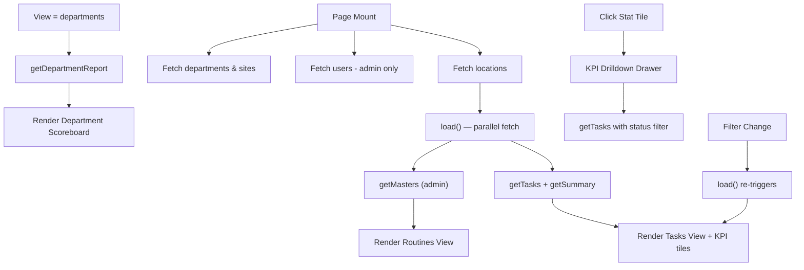

# Checklist Page — UI Documentation

> Source: [`Checklist.jsx`](file:///c:/Users/91995/Desktop/D-table_analytic/nia-infra-hide-pms-mm/nia-infra-hide-pms-mm/Frontend/src/pages/Checklist.jsx)

---

## Overview

The **Checklist** page is the primary interface for managing recurring compliance tasks. Tasks are auto-generated from "Routines" (master rules) and tracked to completion. The page adapts its UI based on the logged-in user's role — **Admin / Manager** users see management controls, while regular **Doers** see a streamlined personal view.

---

## Page Layout (Top → Bottom)

```
┌───────────────────────────────────────────────────────┐
│  1. Header Bar          (title + site switcher + CTA) │
├───────────────────────────────────────────────────────┤
│  2. KPI Stat Tiles      (5 interactive stat cards)    │
├───────────────────────────────────────────────────────┤
│  3. Filter Bar          (search + dropdowns + dates)  │
├───────────────────────────────────────────────────────┤
│  4. Bulk Action Bar     (appears when tasks selected) │
├───────────────────────────────────────────────────────┤
│  5. Content Area   (one of 3 tab views)               │
│    ├─ Tasks View   (task table — default)             │
│    ├─ Routines View  (master rule table — admin only) │
│    └─ Departments View (scoreboard — admin only)      │
├───────────────────────────────────────────────────────┤
│  6. Footer count  ("Showing N tasks for HO")          │
├───────────────────────────────────────────────────────┤
│  7. Modals / Drawers   (overlays, triggered on action)│
└───────────────────────────────────────────────────────┘
```

---

## 1. Header Bar

| Element | Description | Visibility |
|---------|-------------|------------|
| **Page icon** | `ClipboardList` icon in an emerald-tinted rounded container | Always |
| **Title** | `Checklist` — `text-3xl font-extrabold` | Always |
| **Subtitle** | _"Recurring compliance tasks — generated ahead, tracked to completion."_ | Always |
| **Site Switcher** | Pill-group toggle (`HO`, `Site1`, …). Active site gets `bg-emerald-600 text-white`. Disabled buttons for sites user can't access. | Only when > 1 location exists |
| **Refresh button** | `RefreshCw` icon button. Spins with `animate-spin` while loading. | Always |
| **New checklist button** | `Plus` icon + label. Label reads _"New checklist"_ for admin/manager, _"Add checklist task"_ for doers. Emerald CTA style. | Always |

---

## 2. KPI Stat Tiles

Five interactive cards in a responsive grid (`grid-cols-2 lg:grid-cols-5`):

| # | Tile | Icon | Accent | Value source | Extra |
|---|------|------|--------|--------------|-------|
| 1 | **Total** | `ClipboardList` | `bg-slate-500` | `summary.total` | — |
| 2 | **Pending today** | `Clock` | `bg-blue-500` | `summary.pendingToday` | Caption shows carried-over count |
| 3 | **Overdue** | `AlertTriangle` | `bg-red-500` | `summary.overdue` | — |
| 4 | **Completed** | `CheckCircle2` | `bg-emerald-500` | `summary.completed` | — |
| 5 | **Compliance** | `TrendingUp` | `bg-indigo-500` | `summary.complianceRate` | Suffix `%` |

### StatTile Card Anatomy

```
┌─────────────────────────────┐
│  [Icon]  LABEL              │  ← 11px, uppercase, tracking-wider
│                             │
│  42                         │  ← 3xl, font-extrabold, tabular-nums
│  carried over from earlier  │  ← 10px caption (optional)
│  View →                     │  ← toggles to "Showing" when active
└─────────────────────────────┘
```

- **On click**: Opens a **KPI Drilldown Drawer** (right-side panel) showing the exact occurrences behind that stat.
- **Active state**: Emerald border + soft emerald background + "Showing" label.
- **Decorative blob**: 20×20px circle at `−right-4 −top-4`, 7% opacity, using the tile's accent color.

---

## 3. Filter Bar

A horizontal toolbar (`rounded-2xl`, secondary bg, border) wrapping with `flex-wrap`.

### View Switcher (Admin/Manager only)

A pill-group with three options:

| Tab | Icon | ID |
|-----|------|----|
| **Tasks** | `ClipboardList` | `tasks` |
| **Routines** | `ListTree` | `routines` |
| **Departments** | `Building2` | `departments` |

Active tab: `bg-emerald-600 text-white shadow-sm`

### Filter Controls

| Control | Type | Placeholder / Label | Visibility |
|---------|------|---------------------|------------|
| **Search** | Text input with `Search` icon | _"Search tasks…"_ | Always |
| **Frequency** | `<select>` | _"All frequencies"_ → Daily, Weekly, Fortnightly, Monthly, Quarterly, Yearly | Always |
| **Status** | `<select>` | _"All statuses"_ → Pending, Overdue, Completed, Non-Functional | Always |
| **Department** | `<select>` | _"All departments"_ (data-driven) | Admin/Manager + departments exist |
| **Site** | `<select>` | _"All sites"_ (data-driven) | When sites exist |
| **Doer** | `<select>` | _"Everyone"_ → list of users | Admin/Manager + users loaded |
| **Specific Date** | `<input type="date">` | Title: _"Specific date"_ | Always. Gets emerald ring when set. |
| **From date** | `<input type="date">` | Title: _"From"_ | Always. Disabled when specific date is set. |
| **To date** | `<input type="date">` | Title: _"To"_ | Always. Disabled when specific date is set. |
| **Clear** | Text button | _"Clear (N)"_ showing active filter count | When any filter is active |

### Select & Input Styling

All share a common CSS class:
```
px-3 py-2.5 rounded-xl border bg-secondary text-primary text-sm
focus: ring-2 ring-emerald-500/40 border-emerald-500
```

---

## 4. Bulk Action Bar

Appears when **≥ 1 open task is selected** and user is Admin/Manager.

```
┌─────────────────────────────────────────────────────────┐
│  "3 tasks selected"       [💬 Add remark]  [Clear]      │
│  bg-emerald-600  text-white  shadow-lg  rounded-2xl     │
└─────────────────────────────────────────────────────────┘
```

- Slides in with `animate-in slide-in-from-top-2`.
- **Add remark** — opens `RemarkModal` for all selected task IDs.
- **Clear** — deselects everything.

---

## 5. Content Area

### 5A. Tasks View (default)

#### Loading State
Six skeleton rows (`h-14 skeleton` class).

#### Empty State

```
┌──────────────────────────────────────────┐
│         [ClipboardList icon]             │
│       No checklist tasks                 │
│  "Nothing matches…" or "Nothing set up…" │
│         [Clear filters] or              │
│       [+ Create the first one]           │
└──────────────────────────────────────────┘
```

#### Data Table

| Column | Content | Notes |
|--------|---------|-------|
| **☐** (checkbox) | Select/deselect open task | Admin/Manager only. Header checkbox toggles all open. Disabled for completed tasks. |
| **Task** | `taskName` (bold, 14px, truncated) + `taskCode` (mono, 11px) | Badges: 🔴 follow-up count (`MessageSquare`), 🟣 "reassigned" (`UserCog`) |
| **Owner** | `doerFirstName doerLastName` (13px) | Sub-line: department · site (site in sky-600 bold) |
| **Frequency** | Pill badge: `Repeat` icon + frequency label | Indigo-50 bg, 11px |
| **Planned** | `CalendarDays` icon + formatted date (`DD MMM YYYY`) | If completed: sub-line _"done DD MMM YYYY"_ in emerald |
| **Status** | Colored pill badge | See Status Badge Styles below |
| **Proof** | Link / label / dash | `View` (emerald link + `Paperclip`) if document exists; `Required` (amber) if proof needed; `—` otherwise |
| **Actions** | `Complete` button + `⋯` menu | Open tasks only. Completed tasks show completion date. |

#### Status Badge Styles

| Status | Background | Text | Border |
|--------|-----------|------|--------|
| **Completed** | `emerald-50` | `emerald-700` | `emerald-200` |
| **Pending** | `slate-100` | `slate-600` | `slate-200` |
| **Overdue** | `red-50` | `red-700` | `red-200` |
| **Non-Functional** | `amber-50` | `amber-700` | `amber-200` |

> All have dark mode variants using `500/10` opacity backgrounds and `400` text shades.

#### Row Hover
`hover:bg-emerald-50/40 dark:hover:bg-emerald-500/5`

#### Three-Dot Context Menu (`⋯`)

Dropdown (`w-52`, rounded-xl, shadow-xl) with:

| Action | Icon | Visibility |
|--------|------|------------|
| **Add remark** | `MessageSquare` | Always |
| **Reassign** | `UserCog` | Admin/Manager only |
| **Mark non-functional** | `Ban` | Always (amber text) |

Backdrop overlay (`fixed inset-0 z-10`) closes menu on outside click.

---

### 5B. Routines View (Admin/Manager only)

A data table listing the master rules that generate task occurrences.

| Column | Content |
|--------|---------|
| **Routine** | `taskName` (bold, 14px) + `code` (mono, 11px). Badges: `stopped` (slate) if inactive, `no cadence` (amber) if no frequency. |
| **Owner** | `doerFirstName doerLastName` |
| **Frequency** | Pill: `Repeat` icon + frequency (indigo) |
| **Window** | `startDate to endDate` (12px, slate-500) |
| **Progress** | Progress bar (emerald fill on slate track, `h-1.5 rounded-full`) + `done/total` label |
| **Actions** | `✏️ Edit` button + `⏻ Stop` button (amber, only for active routines) |

#### Empty State
_"No routines yet. Create one and every occurrence is generated up front."_

---

### 5C. Departments View (Admin/Manager only)

#### Loading State
Four skeleton blocks (`h-24 rounded-2xl`).

#### Empty State
`Building2` icon + _"No department data yet"_ + explanatory text.

#### Overall Summary Strip

A 4-column grid of colored stat cards:

| Metric | Color |
|--------|-------|
| Completed | Emerald (`bg-emerald-50`, ring) |
| Pending | Amber |
| Missed | Red |
| Compliance (%) | Indigo |

#### Department Scoreboard

Ranked list (sorted by compliance rate). Each row is an expandable accordion:

```
┌──────────────────────────────────────────────────────────┐
│  [Rank badge]  Department Name         [done] [pend]     │
│                4 tasks · 2 people      [miss]    85%     │
│                                        ████████░░  bar   │
└──────────────────────────────────────────────────────────┘
```

- **Rank badges**: Gold (#1), Silver (#2), Bronze (#3), neutral otherwise.
- **Compliance bar**: Emerald ≥ 80%, Amber ≥ 50%, Red < 50%.

##### Expanded Row (accordion content)

Shows people in that department:

```
┌─────────────────────────────────────────────────┐
│  People in [Department]         [View tasks →]  │
├─────────────────────────────────────────────────┤
│  John Doe · 5 tasks    3✓  1 pend  1 miss  80% │
│  Jane Smith · 3 tasks  3✓  0 pend  0 miss 100% │
└─────────────────────────────────────────────────┘
```

- **View tasks →** link switches to Tasks view filtered by that department.

---

## 6. Footer Count

Centered text below the task table:
_"Showing 42 tasks for HO"_ — 12px, slate-400.

Only visible when `view === 'tasks'` and tasks exist.

---

## 7. Modals & Drawers

| Component | Trigger | Purpose |
|-----------|---------|---------|
| [`CompleteChecklistModal`](file:///c:/Users/91995/Desktop/D-table_analytic/nia-infra-hide-pms-mm/nia-infra-hide-pms-mm/Frontend/src/components/checklist/ChecklistModals.jsx) | "Complete" button on a task row | Mark a task as done (with optional proof upload) |
| [`NonFunctionalModal`](file:///c:/Users/91995/Desktop/D-table_analytic/nia-infra-hide-pms-mm/nia-infra-hide-pms-mm/Frontend/src/components/checklist/ChecklistModals.jsx) | "Mark non-functional" in `⋯` menu | Flag a task as non-functional |
| [`ReassignChecklistModal`](file:///c:/Users/91995/Desktop/D-table_analytic/nia-infra-hide-pms-mm/nia-infra-hide-pms-mm/Frontend/src/components/checklist/ChecklistModals.jsx) | "Reassign" in `⋯` menu | Transfer task to another user |
| [`RemarkModal`](file:///c:/Users/91995/Desktop/D-table_analytic/nia-infra-hide-pms-mm/nia-infra-hide-pms-mm/Frontend/src/components/checklist/ChecklistModals.jsx) | "Add remark" (single or bulk) | Add a follow-up note to one or more tasks |
| [`EditChecklistModal`](file:///c:/Users/91995/Desktop/D-table_analytic/nia-infra-hide-pms-mm/nia-infra-hide-pms-mm/Frontend/src/components/checklist/ChecklistModals.jsx) | "Edit" on a Routine row | Modify an existing routine's properties |
| [`CreateChecklistDrawer`](file:///c:/Users/91995/Desktop/D-table_analytic/nia-infra-hide-pms-mm/nia-infra-hide-pms-mm/Frontend/src/components/checklist/ChecklistModals.jsx) | "New checklist" / "Add checklist task" button | Create a new routine + its occurrences |
| **KPI Drilldown Drawer** | Clicking any stat tile | Shows all occurrences in that KPI bucket. Header includes "Show in list →" to filter main table. |

---

## Role-Based UI Visibility Matrix

| Feature | Admin / Manager | Doer |
|---------|:-:|:-:|
| Site switcher (multi-location) | ✅ | ✅ (if granted) |
| View tabs (Tasks / Routines / Departments) | ✅ | ❌ (Tasks only) |
| Department filter | ✅ | ❌ |
| Doer (person) filter | ✅ | ❌ |
| Row checkboxes + bulk bar | ✅ | ❌ |
| Reassign in `⋯` menu | ✅ | ❌ |
| CTA label | "New checklist" | "Add checklist task" |
| User picker in create drawer | All users | Only self |

---

## Design System Tokens Used

| Token | Purpose |
|-------|---------|
| `--bg-primary` | Page / alternate row background |
| `--bg-secondary` | Cards, filter bar, table container |
| `--text-primary` | Primary text color |
| `--border-color` | All borders |
| `emerald-600` | Primary action color (CTA buttons, active states, links) |
| `emerald-500/10` | Hover / active tile background |
| `slate-400 / 500` | Secondary / muted text |
| `indigo-*` | Frequency badges |
| `amber-*` | Non-functional / warning states |
| `red-*` | Overdue / missed states |

---

## Animations & Transitions

| Animation | Where |
|-----------|-------|
| `animate-in fade-in duration-500` | Page container mount |
| `animate-in slide-in-from-top-2 duration-200` | Bulk action bar |
| `animate-spin` | Refresh icon while loading |
| `transition-all duration-200` | All buttons, cards, hover states |
| `hover:shadow-md` | Stat tiles on hover |

---

## Responsive Behavior

| Breakpoint | Behavior |
|------------|----------|
| < `lg` | Stat tiles stack to 2 columns. Department badge counts hide (`hidden sm:flex`). |
| < `sm` | Filter bar wraps vertically. Tables scroll horizontally (`overflow-x-auto`, `min-w-[980px]` for tasks, `min-w-[840px]` for routines). |

---

## Data Flow Summary


