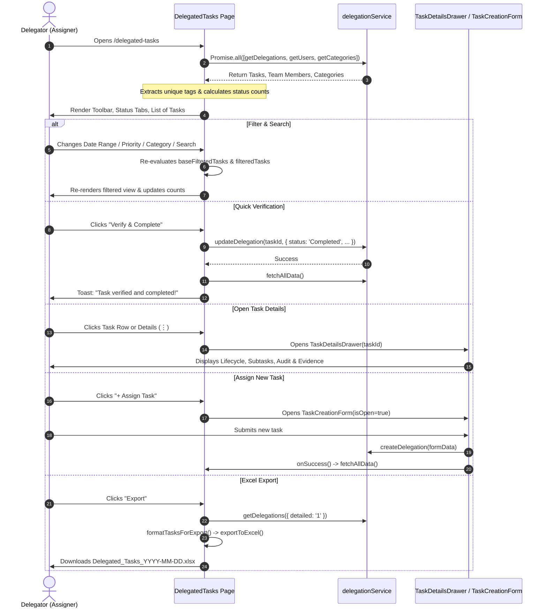

# Delegated Tasks Page — UI Documentation

> Source: [`DelegatedTasks.jsx`](file:///c:/Users/91995/Desktop/D-table_analytic/nia-infra-hide-pms-mm/nia-infra-hide-pms-mm/Frontend/src/pages/DelegatedTasks.jsx)

---

## Overview

The **Delegated Tasks** page is the management console for tasks that the logged-in user has assigned to team members (`t.assignerId === currentUserId`). It provides full lifecycle visibility over delegated work: from assignment to progress tracking, review, and final verification.

### Core Objectives
1. **Delegator Perspective**: Displays exclusively tasks delegated *by* the active user to other team members.
2. **Three Specialized Views**: Offers **List View**, **Kanban Board**, and **Calendar Schedule View**.
3. **Verification Workflow**: Dedicated highlight and one-click **"Verify & Complete"** action for tasks submitted by doers awaiting delegator approval.
4. **Deep Linking**: Supports URL parameter routing (`/delegated/:taskId` / `/tasks/:taskId`), automatically opening the task details drawer on mount.

---

## Page Layout (Top → Bottom)

```
┌────────────────────────────────────────────────────────────────────────────────────────────────────────┐
│  1. TOOLBAR                                                                                            │
│  [+ Assign Task] [Date Range ▾] [Start / End] [Filter (N) ▾] [Search tasks...  ] [↺] [⤓ Export] [𝄜 ⊞ 📅]│
├────────────────────────────────────────────────────────────────────────────────────────────────────────┤
│  2. STATUS TABS                                                                                        │
│     All — 24   ● Overdue — 3   ○ Pending — 8   ● In Progress — 6   ● Verification — 2   ● Completed — 5│
├────────────────────────────────────────────────────────────────────────────────────────────────────────┤
│  3. ACTIVE FILTER CHIPS                                                                                │
│     [Priority: Urgent ✕]  [Category: Operations ✕]  [Assigned To: Rahul ✕]  [Tag: Urgent ✕]            │
├────────────────────────────────────────────────────────────────────────────────────────────────────────┤
│  4. CONTENT AREA (One of 3 Selected View Modes)                                                        │
│                                                                                                        │
│    ├─ 4A. List View (Default)                                                                          │
│    │  ┌──────────────────────────────────────────────────────────────────────────────────────────────┐│
│    │  │ [☐] (Initials) Doer Name → Hierarchy  Task Title  [Status] [Frequency] [● Priority] Time  [⋮]││
│    │  │ └─ Expanded: Due Date · Category · Priority · Description Snippet · Tag Badges              ││
│    │  └──────────────────────────────────────────────────────────────────────────────────────────────┘│
│    │                                                                                                   │
│    ├─ 4B. Kanban Board View                                                                            │
│    │  ┌───────────────┐ ┌───────────────┐ ┌───────────────┐ ┌───────────────┐                          │
│    │  │  Pending (8)  │ │Need Revision(0│ │In Progress (6)│ │ Completed (5) │                          │
│    │  │  [Task Card]  │ │               │ │  [Task Card]  │ │  [Task Card]  │                          │
│    │  └───────────────┘ └───────────────┘ └───────────────┘ └───────────────┘                          │
│    │                                                                                                   │
│    └─ 4C. Calendar Schedule View                                                                       │
│       [< Today >]  [Day | Week | Month]  Apr 13 - Apr 19, 2026                                         │
│       [08:00 AM - 10:00 PM Time Grid with Scheduled Task Blocks]                                      │
├────────────────────────────────────────────────────────────────────────────────────────────────────────┤
│  5. OVERLAYS & DRAWERS                                                                                 │
│    ├─ TaskCreationForm Drawer  (Triggered by "+ Assign Task")                                          │
│    └─ TaskDetailsDrawer        (Triggered by Row Click, Card Click, or URL :taskId)                    │
└────────────────────────────────────────────────────────────────────────────────────────────────────────┘
```

---

## 1. Top Toolbar & Action Controls

The toolbar wraps responsively (`flex flex-wrap items-end gap-3 mb-8`), providing actionable tools in an ergonomic layout:

```
┌──────────────┐ ┌────────────┐ ┌────────────┐ ┌────────────┐ ┌────────────┐ ┌─────────────┐ ┌───┐ ┌──────────┐ ┌─────┐
│ + Assign Task│ │ Date Range │ │ Start Date │ │  End Date  │ │   Filter   │ │Search tasks │ │ ↺ │ │ ⤓ Export │ │𝄜 ⊞ 📅│
└──────────────┘ └────────────┘ └────────────┘ └────────────┘ └────────────┘ └─────────────┘ └───┘ └──────────┘ └─────┘
```

| Element | Component Type | Styling / Tokens | Behavior / Function |
|---------|---------------|------------------|---------------------|
| **Assign Task Button** | Button | `h-11 px-5 bg-[#1E4C92] hover:bg-[#163a6a] text-white rounded-lg font-bold shadow-sm active:scale-95` | Opens `TaskCreationForm` drawer (`showTaskDrawer = true`). Contains `CheckSquare` icon. |
| **Date Range Dropdown** | `<select>` | `h-11 bg-white border border-[#1E4C92] rounded-lg pl-3 pr-8 text-sm font-bold text-slate-700 shadow-sm` | Options: `All Time`, `Today`, `Yesterday`, `This Week`, `Last Week`, `This Month`, `Last Month`, `This Year`, `Custom`. Filter applied to `dueDate` or `createdAt`. |
| **Custom Start & End Dates** | Grouped Inputs | Two `h-11 bg-white border border-[#1E4C92] rounded-lg px-2.5 flex items-center` with `CalendarIcon` | Displayed only when `dateRange === 'Custom'`. Filters tasks falling between `[customStartDate, customEndDate 23:59:59]`. |
| **Filter Button & Flyout** | Toggle Popover | `h-11 px-5 rounded-lg font-bold text-sm bg-[#1E4C92]` (turns `bg-slate-800` when open). Includes count badge `bg-white text-[#1E4C92]` | Toggles a floating filter panel (`absolute top-[calc(100%+8px)] z-50 min-w-[240px] shadow-2xl bg-white rounded-xl border border-slate-200 p-4`). |
| **Search Input** | Text Field with `Search` icon | `h-11 pl-10 pr-4 bg-white border border-slate-200 rounded-lg text-sm font-bold outline-none focus:ring-2 focus:ring-emerald-500/20` | Real-time title search (`taskTitle.toLowerCase().includes(...)`). Max width `max-w-sm flex-1`. |
| **Clear Filters Button** | Icon Button | `h-11 w-11 bg-[#1E4C92] hover:bg-[#163a6a] text-white rounded-lg` with `RotateCcw` icon | Resets all filters (search, date range, custom dates, status, priority, category, assignee, tag, verification). |
| **Export Button** | Button | `h-11 px-4 bg-[#1E4C92] hover:bg-[#163a6a] text-white rounded-lg font-bold` with `FileUp` icon | Fetches detailed delegations via `delegationService.getDelegations({ detailed: '1' })`, merges with filtered set, formats columns, and downloads `Delegated_Tasks_YYYY-MM-DD.xlsx`. |
| **View Mode Switcher** | Segmented Pill Group | `h-11 bg-white rounded-lg p-1 border border-slate-200 flex items-center` | Switches active layout mode: `List` (`List` icon), `Kanban` (`Layout` icon), or `Calendar` (`Calendar` icon). Active button receives `bg-[#1E4C92] text-white shadow-sm`. |

---

### Filter Flyout Panel Details

When the **Filter** button is clicked, an animated popup card opens (`animate-in slide-in-from-top-2 duration-200`):

```
┌──────────────────────────────────────────────┐
│  FILTERS                         Clear All   │
├──────────────────────────────────────────────┤
│  ASSIGNED TO                                 │
│  [ All Members ▾ ]                           │
│                                              │
│  PRIORITY                                    │
│  [ All Priority / Urgent / High / Med / Low ]│
│                                              │
│  CATEGORY                                    │
│  [ All Categories / Operations / HR ... ]    │
│                                              │
│  TAG                                         │
│  [ All Tags / Client / Audit ... ]           │
│                                              │
│  VERIFICATION                                │
│  [ All Tasks / Verification Required / None ]│
└──────────────────────────────────────────────┘
```

- **Outside Click Dismissal**: Wrapped with `filterPanelRef`; auto-closes when clicking anywhere outside.
- **Badge Counter**: The main filter button displays a circular numerical badge indicating how many of `{ priority, category, assignedTo, tagFilter }` are active.

---

## 2. Status Tab Navigation Bar

A horizontal navigation strip centered below the toolbar (`border-b border-white/20 mb-8`):

```
┌───────────────────────────────────────────────────────────────────────────────────────────────────────┐
│  All — 24   ● Overdue — 3   ○ Pending — 8   ● In Progress — 6   ● Verification — 2   ● Completed — 5 │
│                             ═════════════ (Active Indicator: #1E4C92 bar)                             │
└───────────────────────────────────────────────────────────────────────────────────────────────────────┘
```

| Tab Key | Label | Dot Style | Derivation / Logic |
|---------|-------|-----------|--------------------|
| `All` | **ALL** | `bg-slate-400` | Count of all delegated tasks matching active filters (excluding status tab). |
| `Overdue` | **OVERDUE** | `bg-red-500` | **Dynamic calculation**: `dueDate` exists, not in `['Completed', 'Awaiting Verification']`, and `new Date(dueDate).getTime() < Date.now()`. |
| `Pending` | **PENDING** | `border-2 border-slate-400 bg-transparent` | Explicit status `t.status === 'Pending'`. |
| `In Progress` | **IN PROGRESS** | `bg-orange-500` | Explicit status `t.status === 'In Progress'`. |
| `Awaiting Verification` | **VERIFICATION** | `bg-blue-500` | Tasks submitted by the doer awaiting delegator review (`t.status === 'Awaiting Verification'`). |
| `Completed` | **COMPLETED** | `bg-emerald-500` | Explicit status `t.status === 'Completed'`. |

- **Active Tab State**: Active text turns `text-slate-800 font-bold`; underlined by a bottom indicator pill `h-1 bg-[#1E4C92] rounded-t-full`.
- **Pre-computed Counts**: Counts update live based on search and secondary filter criteria (`getStatusCount(key)`).

---

## 3. Active Filter Chips Bar

When any non-status filter is active (`activeFilterCount > 0`), removable pill chips appear above the content:

```
[Priority: Urgent  ✕]   [Category: Legal  ✕]   [Assigned To: Amit  ✕]   [Tag: Compliance  ✕]
```

- **Chip Anatomy**: `bg-white border border-[#1E4C92]/40 text-[#1E4C92] rounded-full text-[11px] font-bold px-3 py-1 flex items-center gap-1.5`.
- **Individual Dismissal**: Clicking the `X` icon removes only that specific filter without resetting others.

---

## 4. Content Views

### 4A. List View (Default)

#### Loading & Empty States
- **Loading**: Centered spinning ring (`w-12 h-12 border-4 border-[#1E4C92] border-t-transparent rounded-full animate-spin`) with caption `"Loading Tasks..."`.
- **Empty State**: Rounded dashed container (`bg-white/40 border-2 border-dashed border-white/60 rounded-3xl p-20`) featuring `CheckSquare` graphic, `"No Tasks Found"` heading, subtitle, and `"Clear Filters"` CTA.

#### Task Row Anatomy

```
┌────────────────────────────────────────────────────────────────────────────────────────────────────────┐
│ [☐] (AK)  Amit Kumar → Head Ops   Quarterly Tax Filing Audit   [AWAITING VERIF] [WEEKLY] ● Urgent  2h  │
│                                                                 [🛡️ Verify & Complete]           [⋮]   │
├────────────────────────────────────────────────────────────────────────────────────────────────────────┤
│  ▼ EXPANDED DETAILS ACCORDION                                                                          │
│  🕒 Due: 15 Apr 2026    👤 Amit Kumar    📁 Finance    🚩 Urgent                                      │
│  │ Please reconcile the Q4 invoices against GST portal filings...                                      │
│  [ 🏷️ TAX ] [ 🏷️ HIGH-PRIORITY ]                                                                      │
└────────────────────────────────────────────────────────────────────────────────────────────────────────┘
```

#### Row Header Elements (Left → Right):
1. **Selection Checkbox**: `w-5 h-5 rounded border-slate-300 accent-[#1E4C92]` (stops click propagation).
2. **Assignee Avatar**: Circular pill `w-10 h-10 rounded-full bg-[#1E4C92]/10 text-[#1E4C92] font-bold` with initials (`getInitials(first, last)`) and subtle cyan border `border-sky-400`.
3. **Assignee Info & Hierarchy**:
   - `task.doerFirstName task.doerLastName` (hidden on mobile, visible on `sm`).
   - `→ task.assigneeHierarchy` (e.g., `"Amit Kumar → Head Ops"`).
4. **Task Title**: `text-base font-black text-slate-800 truncate`.
5. **Status Badge**:
   - **Completed**: `bg-emerald-50 text-emerald-600 border-emerald-200`
   - **Awaiting Verification**: `bg-blue-50 text-blue-600 border-blue-200` (Row glows with `ring-2 ring-blue-500 shadow-[0_0_15px_rgba(59,130,246,0.2)] bg-blue-50/10`)
   - **In Progress**: `bg-orange-50 text-orange-600 border-orange-200`
   - **Overdue**: `bg-red-50 text-red-600 border-red-200`
   - **Pending / Other**: `bg-slate-50 text-slate-500 border-slate-200`
6. **Recurrence Badge**:
   - Recurring: `bg-purple-50 text-purple-600 border-purple-200` with `RotateCcw` icon and frequency name (e.g., `Daily`, `Weekly`).
   - One-off: `bg-slate-50 text-slate-400 border-slate-200` labeled `"One Time"`.
7. **Priority Indicator**: Colored dot + label (`● Urgent` in red, `● High` in orange, `● Medium` in blue, `● Low` in slate).
8. **Relative Timestamp**: `"Just now"`, `"${diff}h ago"`, or `"${diff}d ago"`.
9. **Quick Action — Verify & Complete**:
   - Only appears when `task.status === 'Awaiting Verification'`.
   - Button: `bg-emerald-500 hover:bg-emerald-600 text-white rounded-lg px-3 py-1.5 font-black uppercase text-[10px]`.
   - Action: Directly updates task status to `'Completed'` without opening drawer, showing `Loader2` during submit.
10. **Details Button (`⋮`)**: `MoreVertical` icon button opening `TaskDetailsDrawer`.

#### Expanded Accordion Details:
Clicking the row toggles the expanded drawer (`animate-in slide-in-from-top-2 duration-300`):
- **Metadata Badges**: Due date with `Clock` icon (red text), Assignee with `User` icon, Category with `Folder` icon, Priority with `Flag` icon.
- **Description Snippet**: Sanitized HTML (`sanitizeHtml`) with `line-clamp-2` and indigo left accent border `border-l-2 border-[#1E4C92]/30 pl-3`.
- **Colored Tags**: Rendered with dynamic background and border derived from `tagColor(tag)` and `Tag` icon.

---

### 4B. Kanban Board View

Rendered via [`TaskKanbanView.jsx`](file:///c:/Users/91995/Desktop/D-table_analytic/nia-infra-hide-pms-mm/nia-infra-hide-pms-mm/Frontend/src/components/delegation/TaskKanbanView.jsx).

```
┌─────────────────┐ ┌─────────────────┐ ┌─────────────────┐ ┌─────────────────┐
│ 🔴 PENDING  (8) │ │ 🔵 REVISION (0) │ │ 🟠 PROGRESS (6) │ │ 🟢 COMPLETED(5) │
├─────────────────┤ ├─────────────────┤ ├─────────────────┤ ├─────────────────┤
│ ┌─────────────┐ │ │                 │ │ ┌─────────────┐ │ │ ┌─────────────┐ │
│ │ Task Title  │ │ │                 │ │ │ Task Title  │ │ │ │ Task Title  │ │
│ │ Description │ │ │                 │ │ │ Description │ │ │ │ Description │ │
│ │ [Tags]      │ │ │                 │ │ │ [Tags]      │ │ │ │ [Tags]      │ │
│ │ (AK) Due Date││ │                 │ │ │ (SJ) Due Date││ │ │ (PS) Due Date││
│ └─────────────┘ │ │                 │ │ └─────────────┘ │ │ └─────────────┘ │
└─────────────────┘ └─────────────────┘ └─────────────────┘ └─────────────────┘
```

#### Kanban Columns:
1. **Pending**: `text-red-500`, `AlertCircle` icon.
2. **Need Revision**: `text-blue-500`, `History` icon.
3. **In Progress**: `text-orange-400`, `History` icon.
4. **Completed**: `text-emerald-500`, `CheckCircle2` icon.

#### Kanban Card Features:
- Card left border hover effect (`hover:border-l-[#5182c8] transition-all hover:shadow-md`).
- Priority pill in top right corner.
- HTML sanitized description preview (`prose prose-xs line-clamp-2`).
- Tag badges with inline hex color tinting (`${tag.color}10`).
- Footer with circular assignee avatar and formatted due date (`Calendar` icon).
- **Click Interaction**: Fires `onTaskClick(task)`, setting `selectedTaskId` and opening `TaskDetailsDrawer`.

---

### 4C. Calendar Schedule View

Rendered via [`TaskCalendarView.jsx`](file:///c:/Users/91995/Desktop/D-table_analytic/nia-infra-hide-pms-mm/nia-infra-hide-pms-mm/Frontend/src/components/delegation/TaskCalendarView.jsx).

```
┌────────────────────────────────────────────────────────────────────────┐
│  [ < ]  [ Today ]  [ > ]   Apr 13 - Apr 19, 2026    [ Day | Week | Month]│
├────────────────────────────────────────────────────────────────────────┤
│  TIME    │ MON 13  │ TUE 14  │ WED 15  │ THU 16  │ FRI 17  │ SAT 18  │...│
├──────────┼─────────┼─────────┼─────────┼─────────┼─────────┼─────────┤...│
│ 08:00 AM │         │ [Task]  │         │         │         │         │   │
│ 09:00 AM │ [Task]  │         │         │ [Task]  │         │         │   │
│ 10:00 AM │         │         │ [Task]  │         │         │         │   │
│ ...      │         │         │         │         │         │         │   │
│ 10:00 PM │         │         │         │         │         │         │   │
└────────────────────────────────────────────────────────────────────────┘
```

#### Calendar View Features:
- **View Type Switching**: Seamless toggle between `Day`, `Week`, and `Month` views.
- **Date Navigation**: Previous/Next chevron controls and `"Today"` quick reset.
- **Week Date Range Header**: Displays e.g., `"Apr 13 - Apr 19, 2026"`.
- **Hourly Timeline Grid**: Displays scheduled items from `08:00 AM` to `10:00 PM`.
- **Today Column Highlight**: Visual indicator highlighting the current day's column.
- **Click Interaction**: Clicking any task block opens `TaskDetailsDrawer`.

---

## 5. Overlays & Drawers Ecosystem

The page integrates two high-powered slide-over drawers:

| Component | Trigger | Purpose / Key Features |
|-----------|---------|------------------------|
| [`TaskCreationForm`](file:///c:/Users/91995/Desktop/D-table_analytic/nia-infra-hide-pms-mm/nia-infra-hide-pms-mm/Frontend/src/components/delegation/TaskCreationForm.jsx) | `+ Assign Task` button in top toolbar | Comprehensive task creation drawer: <br>• **Title & Description**: Rich text formatting, speech-to-text / voice recording, file upload.<br>• **Doer Assignment**: Multi-assignee support, recent assignee suggestions, user search.<br>• **In-Loop Stakeholders**: Cc / loop notifications for collaborators.<br>• **Category Management**: Category dropdown with inline color palette picker modal (`categoryColors`).<br>• **Priority Picker**: Low, Medium, High, Urgent.<br>• **Scheduling & Recurrence**: Date picker, due date, start/end dates, daily/weekly/monthly cadence.<br>• **Verification & Proof Flags**: `evidenceRequired` and `verificationRequired` toggles. |
| [`TaskDetailsDrawer`](file:///c:/Users/91995/Desktop/D-table_analytic/nia-infra-hide-pms-mm/nia-infra-hide-pms-mm/Frontend/src/components/delegation/TaskDetailsDrawer.jsx) | Row click, `⋮` button, Kanban card click, or URL `:taskId` | Full-screen detail & lifecycle management drawer: <br>• **Task Lifecycle Stepper**: Progress flow tracker (`TaskLifecyclePanel`).<br>• **Subtasks System**: Subtask completion, inline addition, progress bar.<br>• **Verification Action**: Full delegator review modal (`VerificationSubmitModal`).<br>• **Remarks & Audit Trail**: Threaded conversation history with voice note playback and document attachments.<br>• **Dependencies**: `BlockedByModal` and `MarkDependentModal`.<br>• **Schedule Management**: `ReviseDateModal` and `TaskRemindersModal`.<br>• **Follow-Up System**: `FollowUpModal` with logging. |

---

## 6. User Interactions & Event Handling



---

## 7. Design System Tokens & Color Palette

### Primary Color Tokens
| Token / Hex | Purpose | UI Elements |
|-------------|---------|-------------|
| `#1E4C92` | **Brand Deep Navy** | "Assign Task" button, date dropdown border, filter flyout, search focus, active view mode button, active status tab bar, selection checkboxes. |
| `#163a6a` | **Navy Hover Shade** | Button hover states (`hover:bg-[#163a6a]`). |
| `--bg-primary` | Base Background | Page background wrapper (`min-h-screen bg-(--bg-primary)`). |

### Status Colors & Indicators
| State | Badge BG | Badge Text | Badge Border | Visual Accent / Dot |
|-------|----------|------------|--------------|---------------------|
| **Overdue** | `bg-red-50` | `text-red-600` | `border-red-200` | `bg-red-500` dot |
| **Pending** | `bg-slate-50` | `text-slate-500` | `border-slate-200` | `border-2 border-slate-400` open dot |
| **In Progress**| `bg-orange-50`| `text-orange-600` | `border-orange-200` | `bg-orange-500` dot |
| **Awaiting Verification** | `bg-blue-50` | `text-blue-600` | `border-blue-200` | `bg-blue-500` dot + row pulse glow `shadow-[0_0_15px_rgba(59,130,246,0.2)]` |
| **Completed** | `bg-emerald-50` | `text-emerald-600` | `border-emerald-200` | `bg-emerald-500` dot |

### Priority Colors
- **Urgent**: `text-red-500`
- **High**: `text-orange-500`
- **Medium**: `text-blue-500`
- **Low**: `text-slate-400`

---

## 8. Responsive Behavior

| Screen Size | Breakpoint | Layout Adjustments |
|-------------|------------|--------------------|
| **Desktop** | `≥ 1024px` | Full multi-column toolbar, uncollapsed assignee hierarchy path (`sm:block`), expanded badge strip (`md:inline-flex`), full Kanban columns side-by-side. |
| **Tablet** | `768px - 1023px` | Status badges and recurrence pills remain visible; priority text condenses; search input shrinks to accommodate action buttons; Kanban horizontally scrolls (`overflow-x-auto`). |
| **Mobile** | `< 768px` | Toolbar controls wrap onto multiple rows; assignee name hides hierarchy prefix; status tab bar enables smooth horizontal swiping (`overflow-x-auto`); List view expands cleanly with responsive tap targets. |

---

## 9. Key Differences: Delegated Tasks vs. My Tasks / Checklist

| Aspect | Delegated Tasks (`DelegatedTasks.jsx`) | My Tasks / In-Loop Tasks | Checklist (`Checklist.jsx`) |
|--------|---------------------------------------|--------------------------|-----------------------------|
| **Perspective** | Tasks assigned **BY** current user (`assignerId === me`). | Tasks assigned **TO** current user (`doerId === me`). | Compliance routines generated on cadence for location/dept. |
| **Primary CTA** | **Assign Task** (delegate to others). | **Create Personal Task** or Submit. | **New Checklist Routine** (Admin). |
| **Key Action** | **Verify & Complete** (audit doer work). | **Submit for Verification** or Complete. | **Mark Routine Occurrences Done** + Evidence. |
| **Views** | List, Kanban Board, Calendar. | List, Kanban. | Tasks Table, Routines Table, Department Scoreboard. |
| **Export** | Full delegation export with doer breakdown. | Simple task list export. | Routine compliance audit sheets. |
