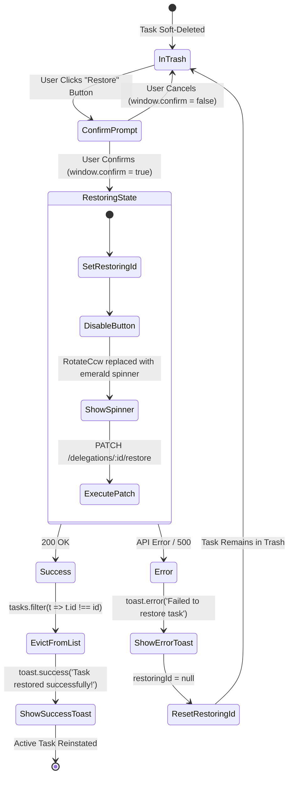

# Deleted Tasks ("Trash Bin") Page — UI Documentation

> Source: [`DeletedTasks.jsx`](file:///c:/Users/91995/Desktop/D-table_analytic/nia-infra-hide-pms-mm/nia-infra-hide-pms-mm/Frontend/src/pages/DeletedTasks.jsx)  
> Component: `DeletedTasks`  
> Primary Route: `/deleted-tasks`  
> Local Documentation: [`Frontend/src/pages/DeletedTasks.md`](file:///c:/Users/91995/Desktop/D-table_analytic/nia-infra-hide-pms-mm/nia-infra-hide-pms-mm/Frontend/src/pages/DeletedTasks.md)  
> Sidebar Entry: `SecondarySidebar.jsx` → `Deleted Tasks` (`Trash2` icon)  
> Access Restriction: **ADMIN / SUPERADMIN Role Only**

---

## Overview

The **Deleted Tasks** page (`DeletedTasks.jsx`) functions as the enterprise soft-delete archive and audit recovery workbench for delegations and tasks within the PMS/IMS platform. When tasks are removed anywhere in the system, they are soft-deleted and redirected to this centralized administrative trash repository rather than permanently purged from the database.

This interface provides platform administrators with forensic visibility into when tasks were deleted, who executed the deletion, the original assigner/doer hierarchy, and offers a fail-safe, one-click restoration mechanism to reinstate tasks to active workflows.

### Role-Based Access Scoping

| User Role | Access Level | UI Behavior |
|---|---|---|
| **ADMIN / SUPERADMIN** | **Full Audit & Restoration Authority** | Unrestricted access to inspect, search, filter, and restore any soft-deleted task across the entire enterprise database. |
| **Standard User / Employee** | **Access Denied (Gated)** | Blocked by a dedicated security screen displaying a centered warning card (`Shield` icon: *"ADMIN Only — You need administrator access to view the deleted tasks bin"*). |

### Core Objectives & Functional Highlights

1. **Enterprise Soft-Delete Audit Trail**:
   - Captures and displays comprehensive audit metadata including `deletedAt` timestamps and deletion author identity (`deletedByFirstName`, `deletedByLastName`).
   - Retains original task context: title, description, doer initials, assigner name, category, priority, and original due date.
2. **One-Click Restoration Workflow**:
   - Each card provides a prominent `"Restore"` action backed by browser confirmation (`window.confirm`) to prevent accidental reinstatements.
   - Executes `delegationService.restoreDelegation(id)` (`PATCH /delegations/:id/restore`) with optimistic local state eviction and success toast feedback.
3. **Multi-Criteria Filter Engine**:
   - **Date Range Selector**: Presets for *All Time*, *Today*, *Yesterday*, *This Week*, *Next Week*, *This Month*, *Next Month*, and *Custom* date pickers (evaluated against `deletedAt` or `createdAt`).
   - **Popover Filter Panel**: Independent dropdown filtering by **Assigned By**, **Priority**, **Category**, and **Tag**.
   - **Live Substring Search**: Real-time filtering against `taskTitle` and `description`.
4. **Status Navigation Ribbon**:
   - Segmented count tabs displaying totals for **All**, **OverDue**, **Pending**, **In Progress**, and **Completed**.
   - Overdue items are automatically computed if `status !== 'Completed'` and `dueDate < now`.
5. **Multi-Column Sorting**:
   - Dynamic sorting across **Deleted At** (default), **Due Date**, **Created At**, and **Title**.
   - Instant Ascending/Descending direction toggle with animated `ArrowUpDown` rotation.

---

## Page Layout & Component Hierarchy

```
┌────────────────────────────────────────────────────────────────────────────────────────────────────────┐
│  1. ACCESS CONTROL GUARD (If Not Admin)                                                                │
│     ┌────────────────────────────────────────────────────────────┐                                     │
│     │                      [ 🛡️ ] (Red Shield)                   │                                     │
│     │                      ADMIN Only                            │                                     │
│     │  You need administrator access to view the deleted tasks...│                                     │
│     └────────────────────────────────────────────────────────────┘                                     │
├────────────────────────────────────────────────────────────────────────────────────────────────────────┤
│  2. HEADER & REFRESH ACTION                                                                            │
│     [ 🗑️ ] Deleted Tasks                                                                 [ ↺ Refresh ] │
│            ADMIN View — Trash Bin                                                                      │
├────────────────────────────────────────────────────────────────────────────────────────────────────────┤
│  3. TOOLBAR & MULTI-FACTOR FILTER CONTROLS                                                             │
│     [ Date Range ▾ ] [ Start / End ] [ ⊶ Filter (N) ] [ 🔍 Search deleted tasks... ] [↺] [ Sort ▾ ] [⇅] │
│     ───────────────────────────────────────────────────────────────────────────────────────────────    │
│     ▼ Popover Filter Panel:                                                                            │
│       [ Assigned By ▾ ] [ Priority ▾ ] [ Category ▾ ] [ Tag ▾ ]                                        │
├────────────────────────────────────────────────────────────────────────────────────────────────────────┤
│  4. ACTIVE FILTER CHIPS                                                                                │
│     [ Priority: High ✕ ]   [ Category: MEP ✕ ]   [ Assigned By: Amit Kumar ✕ ]   [ Tag: Safety ✕ ]     │
├────────────────────────────────────────────────────────────────────────────────────────────────────────┤
│  5. STATUS NAVIGATION TABS                                                                             │
│     ALL — 24   ● OVERDUE — 3   ○ PENDING — 7   ● IN PROGRESS — 8   ● COMPLETED — 6                     │
│                                                ═════════════════ (Active Indicator: Red #EF4444 Bar)   │
├────────────────────────────────────────────────────────────────────────────────────────────────────────┤
│  6. CONTENT AREA (Loading / Empty State / Deleted Task Cards)                                          │
│                                                                                                        │
│    ┌──────────────────────────────────────────────────────────────────────────────────────────────────┐│
│    │ (RS)  Rahul Sharma   MEP LEAD                                           Deleted 14 Sep 2026     ││
│    │       HVAC Duct Pressure Test - Tower B                                                          ││
│    │       Assigned By: Amit Kumar · 🕒 18 Sep 2026 · [IN PROGRESS] · 🚩 High · 🗑️ Deleted by Admin   ││
│    │                                                                          [ ↺ Restore ]           ││
│    └──────────────────────────────────────────────────────────────────────────────────────────────────┘│
└────────────────────────────────────────────────────────────────────────────────────────────────────────┘
```

---

## 1. Access Control Guard (Admin-Only Authorization)

Before rendering any task data or UI controls, `DeletedTasks` evaluates the role of the authenticated user stored in `localStorage`:

```javascript
const storedUser  = JSON.parse(localStorage.getItem('user') || '{}');
const currentUser = storedUser?.user || storedUser;
const isAdmin     = ['ADMIN', 'SUPERADMIN'].includes(currentUser?.role?.toUpperCase());
```

### Unauthorized State (Non-Admin View)

If `isAdmin === false`, the page immediately halts and displays an access denial splash screen:

```
┌──────────────────────────────────────────────────────────┐
│                                                          │
│                      [ 🛡️ ]                              │
│                    ADMIN Only                            │
│   You need administrator access to view the deleted      │
│   tasks bin.                                             │
│                                                          │
└──────────────────────────────────────────────────────────┘
```

- **Container**: `min-h-screen bg-(--bg-primary) flex items-center justify-center`
- **Card**: `text-center p-12 bg-white rounded-3xl shadow-sm border border-slate-100 max-w-sm`
- **Icon**: `w-20 h-20 rounded-full bg-red-50 flex items-center justify-center mx-auto mb-5` housing `<Shield size={36} className="text-red-400" />`
- **Heading**: `text-xl font-black text-slate-800 mb-2` (`ADMIN Only`)
- **Body Text**: `text-slate-400 text-sm font-medium`

---

## 2. Page Header & Synchronization

When accessed by an authorized administrator, the header renders at the top with a distinctive crimson theme:

```
┌──────────────────────────────────────────────────────────────────────────────┐
│ [ 🗑️ ] Deleted Tasks                                         [ ↺ Refresh ]   │
│        ADMIN View — Trash Bin                                                │
└──────────────────────────────────────────────────────────────────────────────┘
```

### UI Elements & Specifications

| Element | Visual Styling & Classes | Behavior / Interaction |
|---|---|---|
| **Icon Badge** | `w-10 h-10 bg-red-500 rounded-xl flex items-center justify-center shadow-lg shadow-red-500/30` | Displays `<Trash2 size={22} className="text-white" strokeWidth={2.5} />` |
| **Page Title** | `text-2xl font-black text-slate-800 leading-none` | Static title `"Deleted Tasks"` |
| **Admin Subtitle** | `text-xs font-bold text-slate-400 mt-0.5` | Static role indicator `"ADMIN View — Trash Bin"` |
| **Refresh Button** | `flex items-center gap-2 px-4 py-2.5 bg-red-500 hover:bg-red-600 text-white rounded-xl font-bold text-sm transition shadow-sm` | Invokes `fetchAllData()` to reload tasks, users, and categories concurrently via `Promise.all` |

---

## 3. Toolbar & Multi-Factor Filtering Controls

The toolbar wraps responsively (`flex flex-wrap items-end gap-3 mb-6`) matching the ergonomic layout of primary work pages:

```
┌────────────────────────────────────────────────────────────────────────────────────────────────────────┐
│ [ Date Range ▾ ] [ Start / End ] [ ⊶ Filter (N) ] [ 🔍 Search deleted tasks... ] [↺] [ Sort ▾ ] [⇅]   │
└────────────────────────────────────────────────────────────────────────────────────────────────────────┘
```

### 3.1 Date Range Preset Selector

A specialized dropdown styled with a distinctive crimson border (`border-red-400`) to highlight trash lifecycle filtering:

- **Label**: `text-[10px] font-black text-slate-400 uppercase tracking-widest ml-1` (`Date Range`)
- **Select Container**: `w-full h-11 bg-white border border-red-400 rounded-lg pl-3 pr-8 text-sm font-bold text-slate-700 outline-none appearance-none cursor-pointer shadow-sm`
- **Supported Options**:
  - `All Time` (Default)
  - `Today`
  - `Yesterday`
  - `This Week`
  - `Next Week`
  - `This Month`
  - `Next Month`
  - `Custom`
- **Filter Evaluation**: Evaluated against `task.deletedAt || task.createdAt`.

### 3.2 Custom Date Range Pickers

Conditionally revealed inline whenever `dateRange === 'Custom'`:

- **Start Date Input**:
  - Container: `relative border border-red-400 rounded-lg h-11 flex items-center px-2.5 gap-1.5 bg-white min-w-[130px]`
  - Icon: `<CalendarIcon size={14} className="text-red-500 shrink-0" />`
  - Sub-label: `text-[8px] font-bold text-slate-400 leading-none` (`Start`)
  - Input: `<input type="date" value={customStartDate} />`
- **End Date Input**:
  - Identical container and styling for `customEndDate` (`End`)
- **Timestamp Boundary**: Filters records from `customStartDate 00:00:00` through `customEndDate 23:59:59`.

### 3.3 Popover Filter Button & Panel

A drop-down panel for advanced secondary criteria with outside-click dismissal:

```
┌──────────────────────────────────────┐
│ FILTERS                    Clear All │
│                                      │
│ ASSIGNED BY                          │
│ [ Anyone                           ▾]│
│                                      │
│ PRIORITY                             │
│ [ All Priority                     ▾]│
│                                      │
│ CATEGORY                             │
│ [ All Categories                   ▾]│
│                                      │
│ TAG                                  │
│ [ All Tags                         ▾]│
└──────────────────────────────────────┘
```

- **Trigger Button**:
  - Inactive: `bg-red-500 hover:bg-red-600 text-white`
  - Active/Open: `bg-slate-800 text-white`
  - Badge Indicator: If `activeFilterCount > 0`, renders a circular white pill badge (`bg-white text-red-500 text-[10px] font-black rounded-full w-5 h-5 flex items-center justify-center`) displaying active filter count.
- **Popover Panel Architecture**:
  - Positioned `absolute top-[calc(100%+8px)] left-0 z-50`
  - Styling: `bg-white border border-slate-200 rounded-xl shadow-2xl p-4 flex flex-col gap-4 min-w-[240px]`
  - Outside Click Handler: Managed via `filterPanelRef` document listener.
- **Filter Fields**:
  1. **Assigned By**: Populated dynamically from `teamService.getUsers()` (`Anyone` or specific user name).
  2. **Priority**: Select from `All`, `Urgent`, `High`, `Medium`, `Low`.
  3. **Category**: Populated dynamically from `delegationService.getCategories()`.
  4. **Tag**: Populated from dynamically extracted unique tag tokens in `allTags`.
  5. **Clear All**: Reset link in panel header.

### 3.4 Search Input

- **Container**: `relative flex-1 max-w-sm flex flex-col gap-1`
- **Left Icon**: `<Search size={18} className="absolute left-3 top-1/2 -translate-y-1/2 text-slate-400" />`
- **Input Field**: `w-full h-11 pl-10 pr-10 bg-white border border-slate-200 rounded-lg text-sm font-bold outline-none focus:ring-2 focus:ring-red-400/20 focus:border-red-300`
- **Placeholder**: `"Search deleted tasks..."`
- **Clear Button**: Right-aligned `<X size={14} />` icon button appears when search text is non-empty.
- **Matching Behavior**: Case-insensitive substring match across `taskTitle` and `description`.

### 3.5 Reset / Clear All Filters Button

- **Button**: `h-11 w-11 flex items-center justify-center bg-red-500 text-white rounded-lg hover:bg-red-600 transition-all shadow-sm`
- **Icon**: `<RotateCcw size={18} strokeWidth={3} />`
- **Action**: Resets `search`, `dateRange`, `customStartDate`, `customEndDate`, `statusFilter`, `priority`, `category`, `assignedBy`, and `tagFilter`.

### 3.6 Sorting Controls

- **Sort Metric Dropdown**:
  - Container: `relative min-w-[140px]`
  - Select: `w-full h-11 bg-white border border-slate-200 rounded-lg pl-3 pr-8 text-sm font-bold text-slate-700 outline-none appearance-none cursor-pointer shadow-sm focus:border-red-400`
  - Sort Fields:
    - `Deleted At` (Default — chronological deletion order)
    - `Due Date` (Deadline order)
    - `Created At` (Original creation date)
    - `Title` (Alphabetical order)
- **Direction Toggle Button**:
  - Container: `h-11 w-11 flex justify-center items-center bg-white border border-slate-200 rounded-lg text-slate-500 hover:text-slate-800 transition-colors shadow-sm`
  - Icon: `<ArrowUpDown size={18} className={sortDesc ? '' : 'rotate-180 transform transition-transform'} />`
  - Action: Toggles between descending (`sortDesc = true`) and ascending (`sortDesc = false`).

---

## 4. Active Filter Chips

When any popover filter is actively applied (`activeFilterCount > 0`), a row of dismissible chip pills appears below the toolbar:

```
┌────────────────────────────────────────────────────────────────────────────────────────┐
│ [ Priority: High ✕ ]   [ Category: MEP ✕ ]   [ Assigned By: Amit ✕ ]   [ Tag: Fire ✕ ] │
└────────────────────────────────────────────────────────────────────────────────────────┘
```

- **Chip Component**:
  ```jsx
  const FilterChip = ({ label, onRemove }) => (
      <div className="flex items-center gap-1.5 px-3 py-1 bg-white border border-[#1E4C92]/40 text-[#1E4C92] rounded-full text-[11px] font-bold">
          {label}
          <button onClick={onRemove} className="hover:text-red-500 transition-colors ml-0.5">
              <X size={12} strokeWidth={3} />
          </button>
      </div>
  );
  ```
- **Dismissal**: Clicking `✕` resets only that individual parameter back to `'All'`.

---

## 5. Status Navigation Tabs

A centered status ribbon categorizes the deleted tasks by their operational lifecycle state:

```
┌──────────────────────────────────────────────────────────────────────────────────────────────┐
│    ALL — 24   ● OVERDUE — 3   ○ PENDING — 7   ● IN PROGRESS — 8   ● COMPLETED — 6            │
│                               ═════════════════ (Active Tab Indicator: Red Bar)              │
└──────────────────────────────────────────────────────────────────────────────────────────────┘
```

### Tab Configuration & Styling

| Tab Key | Label Display | Dot Indicator Styling | Active Indicator |
|---|---|---|---|
| `All` | `ALL — {count}` | `w-3 h-3 rounded-full bg-slate-400` | Red bottom accent bar (`h-1 bg-red-500 rounded-t-full`) |
| `OverDue` | `OVERDUE — {count}` | `w-3 h-3 rounded-full bg-red-500` | Red bottom accent bar (`h-1 bg-red-500 rounded-t-full`) |
| `Pending` | `PENDING — {count}` | `w-3 h-3 rounded-full border-2 border-slate-400 bg-transparent` | Red bottom accent bar (`h-1 bg-red-500 rounded-t-full`) |
| `In Progress` | `IN PROGRESS — {count}` | `w-3 h-3 rounded-full bg-orange-500` | Red bottom accent bar (`h-1 bg-red-500 rounded-t-full`) |
| `Completed` | `COMPLETED — {count}` | `w-3 h-3 rounded-full bg-emerald-500` | Red bottom accent bar (`h-1 bg-red-500 rounded-t-full`) |

### Overdue Evaluation Logic

```javascript
const isOverdue = (t) => t.status !== 'Completed' && t.dueDate && new Date(t.dueDate) < new Date();
const getStatus = (t) => isOverdue(t) ? 'OverDue' : t.status;
```

---

## 6. Content Area & Card Architecture

The main content container (`space-y-3 pb-20`) renders one of three states: **Loading**, **Empty Trash**, or the **Deleted Task Card Stream**.

### 6.1 Loading State

```
┌──────────────────────────────────────────────┐
│                    ◯ (Spinning Red Loader)   │
│         LOADING DELETED TASKS...             │
└──────────────────────────────────────────────┘
```

- **Spinner**: `w-12 h-12 border-4 border-red-400 border-t-transparent rounded-full animate-spin`
- **Label**: `text-sm font-bold text-slate-500 uppercase tracking-widest`

### 6.2 Empty State ("Trash Is Empty")

```
┌────────────────────────────────────────────────────────────┐
│                                                            │
│                      [ 🗑️ ]                                │
│                  Trash Is Empty                            │
│           No deleted tasks match your filters              │
│                                                            │
│                 [ Clear Filters ]                          │
└────────────────────────────────────────────────────────────┘
```

- **Container**: `bg-white border-2 border-dashed border-slate-200 rounded-3xl p-20 flex flex-col items-center justify-center text-center`
- **Icon Circle**: `w-20 h-20 bg-slate-50 rounded-full flex items-center justify-center mb-5` with `<Trash2 size={32} className="text-slate-300" />`
- **Heading**: `text-lg font-black text-slate-700` (`Trash Is Empty`)
- **Subtitle**:
  - Filtered: *"No deleted tasks match your filters"*
  - Natural: *"No deleted tasks found"*
- **Action**: Optional `"Clear Filters"` button (`px-4 py-2 bg-red-500 text-white rounded-lg text-sm font-bold hover:bg-red-600 transition-all`) shown if filters are currently restricting results.

### 6.3 Deleted Task Card Architecture

Each deleted task record is rendered in an information-dense, interactive horizontal card:

```
┌──────────────────────────────────────────────────────────────────────────────────────────────────────────────────┐
│ ┌──────┐  Rahul Sharma  •  MEP LEAD                                                          Deleted 14 Sep 2026 │
│ │  RS  │  HVAC Duct Pressure Test - Tower B                                                                      │
│ └──────┘  Assigned By Amit Kumar · 🕒 18 Sep 2026 · [● IN PROGRESS] · [🚩 High] · 🗑️ Deleted by Admin            │
│                                                                                           [ ↺ Restore ]          │
└──────────────────────────────────────────────────────────────────────────────────────────────────────────────────┘
```

#### Anatomical Breakdown

```
Card Container (bg-white rounded-xl border border-slate-100 p-4 shadow-sm hover:shadow-md)
│
├── [1] Doer Initials Avatar (40x40px gradient circle from-rose-400 to-red-500)
│
├── [2] Task Content Column (flex-1 min-w-0)
│   ├── [2.1] Header Line:
│   │   ├── Doer Full Name (font-black text-slate-700 text-sm)
│   │   ├── Category Tag (uppercase text-[10px] tracking-widest text-slate-400)
│   │   └── Deletion Timestamp (text-[11px] font-bold text-red-400 ml-auto: "Deleted {fmt(task.deletedAt)}")
│   │
│   ├── [2.2] Title Line:
│   │   └── Task Title (text-base font-black text-slate-800 truncate mb-2)
│   │
│   └── [2.3] Metadata Pill Line:
│       ├── Assigner Indicator ("Assigned By {task.assignerFirstName} {task.assignerLastName}")
│       ├── Due Date & Overdue Badge (Clock icon + formatted date; red "| Overdue" if overdue)
│       ├── Status Badge (Color-coded pill + status dot)
│       ├── Priority Badge (Flag icon + priority name)
│       └── Deletion Author Audit ("Deleted by {task.deletedByFirstName} {task.deletedByLastName}")
│
└── [3] Action Column (shrink-0)
    └── Restore Button (border-2 border-slate-200 hover:border-emerald-400 hover:text-emerald-600 hover:bg-emerald-50)
```

---

## 7. Restoration Flow & State Machine

Restoring a task revives it from soft-deleted status and immediately returns it to active surveillance across `AllTasks.jsx`, `MyDay.jsx`, and `DelegatedTasks.jsx`.



### Step-by-Step Restoration Logic

```javascript
const handleRestore = async (id) => {
    if (!window.confirm('Restore this task? It will become active again.')) return;
    try {
        setRestoringId(id);
        await delegationService.restoreDelegation(id);
        toast.success('Task restored successfully!');
        setTasks(prev => prev.filter(t => t.id !== id));
    } catch {
        toast.error('Failed to restore task');
    } finally {
        setRestoringId(null);
    }
};
```

1. **Confirmation Prompt**: Native browser modal prompts `"Restore this task? It will become active again."`.
2. **In-Flight Visual Feedback**:
   - `restoringId` is set to the active task's `id`.
   - Restore button is disabled (`disabled:opacity-50`).
   - The `<RotateCcw />` icon is replaced with a spinning emerald loader (`w-4 h-4 border-2 border-emerald-500 border-t-transparent rounded-full animate-spin`).
3. **Optimistic Local Eviction**: Upon successful API response, the item is removed from the local `tasks` array immediately without needing a full page reload.
4. **Toast Notification**: Triggers `react-hot-toast` banner confirmation.

---

## 8. Visual Tokens, Color Palette & Badges

### 8.1 Status Color Token Matrix (`STATUS_MAP`)

| Status | Dot Styling | Text Color | Background | Border |
|---|---|---|---|---|
| **OverDue** | `bg-red-500` | `text-red-500` | `bg-red-50` | `border-red-200` |
| **Pending** | `border-2 border-slate-400 bg-transparent` | `text-slate-500` | `bg-slate-50` | `border-slate-200` |
| **In Progress** | `bg-orange-500` | `text-orange-600` | `bg-orange-50` | `border-orange-200` |
| **Completed** | `bg-emerald-500` | `text-emerald-600` | `bg-emerald-50` | `border-emerald-200` |

### 8.2 Priority Color Token Matrix (`PRIORITY_COLORS`)

| Priority | Dot / Icon Color | Text Color | Background | Border |
|---|---|---|---|---|
| **Urgent** | `bg-red-500` | `text-red-500` | `bg-red-50` | `border-red-200` |
| **High** | `bg-orange-500` | `text-orange-500` | `bg-orange-50` | `border-orange-200` |
| **Medium** | `bg-amber-500` | `text-amber-600` | `bg-amber-50` | `border-amber-200` |
| **Low** | `bg-emerald-500` | `text-emerald-600` | `bg-emerald-50` | `border-emerald-200` |

### 8.3 Crimson Theming Palette

As an administrative recovery trash bin, `DeletedTasks` adopts an authoritative red accent theme across primary controls:

| Element | Color / Classes | Purpose |
|---|---|---|
| **Header Icon Badge** | `bg-red-500 shadow-red-500/30` | Trash bin visual theme |
| **Primary Action Buttons** | `bg-red-500 hover:bg-red-600 text-white` | Refresh, Filter, Clear, and Action CTAs |
| **Date Range Borders** | `border-red-400` | Distinguishes trash lifecycle filters |
| **Active Tab Line** | `bg-red-500` | Bottom indicator on selected status tab |
| **Deleted Timestamp** | `text-red-400 font-bold` | Prominently highlights deletion time |
| **Doer Initials Avatar** | `from-rose-400 to-red-500` | Warm red gradient for doer avatar |
| **Restore Hover** | `hover:border-emerald-400 hover:text-emerald-600 hover:bg-emerald-50` | Hopeful green affirmation on recovery |

---

## 9. Data Model & API Contracts

### 9.1 Deleted Task Object Schema

Each item in the `tasks` array contains the following schema:

```typescript
interface DeletedTask {
    id: string | number;
    taskTitle: string;
    description?: string;
    category?: string;
    priority: 'Urgent' | 'High' | 'Medium' | 'Low';
    status: 'Pending' | 'In Progress' | 'Completed' | 'OverDue';
    dueDate?: string;            // ISO Date string
    createdAt: string;          // ISO Date string
    deletedAt?: string;          // ISO Date string (time of deletion)
    
    // Assignee / Doer details
    doerId: string | number;
    doerFirstName: string;
    doerLastName: string;
    
    // Assigner details
    assignerId: string | number;
    assignerFirstName: string;
    assignerLastName: string;
    
    // Deletion audit details
    deletedById?: string | number;
    deletedByFirstName?: string;
    deletedByLastName?: string;
    
    // Dynamic metadata
    tags?: string | Array<{ text: string; [key: string]: any }>;
}
```

### 9.2 API Service Endpoints

| Operation | Service Method | HTTP Method & Route | Payload / Query |
|---|---|---|---|
| **Fetch Deleted Tasks** | `delegationService.getDeletedDelegations` | `GET /delegations/deleted` | Optional filter query params |
| **Restore Task** | `delegationService.restoreDelegation` | `PATCH /delegations/:id/restore` | Task ID in URL parameter |
| **Fetch Team Users** | `teamService.getUsers` | `GET /users` | User list for assigner mapping |
| **Fetch Categories** | `delegationService.getCategories` | `GET /categories` | Category lookup list |

---

## 10. Responsive Design & Accessibility

- **Desktop (`lg:p-8`)**: Displays full multi-column toolbar, active filter chips, centered status tab bar, and expansive horizontal task cards with right-aligned restore CTAs.
- **Tablet / Mobile (`p-6`)**: Toolbar controls wrap cleanly into multiple stacked rows. Date pickers and dropdowns maintain touch-friendly heights (`h-11`).
- **Touch Targets**: All buttons (`h-11`, restore button `px-4 py-2.5`, filter pills) exceed the standard 44px minimum touch target size.
- **Keyboard & Screen Reader Safety**: Form inputs include clear uppercase metadata labels (`Date Range`, `Assigned By`, `Priority`, `Category`, `Tag`). Clear buttons have explicit title tooltips (`title="Clear Filters"`).
