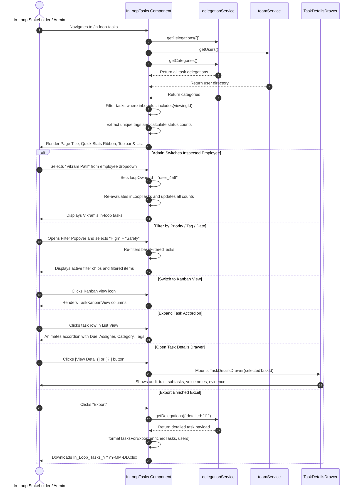

# Loop Tasks ("In-Loop") Page — UI Documentation

> Source: [`InLoopTasks.jsx`](file:///c:/Users/91995/Desktop/D-table_analytic/nia-infra-hide-pms-mm/nia-infra-hide-pms-mm/Frontend/src/pages/InLoopTasks.jsx)  
> Component: `InLoopTasks`  
> Primary Route: `/in-loop-tasks`  
> Deep Linking Route: `/in-loop-tasks/:taskId`  
> Sidebar Entry: `SecondarySidebar.jsx` → `Loop Tasks` (`CheckCircle2` icon)

---

## Overview

The **Loop Tasks** page (`InLoopTasks.jsx`) is the specialized surveillance and followup workbench for tasks on which the user has been tagged as an **"In-Loop" stakeholder** (i.e. where the user ID is present in `task.inLoopIds`).

Unlike direct doers (who execute work on `MyDay.jsx`) or delegators (who assign work on `DelegatedTasks.jsx`), users on this screen act as **observers, auditors, supervisors, or cross-functional collaborators** who need real-time progress visibility, audit trails, and review capability without being the primary assignee.

### Core Objectives & Capabilities

1. **Stakeholder & Followup Perspective**: Curates only tasks where the active user is in the task's `inLoopIds` list (`t.inLoopIds.includes(viewingId)`).
2. **Admin Impersonation / Multi-User Inspection**:
   - **Role-Gated Access**: Users with `ADMIN` or `SUPERADMIN` privileges can audit any employee's in-loop stream using an employee switcher dropdown in the header.
   - **Standard Doer Mode**: Regular employees only ever see their own in-loop tasks; the switcher is omitted.
3. **6-Metric Quick Stats Ribbon**: Above-the-fold summary KPI cards reflecting counts across **Total**, **Overdue**, **Pending**, **In Progress**, **Verification**, and **Completed**.
4. **Tri-Modal Visualization Engine**:
   - **List View (Default)**: Collapsible, high-density row items with assigner avatar, hierarchy path, inline metadata, tags, and quick-access accordion expansion.
   - **Kanban Board View**: Columnar status progression using `TaskKanbanView`.
   - **Calendar Schedule View**: Hourly agenda & time-grid scheduling via `TaskCalendarView`.
5. **Comprehensive Multi-Factor Filtering**: Real-time substring search, 9 predefined date ranges plus custom date range pickers, and a popover panel for Assigner, Priority, Category, In-Loop Tags, and Verification Requirement.
6. **Excel Data Export**: Enriched export integrating full delegation details (`delegationService.getDelegations({ detailed: '1' })`) and user mappings into formatted Excel sheets.
7. **Deep Linking & Slide-over Drawer Integration**: Deep linking via `/in-loop-tasks/:taskId` automatically opens `TaskDetailsDrawer` on mount for inspection, remarks, voice notes, and dependency tracking.

---

## Page Layout & Component Hierarchy

```
┌────────────────────────────────────────────────────────────────────────────────────────────────────────┐
│  1. HEADER & EMPLOYEE SWITCHER                                                                         │
│     [🔔] Loop Tasks                                                 [ Employee: Rahul Sharma ▾ ] (Admin)│
│          Tasks you are copied on for followup                                                          │
├────────────────────────────────────────────────────────────────────────────────────────────────────────┤
│  2. QUICK STATS RIBBON (6 KPI Metric Cards)                                                            │
│     ┌────────────┐ ┌────────────┐ ┌────────────┐ ┌────────────┐ ┌────────────┐ ┌────────────┐          │
│     │  ● TOTAL   │ │ ● OVERDUE  │ │ ○ PENDING  │ │● IN PROGRESS││●VERIFICATION││● COMPLETED│          │
│     │     18     │ │     2      │ │     4      │ │     5      │ │     3      │ │     4      │          │
│     └────────────┘ └────────────┘ └────────────┘ └────────────┘ └────────────┘ └────────────┘          │
├────────────────────────────────────────────────────────────────────────────────────────────────────────┤
│  3. TOOLBAR & CONTROL CENTER                                                                           │
│     [ Date Range ▾ ] [ Start / End ] [ ⊶ Filter (N) ] [ 🔍 Search in loop tasks... ] [↺] [⤓ Export] [𝄜 ⊞ 📅] │
│     ─────────────────────────────────────────────────────────────────────────────────────────────── │
│     ▼ Popover Filter Panel:                                                                            │
│       [ Assigned By ▾ ] [ Priority ▾ ] [ Category ▾ ] [ Tag ▾ ] [ Verification ▾ ]                     │
├────────────────────────────────────────────────────────────────────────────────────────────────────────┤
│  4. STATUS NAVIGATION TABS                                                                             │
│     ALL — 18   ● OVERDUE — 2   ○ PENDING — 4   ● IN PROGRESS — 5   ● VERIFICATION — 3   ● COMPLETED — 4│
│                                                ═════════════════ (Active Indicator: #1E4C92 Bar)       │
├────────────────────────────────────────────────────────────────────────────────────────────────────────┤
│  5. ACTIVE FILTER CHIPS                                                                                │
│     [ Priority: High ✕ ]   [ Category: Engineering ✕ ]   [ Tag: Safety ✕ ]                             │
├────────────────────────────────────────────────────────────────────────────────────────────────────────┤
│  6. CONTENT AREA (One of 3 Selected View Modes)                                                        │
│                                                                                                        │
│    ├─ 6A. List View (Default)                                                                          │
│    │  ┌──────────────────────────────────────────────────────────────────────────────────────────────┐│
│    │  │ [☐] (AK)  From: Amit Kumar ↳ Site Lead   Pour Foundation Slab - Sector 3   [IN PROGRESS]     ││
│    │  │           📅 18 Sep   ● High   2h ago                                                    [⋮] ││
│    │  ├──────────────────────────────────────────────────────────────────────────────────────────────┤│
│    │  │  ▼ EXPANDED DETAILS ACCORDION:                                                               ││
│    │  │  🕒 Due: 18 Sep 2026   👤 Assigned by: Amit Kumar   📁 Structural   🚩 High                  ││
│    │  │  │ Concrete slump test passed. Pouring grade M35 mix...                                      ││
│    │  │  [ 🏷️ CIVIL ]  [ 🏷️ INSPECTION ]                                                              ││
│    │  │  [ 🔔 VIEW DETAILS ]                                                                         ││
│    │  └──────────────────────────────────────────────────────────────────────────────────────────────┘│
│    │                                                                                                   │
│    ├─ 6B. Kanban Board View (`TaskKanbanView`)                                                         │
│    │  ┌───────────────┐ ┌───────────────┐ ┌───────────────┐ ┌───────────────┐                          │
│    │  │  Pending (4)  │ │Need Revision(0│ │In Progress (5)│ │ Completed (4) │                          │
│    │  │  [Task Card]  │ │               │ │  [Task Card]  │ │  [Task Card]  │                          │
│    │  └───────────────┘ └───────────────┘ └───────────────┘ └───────────────┘                          │
│    │                                                                                                   │
│    └─ 6C. Calendar Schedule View (`TaskCalendarView`)                                                  │
│       [ < Today > ]  [ Day | Week | Month ]  Sep 14 - Sep 20, 2026                                      │
│       [ 08:00 AM - 10:00 PM Time Grid with Scheduled Blocks ]                                          │
├────────────────────────────────────────────────────────────────────────────────────────────────────────┤
│  7. OVERLAYS & DRAWERS                                                                                 │
│     └─ TaskDetailsDrawer (Triggered by Row Click, [⋮] Button, [View Details], or URL `/in-loop-tasks/:id`)│
└────────────────────────────────────────────────────────────────────────────────────────────────────────┘
```

---

## 1. Header & Admin Employee Switcher

The header establishes personal context and multi-user inspection controls:

```
┌──────────────────────────────────────────────────────────────────────────────┐
│ [🔔] Loop Tasks                              [ Employee: Vikram Patil ▾ ]    │
│      Loop tasks of Vikram                     (Admin Only Switcher)          │
└──────────────────────────────────────────────────────────────────────────────┘
```

### Component Elements

| Element | DOM / Tailwind Class | Behavioral & Functional Specification |
|---|---|---|
| **Header Icon Badge** | `w-10 h-10 bg-[#1E4C92] rounded-xl flex items-center justify-center shadow-lg shadow-[#1E4C92]/30` | Displays Lucide `Bell` icon (size 22, text-white, strokeWidth 2.5), symbolizing surveillance / notifications. |
| **Page Title** | `h1` `text-2xl font-black text-slate-800 leading-none` | Static title: `"Loop Tasks"`. |
| **Dynamic Subtitle** | `p` `text-xs font-bold text-slate-400 mt-0.5` | Evaluates active perspective:<br>• If `isAdmin && viewingId !== currentUserId`: `"Loop tasks of {firstName || 'this employee'}"`<br>• Otherwise: `"Tasks you are copied on for followup"`. |
| **Admin Employee Switcher** | `<select>` `ml-auto px-3 py-2 rounded-xl border border-slate-200 bg-white text-slate-700 text-[13px] font-semibold` | **Role-Gated**: Only rendered when `myRole === 'ADMIN' || myRole === 'SUPERADMIN'`.<br>• Options: `"My loop tasks"` (`currentUserId`) followed by all team members sorted from `users`.<br>• Toggling updates `loopOwnerId`, re-evaluating `viewingId` and dynamically refreshing in-loop tasks and unique tags. |

---

## 2. Quick Stats Ribbon (6 KPI Metric Cards)

Positioned directly below the header, a responsive ribbon of 6 KPI metric tiles (`flex flex-wrap gap-3 mb-8` with `flex-1 min-w-[100px]`):

```
┌────────────┐ ┌────────────┐ ┌────────────┐ ┌────────────┐ ┌────────────┐ ┌────────────┐
│  ● TOTAL   │ │ ● OVERDUE  │ │ ○ PENDING  │ │●IN PROGRESS│ │●VERIFICATION││● COMPLETED│
│     18     │ │     2      │ │     4      │ │     5      │ │     3      │ │     4      │
└────────────┘ └────────────┘ └────────────┘ └────────────┘ └────────────┘ └────────────┘
 (White)        (Red Tint)     (Slate Tint)   (Orange Tint)   (Blue Tint)   (Emerald Tint)
```

### Metric Card Specifications

| Metric Key | Label | Dot Indicator Style | Card BG & Text Tokens | Computation / Value Derivation |
|---|---|---|---|---|
| `Total` | **TOTAL** | `w-3 h-3 rounded-full bg-slate-400` | `bg-white text-slate-600` | `inLoopTasks.length` (all in-loop tasks for active `viewingId`). |
| `Overdue` | **OVERDUE** | `w-3 h-3 rounded-full bg-red-500` | `bg-red-50 text-red-600` | `getStatusCount('Overdue')` — open tasks past `dueDate`. |
| `Pending` | **PENDING** | `w-3 h-3 rounded-full border-2 border-slate-400` | `bg-slate-50 text-slate-500` | `getStatusCount('Pending')` — `t.status === 'Pending'`. |
| `In Progress` | **IN PROGRESS** | `w-3 h-3 rounded-full bg-orange-500` | `bg-orange-50 text-orange-600` | `getStatusCount('In Progress')` — `t.status === 'In Progress'`. |
| `Verification` | **VERIFICATION** | `w-3 h-3 rounded-full bg-blue-500` | `bg-blue-50 text-blue-600` | `getStatusCount('Awaiting Verification')`. |
| `Completed` | **COMPLETED** | `w-3 h-3 rounded-full bg-emerald-500` | `bg-emerald-50 text-emerald-600` | `getStatusCount('Completed')` — `t.status === 'Completed'`. |

---

## 3. Toolbar & Multi-Factor Filtering System

A multi-control toolbar wrapped in `flex flex-wrap items-end gap-3 mb-8`:

```
┌────────────┐ ┌────────────┐ ┌────────────┐ ┌────────────┐ ┌─────────────┐ ┌───┐ ┌──────────┐ ┌─────┐
│ Date Range │ │ Start Date │ │  End Date  │ │ Filter (N) │ │Search in loo│ │ ↺ │ │ ⤓ Export │ │𝄜 ⊞ 📅│
└────────────┘ └────────────┘ └────────────┘ └────────────┘ └─────────────┘ └───┘ └──────────┘ └─────┘
```

### Toolbar Controls

| Control | DOM / Component | Style Tokens | Functional Logic |
|---|---|---|---|
| **Date Range** | `<select>` + `ChevronDown` | `h-11 bg-white border border-[#1E4C92] rounded-lg pl-3 pr-8 text-sm font-bold text-slate-700 shadow-sm` | Evaluates task dates (`dueDate || createdAt`) via `getDateRangeFilter`. Options: `All Time`, `Today`, `Yesterday`, `This Week`, `Last Week`, `This Month`, `Last Month`, `This Year`, `Custom`. |
| **Custom Start & End** | Grouped Date Inputs | Two `h-11 bg-white border border-[#1E4C92] rounded-lg px-2.5 flex items-center gap-1.5` with `CalendarIcon` | Conditionally rendered when `dateRange === 'Custom'`. Filters between `[customStartDate, customEndDate 23:59:59]`. |
| **Filter Flyout Toggle** | Button | `h-11 px-5 rounded-lg font-bold text-sm bg-[#1E4C92]` (turns `bg-slate-800` when open). Includes count badge `bg-white text-[#1E4C92]` | Toggles floating popover panel. Badge reflects count of active non-default filters (`activeFilterCount`). |
| **Search Input** | Text Field with `Search` icon | `h-11 pl-10 pr-4 bg-white border border-slate-200 rounded-lg text-sm font-bold outline-none focus:ring-2 focus:ring-emerald-500/20 max-w-sm flex-1` | Real-time live substring filter against `task.taskTitle` (case-insensitive). |
| **Reset / Clear** | Icon Button | `h-11 w-11 bg-[#1E4C92] hover:bg-[#163a6a] text-white rounded-lg flex items-center justify-center shadow-sm` with `RotateCcw` | Resets search, date range, custom dates, status tab, priority, category, assigner, tags, and verification. |
| **Export to Excel** | Button | `h-11 px-4 bg-[#1E4C92] hover:bg-[#163a6a] text-white rounded-lg font-bold text-sm flex items-center gap-2 shadow-sm` with `FileUp` | Fetches full detailed delegations (`detailed: '1'`), formats via `formatTasksForExport`, and triggers download of `In_Loop_Tasks_YYYY-MM-DD.xlsx`. |
| **View Mode Switcher** | Segmented Button Group | `h-11 bg-white rounded-lg p-1 border border-slate-200 flex items-center` | Switches active view mode: `List` (`List` icon), `Kanban` (`Layout` icon), or `Calendar` (`CalendarIcon`). Active receives `bg-[#1E4C92] text-white shadow-sm`. |

---

### Filter Flyout Popover Panel

Clicking the **Filter** button opens an absolute popover anchored beneath the button (`animate-in slide-in-from-top-2 duration-200`):

```
┌──────────────────────────────────────────────┐
│  FILTERS                         Clear All   │
├──────────────────────────────────────────────┤
│  ASSIGNED BY                                 │
│  [ Anyone ▾ ]                                │
│                                              │
│  PRIORITY                                    │
│  [ All Priority / Urgent / High / Med / Low ]│
│                                              │
│  CATEGORY                                    │
│  [ All Categories / Dynamic category list ]  │
│                                              │
│  TAG                                         │
│  [ All Tags / Dynamic unique tag list ]      │
│                                              │
│  VERIFICATION                                │
│  [ All Tasks / Verification Required / None ]│
└──────────────────────────────────────────────┘
```

- **Outside Click Dismissal**: Uses `filterPanelRef` attached to document `mousedown` event to automatically close the panel when tapping anywhere outside.
- **Dynamic Tag Discovery**: Tags in the dropdown are automatically extracted and deduplicated from all tasks currently in the user's loop (`allTags`).
- **Badge Indicator**: The outer Filter button shows a circular badge with `activeFilterCount` counting active selections across `priority`, `category`, `assignedBy`, and `tagFilter`.

---

## 4. Status Navigation Tab Strip

Centered horizontal tab bar with responsive overflow scrolling (`flex justify-center mb-8 border-b border-white/20 relative`):

```
┌────────────────────────────────────────────────────────────────────────────────────────────────────────┐
│  ALL — 18   ● OVERDUE — 2   ○ PENDING — 4   ● IN PROGRESS — 5   ● VERIFICATION — 3   ● COMPLETED — 4  │
│                                             ═════════════════ (Active Indicator: #1E4C92 Bar)          │
└────────────────────────────────────────────────────────────────────────────────────────────────────────┘
```

### Tab Configuration & Dynamic Calculation

| Tab Key | Display Label | Dot Indicator | Filter & Derivation Logic |
|---|---|---|---|
| `All` | **ALL** | `bg-slate-400` | Count of all in-loop tasks matching secondary toolbar filters (`baseFilteredTasks.length`). |
| `Overdue` | **OVERDUE** | `bg-red-500` | **Dynamic computation**: Task has `dueDate`, is NOT in `['Completed', 'Awaiting Verification']`, and `new Date(dueDate).getTime() < Date.now()`. |
| `Pending` | **PENDING** | `border-2 border-slate-400 bg-transparent` | Explicit stored status: `t.status === 'Pending'`. |
| `In Progress` | **IN PROGRESS** | `bg-orange-500` | Explicit stored status: `t.status === 'In Progress'`. |
| `Awaiting Verification` | **VERIFICATION** | `bg-blue-500` | Tasks submitted by the doer awaiting delegator signoff: `t.status === 'Awaiting Verification'`. |
| `Completed` | **COMPLETED** | `bg-emerald-500` | Explicit stored status: `t.status === 'Completed'`. |

- **Active State**: Active tab displays `text-slate-800` with an animated bottom accent bar `absolute bottom-0 left-0 right-0 h-1 bg-[#1E4C92] rounded-t-full`.
- **Precomputed Counters**: Counts dynamically recalculate in real-time as search terms or secondary filters are adjusted (`getStatusCount(key)`).

---

## 5. Active Filter Chips Bar

When any non-status filter is active (`activeFilterCount > 0`), removable pill chips appear directly above the task container:

```
[ Priority: Urgent ✕ ]   [ Category: Safety ✕ ]   [ Assigned By: Amit Kumar ✕ ]   [ Tag: Civil ✕ ]
```

- **Pill Structure**: `bg-white border border-[#1E4C92]/40 text-[#1E4C92] rounded-full text-[11px] font-bold px-3 py-1 flex items-center gap-1.5`.
- **Targeted Removal**: Clicking the `X` icon removes only that specific criteria, triggering a smooth component re-render.

---

## 6. Content Views

Tasks render within a responsive container (`max-w-7xl mx-auto space-y-3 pb-20`) in one of three view modes:

### 6A. List View (Default)

The List View displays high-density task rows with collapsible accordion details:

```
┌────────────────────────────────────────────────────────────────────────────────────────────────────────┐
│ [☐] (AK)  From: Amit Kumar ↳ Lead Ops   Pour Foundation Slab - Sector 3   [IN PROGRESS] 📅 18 Sep      │
│                                                                           ● High   2h ago          [⋮] │
├────────────────────────────────────────────────────────────────────────────────────────────────────────┤
│  ▼ EXPANDED DETAILS ACCORDION                                                                          │
│  🕒 Due: 18 Sep 2026   👤 Assigned by: Amit Kumar   📁 Structural   🚩 High                            │
│  │ Concrete slump test passed. Pouring grade M35 mix across Grid 4-8...                                │
│  [ 🏷️ CIVIL ]  [ 🏷️ QC-CHECK ]                                                                         │
│  [ 🔔 VIEW DETAILS ]                                                                                   │
└────────────────────────────────────────────────────────────────────────────────────────────────────────┘
```

#### Collapsed Row Header Elements (Left → Right):

1. **Selection Checkbox**: `w-5 h-5 rounded border-slate-300 accent-[#1E4C92]` with click propagation stopped (`e.stopPropagation()`).
2. **Assigner Avatar**: Circular badge `w-10 h-10 rounded-full bg-purple-100 text-purple-600 font-bold relative shrink-0` with double ring `border-2 border-purple-300 opacity-60` displaying initials `${assignerFirstName[0]}${assignerLastName[0]}`. Tooltip: `Assigned by {first} {last}`.
3. **Assigner & Hierarchy**:
   - `From: {task.assignerFirstName} {task.assignerLastName}` (hidden on mobile, visible on `sm`).
   - `↳ {task.assigneeHierarchy}` in `#1E4C92` (e.g. `↳ Lead Ops`).
4. **Task Title**: `text-base font-black text-slate-800 truncate flex-1 min-w-0`.
5. **Status Badge**:
   - **Completed**: `bg-emerald-50 text-emerald-600 border-emerald-200`
   - **Awaiting Verification**: `bg-blue-50 text-blue-600 border-blue-200`
   - **In Progress**: `bg-orange-50 text-orange-600 border-orange-200`
   - **Overdue**: `bg-red-50 text-red-600 border-red-200`
   - **Hold**: `bg-amber-50 text-amber-600 border-amber-200`
   - **Pending / Other**: `bg-slate-50 text-slate-500 border-slate-200`
6. **Due Date Badge**: `📅 {day} {month}` (e.g. `📅 18 Sep`). Displays in `text-red-500` if past due and task is uncompleted; otherwise `text-slate-400`.
7. **Priority Indicator**: `● {task.priority}` (Urgent: red-500, High: orange-500, Medium: blue-500, Low: slate-400).
8. **Relative Timestamp**: `formatTimeAgo(task.createdAt)` (`"Just now"`, `"${diff}h ago"`, `"${diff}d ago"`).
9. **Options / Drawer Trigger (`⋮`)**: `MoreVertical` button that stops propagation, sets `selectedTaskId`, and opens `TaskDetailsDrawer`.

#### Expanded Accordion Content:

Clicking anywhere on the row toggles the expanded accordion (`animate-in slide-in-from-top-2 duration-300`):

- **Metadata Pill Row**:
  - `Clock` icon: `Due: {DD MMM YYYY}` (or `"No date set"`).
  - `User` icon: `Assigned by: {First Last}`.
  - `Folder` icon: `{Category}` (if present).
  - `Flag` icon: `{Priority}` (colored according to urgency).
- **Sanitized Description Snippet**: Sanitized HTML preview (`sanitizeHtml(task.description)`), clamped to 2 lines (`line-clamp-2`), with a distinct left accent line `border-l-2 border-[#1E4C92]/30 pl-3`.
- **Dynamic Tag Chips**: Parsed tag items formatted with `tagLabel(tag)` and inline background/border hex tints derived from `tagColor(tag)`.
- **"View Details" Quick CTA**: Indigo pill button (`px-4 py-2 bg-indigo-50 hover:bg-indigo-100 text-indigo-600 rounded-lg text-[11px] font-black uppercase tracking-widest`) with `Bell` icon that opens `TaskDetailsDrawer`.

---

### 6B. Kanban Board View

Rendered via [`TaskKanbanView.jsx`](file:///c:/Users/91995/Desktop/D-table_analytic/nia-infra-hide-pms-mm/nia-infra-hide-pms-mm/Frontend/src/components/delegation/TaskKanbanView.jsx):

```
┌─────────────────┐ ┌─────────────────┐ ┌─────────────────┐ ┌─────────────────┐
│ 🔴 PENDING  (4) │ │ 🔵 REVISION (0) │ │ 🟠 PROGRESS (5) │ │ 🟢 COMPLETED(4) │
├─────────────────┤ ├─────────────────┤ ├─────────────────┤ ├─────────────────┤
│ ┌─────────────┐ │ │                 │ │ ┌─────────────┐ │ │ ┌─────────────┐ │
│ │ Task Title  │ │ │                 │ │ │ Task Title  │ │ │ │ Task Title  │ │
│ │ Description │ │ │                 │ │ │ Description │ │ │ │ Description │ │
│ │ [Tags]      │ │ │                 │ │ │ [Tags]      │ │ │ │ [Tags]      │ │
│ │ (AK) DueDate│ │ │                 │ │ │ (AK) DueDate│ │ │ │ (AK) DueDate│ │
│ └─────────────┘ │ │                 │ │ └─────────────┘ │ │ └─────────────┘ │
└─────────────────┘ └─────────────────┘ └─────────────────┘ └─────────────────┘
```

- **4 Status Columns**: **Pending** (`text-red-500`), **Need Revision** (`text-blue-500`), **In Progress** (`text-orange-400`), **Completed** (`text-emerald-500`).
- **Observer Mode**: In-Loop users do not drag or alter task stages directly; clicking any card invokes `onTaskClick(task)`, setting `selectedTaskId` and opening `TaskDetailsDrawer`.

---

### 6C. Calendar Schedule View

Rendered via [`TaskCalendarView.jsx`](file:///c:/Users/91995/Desktop/D-table_analytic/nia-infra-hide-pms-mm/nia-infra-hide-pms-mm/Frontend/src/components/delegation/TaskCalendarView.jsx):

```
┌────────────────────────────────────────────────────────────────────────┐
│  [ < ]  [ Today ]  [ > ]   Sep 14 - Sep 20, 2026   [ Day | Week | Month]│
├────────────────────────────────────────────────────────────────────────┤
│  TIME    │ MON 14  │ TUE 15  │ WED 16  │ THU 17  │ FRI 18  │ SAT 19  │...│
├──────────┼─────────┼─────────┼─────────┼─────────┼─────────┼─────────┤...│
│ 08:00 AM │         │ [Task]  │         │         │         │         │   │
│ 09:00 AM │ [Task]  │         │         │ [Task]  │         │         │   │
│ ...      │         │         │         │         │         │         │   │
│ 10:00 PM │         │         │         │         │         │         │   │
└────────────────────────────────────────────────────────────────────────┘
```

- **Time Scale**: Daily, Weekly, and Monthly schedule grids spanning 08:00 AM to 10:00 PM.
- **Interactive Inspection**: Clicking any scheduled block opens `TaskDetailsDrawer`.

---

### 6D. Zero & Loading States

| State | Trigger Condition | Visual UI Representation |
|---|---|---|
| **Loading State** | `loading === true` | Centered spinning indicator (`w-12 h-12 border-4 border-[#1E4C92] border-t-transparent rounded-full animate-spin`) with caption `"Loading Loop Tasks..."`. |
| **No In-Loop Tasks** | `inLoopTasks.length === 0` | Rounded dashed container (`border-2 border-dashed border-white/60 rounded-3xl p-20`) with circular `CheckSquare` graphic, heading `"No Tasks In-Loop"`, and subtitle `"Tasks you are copied on will appear here."` |
| **Filter Mismatch** | `filteredTasks.length === 0 && inLoopTasks.length > 0` | Dashed card with heading `"No Tasks Match Filters"`, subtitle `"Try changing your filters or date range."`, and a `"Clear Filters"` button (`bg-[#1E4C92]`). |

---

## 7. Overlays & Slide-Over Drawer Integration

The page integrates [`TaskDetailsDrawer.jsx`](file:///c:/Users/91995/Desktop/D-table_analytic/nia-infra-hide-pms-mm/nia-infra-hide-pms-mm/Frontend/src/components/delegation/TaskDetailsDrawer.jsx) for comprehensive task inspection:

```
┌────────────────────────────────────────────────────────────────────────┐
│ Task Details — TSK-1049                                          [✕]   │
├────────────────────────────────────────────────────────────────────────┤
│ 1. Lifecycle Progress Stepper (Assigned → In Progress → Complete)      │
│ 2. Subtasks Progress Bar & Checklist                                   │
│ 3. Activity Log & Threaded Comments (Voice Notes + File Attachments)   │
│ 4. Dependencies & Linked Blockers                                      │
│ 5. Follow-Up Reminders & Schedule Audit                                │
└────────────────────────────────────────────────────────────────────────┘
```

### Deep Linking Specification

The component watches the route parameter `:taskId` via `useParams()`:
- **Route**: `/in-loop-tasks/:taskId`
- **Mount Logic**: If `urlTaskId` is present, the component automatically executes:
  ```javascript
  setSelectedTaskId(urlTaskId);
  setShowDetails(true);
  ```
  This allows notification emails, internal links, and activity feed clicks to navigate directly to the specific task within the loop context.

---

## 8. End-to-End User Interaction Flow



---

## 9. Design System Tokens & Color Palette

### Brand & Interface Palette

| Token / Color Hex | UI Application | Tailwind Utility Classes |
|---|---|---|
| `#1E4C92` | **Brand Deep Navy** | Header icon badge, primary buttons (`Filter`, `Export`, `Clear`), active status indicator bar, view mode active button, checkbox accents, filter chip borders. |
| `#163a6a` | **Navy Hover Tint** | Button hover state (`hover:bg-[#163a6a]`). |
| `--bg-primary` | Page Canvas | Base container background (`bg-(--bg-primary)`). |

### Status Colors

| Status Key | Dot Indicator | Badge BG | Badge Text | Badge Border |
|---|---|---|---|---|
| **Overdue** | `bg-red-500` | `bg-red-50` | `text-red-600` | `border-red-200` |
| **Pending** | `border-2 border-slate-400` | `bg-slate-50` | `text-slate-500` | `border-slate-200` |
| **In Progress** | `bg-orange-500` | `bg-orange-50` | `text-orange-600` | `border-orange-200` |
| **Awaiting Verification** | `bg-blue-500` | `bg-blue-50` | `text-blue-600` | `border-blue-200` |
| **Hold** | `bg-amber-500` | `bg-amber-50` | `text-amber-600` | `border-amber-200` |
| **Completed** | `bg-emerald-500` | `bg-emerald-50` | `text-emerald-600` | `border-emerald-200` |

### Assigner & Priority Accents

- **Assigner Avatar**: `bg-purple-100 text-purple-600 border-2 border-purple-300 opacity-60`.
- **Urgent Priority**: `text-red-500`.
- **High Priority**: `text-orange-500`.
- **Medium Priority**: `text-blue-500`.
- **Low Priority**: `text-slate-400`.
- **Quick CTA ("View Details")**: `bg-indigo-50 hover:bg-indigo-100 text-indigo-600`.

---

## 10. Responsive Breakpoint Behaviors

| Viewport | Breakpoint | Responsive Adaptations |
|---|---|---|
| **Desktop** | `≥ 1024px` | Full multi-column toolbar, uncollapsed Assigner label and hierarchy breadcrumb (`sm:block`), expanded badge strip (`md:inline-flex`), full side-by-side Kanban columns. |
| **Tablet** | `768px – 1023px` | Status badges and priority indicators remain visible; search bar flexes; Quick Stats wrap into 3×2 grid; Kanban enables horizontal touch-scrolling (`overflow-x-auto`). |
| **Mobile** | `< 768px` | Toolbar stacks into multi-row wrapped layout; assigner name hides hierarchy breadcrumb; Status Tabs enable horizontal swipe scrolling (`overflow-x-auto`); List view cards expand with generous tap targets. |

---

## 11. Architectural Comparison Matrix

| Dimension | Loop Tasks (`InLoopTasks.jsx`) | My Work (`MyDay.jsx`) | Delegated Tasks (`DelegatedTasks.jsx`) |
|---|---|---|---|
| **User Role** | **Stakeholder / Auditor / CC** | **Doer / Assignee** | **Delegator / Assigner** |
| **Primary Query Filter** | `t.inLoopIds.includes(viewingId)` | `t.doerId === me` | `t.assignerId === me` |
| **Admin View Override** | **Yes** — Admin can switch viewing employee | No — Personal daily workbench | No — Personal delegation manager |
| **Primary Action Target** | **View Details / Follow Up** | **Start / Done** (56px touch CTA) | **Assign Task / Verify & Complete** |
| **View Modes** | List, Kanban, Calendar | Unified Date-Bucket Sections | List, Kanban, Calendar |
| **Quick Summary Band** | 6-card KPI Ribbon (Status-based) | 4-card KPI Grid (Urgency-based) | Tab Counter Strip |
