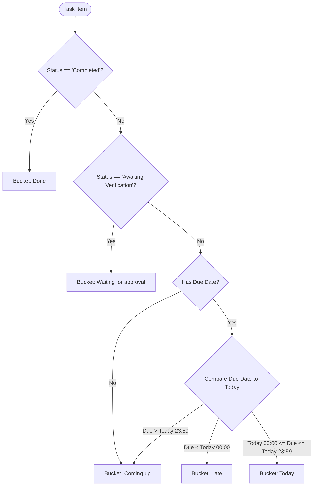
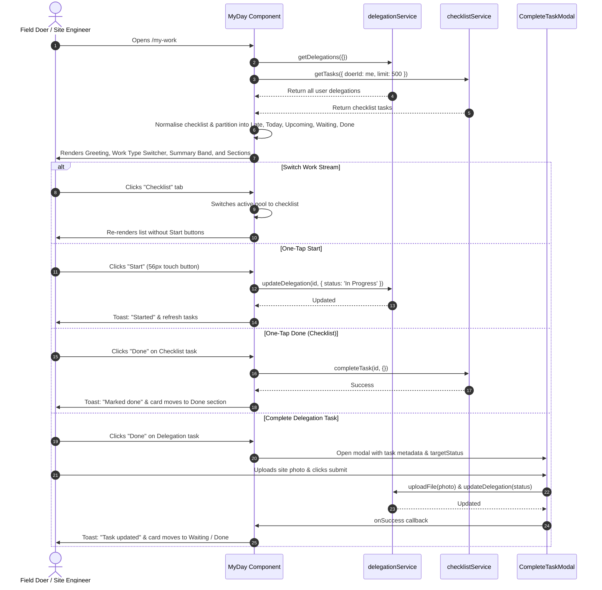

# My Work ("My Day") Page — UI Documentation

> Source: [`MyDay.jsx`](file:///c:/Users/91995/Desktop/D-table_analytic/nia-infra-hide-pms-mm/nia-infra-hide-pms-mm/Frontend/src/pages/MyDay.jsx)  
> Component: `MyDay`  
> Primary Route: `/my-work`  
> Aliases & Redirects: `/dashboard` → `/my-work`, `/my-tasks` → `/my-work`, `/idea-board` → `/my-work`, `/my-tasks/:taskId` → `/all-tasks/:taskId`

---

## Overview

The **"My Work"** page (implemented as `MyDay.jsx`) serves as the primary consolidated workbench for task doers. It unifies all work streams assigned to or followed by the user into a single, clutter-free screen designed for high efficiency on both desktop monitors and mobile devices in the field.

### Core Objectives & Design Philosophy

1. **Unified Doer Workbench**: Merges four distinct task types—**Delegations**, **Checklists**, **In-Loop Follows**, and **Group Tasks**—into one central interface.
2. **Action-Oriented Time Buckets**: Tasks are categorized into visual color-coded urgency sections: **Late** (Red), **Today** (Amber), **Coming up** (Blue), **Waiting for approval** (Indigo), and **Done** (Emerald).
3. **Ergonomic Field/Site Operation**:
   - Oversized, high-contrast action targets (**56px / `h-14` buttons**) optimized for finger-tapping on phones or tablets at job sites.
   - Plain-English time labels (e.g., *"2 days late"*, *"Due today"*, *"Due tomorrow"*, *"Due Wednesday"*).
   - Immediate **one-tap Start** and **one-tap Done** execution.
4. **Adaptive Filtering**: Retains full task search and metadata filtering (Status, Priority, Category, Date Range) with one-click chip dismissal.
5. **Zero-State Celebration**: Provides clear visual affirmation when all daily responsibilities are completed.

---

## Page Layout & Component Hierarchy

```
┌──────────────────────────────────────────────────────────────────────────────────┐
│  1. HEADER & SYNCHRONIZATION                                                     │
│     Hi Rahul                                                                 [↺] │
│     Saturday, 12 September 2026                                                  │
├──────────────────────────────────────────────────────────────────────────────────┤
│  2. TASK TYPE SELECTOR (Segmented Switcher)                                      │
│     [📋 Delegation]    [🔁 Checklist]    [📻 Loop]    [👥 Group]                 │
├──────────────────────────────────────────────────────────────────────────────────┤
│  3. SEARCH & FILTER CONTROLS                                                     │
│     [ 🔍 Search my work…                                   ]  [ ⊶ Filters (2) ] │
│     ──────────────────────────────────────────────────────────────────────────── │
│     ▼ Collapsible Filter Row:                                                    │
│       [ Status: All ▾ ] [ Priority: All ▾ ] [ Category: All ▾ ] [ Date: Today ▾] │
│     ──────────────────────────────────────────────────────────────────────────── │
│     Active Chips:  [ "inspection" ✕ ]  [ High ✕ ]                  [ Clear all ] │
├──────────────────────────────────────────────────────────────────────────────────┤
│  4. QUICK-JUMP SUMMARY BAND (4 KPI Metric Tiles)                                 │
│     ┌──────────────┐ ┌──────────────┐ ┌──────────────┐ ┌──────────────┐          │
│     │      2       │ │      5       │ │      3       │ │      8       │          │
│     │     LATE     │ │    TODAY     │ │   UPCOMING   │ │     DONE     │          │
│     └──────────────┘ └──────────────┘ └──────────────┘ └──────────────┘          │
├──────────────────────────────────────────────────────────────────────────────────┤
│  5. TASK SECTION LISTS (Scroll Anchors & Responsive Grid)                        │
│                                                                                  │
│     🔴 LATE (2) — Do these first                                                 │
│     ┌──────────────────────────────┐  ┌──────────────────────────────┐           │
│     │ Foundation Rebar Inspection  │  │ Safety Netting Clearance     │           │
│     │ ⚠️ 2 days late · DEL-1042     │  │ ⚠️ 1 day late · CHK-8812     │           │
│     │ [ ▶ Start ]   [  ✓ Done   ]  │  │ [  ✓ Done                  ] │           │
│     └──────────────────────────────┘  └──────────────────────────────┘           │
│                                                                                  │
│     🟡 TODAY (5) — Due today                                                     │
│     ┌──────────────────────────────┐  ┌──────────────────────────────┐           │
│     │ Batching Plant Slump Test    │  │ Site Perimeter Walkthrough   │           │
│     │ ☀️ Due today · Tower A        │  │ ☀️ Due today · Zone 2        │           │
│     │ [ ▶ Start ]   [  ✓ Done   ]  │  │ [  ✓ Done                  ] │           │
│     └──────────────────────────────┘  └──────────────────────────────┘           │
│                                                                                  │
│     🔵 COMING UP (3) — For later                                                 │
│     ┌──────────────────────────────┐  ┌──────────────────────────────┐           │
│     │ Curing Tank Water Quality    │  │ Formwork Stripping Permit    │           │
│     │ 🕒 Due Thursday · Lab         │  │ 🕒 Due 18 Sep                │           │
│     │ [ ▶ Start ]   [  ✓ Done   ]  │  │ [ ▶ Start ]   [  ✓ Done   ]  │           │
│     └──────────────────────────────┘  └──────────────────────────────┘           │
│                                                                                  │
│     🟣 WAITING FOR APPROVAL (1) — Sent, being checked                            │
│     ┌──────────────────────────────┐                                             │
│     │ Subgrade Compaction Test     │                                             │
│     │ ⏳ Waiting for approval      │                                             │
│     │ [ ⏳ Sent — waiting for approval                             ] │           │
│     └──────────────────────────────┘                                             │
│                                                                                  │
│     🟢 DONE (8) — Finished                                                       │
│     ┌──────────────────────────────┐  ┌──────────────────────────────┐           │
│     │ Morning Pre-start Briefing   │  │ Dumper Daily Checklist       │           │
│     │ ✅ Completed                  │  │ ✅ Completed                  │           │
│     │ [ ✅ Well done — this is finished                            ] │           │
│     └──────────────────────────────┘  └──────────────────────────────┘           │
├──────────────────────────────────────────────────────────────────────────────────┤
│  6. MODALS & OVERLAYS                                                            │
│     └─ CompleteTaskModal (File/photo evidence upload, verification dispatch)     │
└──────────────────────────────────────────────────────────────────────────────────┘
```

---

## 1. Top Header & Sync Controls

The header establishes personal greeting and operational sync controls:

```
┌────────────────────────────────────────────────────────┐
│  Hi Rahul                                          [↺] │
│  Saturday, 12 September 2026                           │
└────────────────────────────────────────────────────────┘
```

### Component Elements

| Element | DOM / Token | Behavioral Specification |
|---|---|---|
| **User Greeting** | `<h1>` `text-2xl font-extrabold text-(--text-primary)` | Reads user name from `localStorage.getItem('user')`. Displays `"Hi {firstName}"` if available; falls back to `"My Work"`. |
| **Current Date** | `<p>` `text-slate-500 font-medium text-sm` | Renders today's date using `toLocaleDateString(undefined, { weekday: 'long', day: 'numeric', month: 'long' })`. |
| **Manual Refresh** | `<button>` `w-12 h-12 rounded-2xl border border-(--border-color) bg-(--bg-secondary)` | Triggers `load(true)` in quiet mode. Displays spinning `RefreshCw` icon (`animate-spin`) while fetching. |

### Deep-Link Parameter Handling

The component inspects route parameters using `useParams()`:
- Route: `/my-tasks/:taskId`
- Logic: If a `taskId` is present on mount, the component automatically performs a redirection to `/all-tasks/${taskId}` with `{ replace: true }`, ensuring bookmarked task links or notification pushes navigate to the full task drawer without losing context.

---

## 2. Task Type Segmented Switcher

A horizontal scrollable segmented pill group mounted in a dedicated pill bar container (`flex items-center gap-1 p-1 rounded-2xl bg-(--bg-primary) border border-(--border-color) overflow-x-auto`):

```
┌────────────────────────────────────────────────────────────────────────┐
│ [📋 Delegation]    [🔁 Checklist]    [📻 Loop]    [👥 Group]           │
└────────────────────────────────────────────────────────────────────────┘
```

### Supported Work Types

| Type ID | Display Label | Icon | Data Filtering Logic | Permissions / Capabilities |
|---|---|---|---|---|
| `delegation` *(Default)* | **Delegation** | `ClipboardList` | `delegations.filter(t => t.doerId === me && !t.groupId)` | Full execution: "Start", "Done", modal evidence upload. |
| `checklist` | **Checklist** | `Repeat` | `checklist.filter(t => t.doerId === me)` normalized from `checklistService.getTasks` | Direct tick completion via `completeChecklist(t)`. No "Start" step. |
| `loop` | **Loop** | `Radio` | `delegations.filter(t => t.doerId !== me && parseLoopIds(t.inLoopIds).includes(me))` | **Read-Only**: Following mode. Shows informational status pill instead of action buttons. |
| `group` | **Group** | `Users` | `delegations.filter(t => t.doerId === me && !!t.groupId)` | Tasks delegated to the user within a designated group. Full execution. |

### Tab State Styling

- **Active Tab**: `bg-emerald-600 text-white shadow-sm font-bold px-3 py-2.5 rounded-xl text-[13px]`.
- **Inactive Tab**: `text-slate-500 hover:text-emerald-600 font-bold px-3 py-2.5 rounded-xl text-[13px]`.

---

## 3. Search & Filter Controls

```
┌───────────────────────────────────────────────────────────────┐
│ [ 🔍 Search my work…                                ] [ ⊶ Filters (1) ] │
├───────────────────────────────────────────────────────────────┤
│ [ Status: All ▾ ]  [ Priority: All ▾ ]  [ Category: All ▾ ]  [ Date: All Time ▾ ] │
├───────────────────────────────────────────────────────────────┤
│ [ "foundation" ✕ ]  [ High ✕ ]                    Clear all   │
└───────────────────────────────────────────────────────────────┘
```

### Search Bar

- **Input**: Full-width styled text box with absolute-positioned `Search` icon.
- **Matching Rule**: Live case-insensitive substring match against `task.taskTitle`.

### Collapsible Filter Row

Toggled via the **Filters** button (`setShowFilters(v => !v)`). The button displays an active count badge when filters are applied.

| Filter Dropdown | Options | Filter Logic & Behavior |
|---|---|---|
| **Status** | `All`, `Overdue`, `Pending`, `Accepted`, `In Progress`, `Awaiting Verification`, `Completed` | • `Overdue`: Calculated dynamically where `dueDate < now` and task is not finished.<br>• Other statuses match exact string `t.status === status`. |
| **Priority** | `All`, `Critical`, `High`, `Medium`, `Low` | Direct match on `t.priority`. **Note**: Hidden automatically when `type === 'checklist'`. |
| **Category** | `All`, dynamic unique list | Dynamically derived from unique categories present in the active pool (`pool.map(t => t.category)`). |
| **Date Range** | `All Time`, `Today`, `This Week`, `This Month`, `Overdue` | Evaluated against `t.dueDate || t.createdAt` via `inDateRange()` helper. |

### Active Filter Chips

When any non-default filter is active, removable pill badges appear above the summary cards:
- **Pill Style**: `bg-emerald-50 dark:bg-emerald-500/10 text-emerald-700 dark:text-emerald-400 rounded-full pl-2.5 pr-1.5 py-1 text-[12px] font-bold`.
- **Dismissal**: Clicking the `X` button clears that specific filter.
- **Clear All Button**: Resets search, status, priority, category, and date range in a single tap.

---

## 4. Quick-Jump Summary Metric Band

A 4-column responsive KPI grid positioned above the task sections (`grid grid-cols-4 gap-2.5`):

```
┌──────────────┐ ┌──────────────┐ ┌──────────────┐ ┌──────────────┐
│      2       │ │      5       │ │      3       │ │      8       │
│     LATE     │ │    TODAY     │ │   UPCOMING   │ │     DONE     │
└──────────────┘ └──────────────┘ └──────────────┘ └──────────────┘
  (Red Tint)       (Amber Tint)     (Blue Tint)     (Emerald Tint)
```

### Summary Tile Attributes

| Section Key | Title | Counter Value | Visual Theme (Soft BG / Ring / Text) | Anchor Click Target |
|---|---|---|---|---|
| `late` | **LATE** | `groups.late.length` | `bg-red-50 dark:bg-red-500/10 ring-red-300 text-red-600` | Smooth-scrolls to `#sec-late` |
| `today` | **TODAY** | `groups.today.length` | `bg-amber-50 dark:bg-amber-500/10 ring-amber-300 text-amber-600` | Smooth-scrolls to `#sec-today` |
| `upcoming` | **UPCOMING** | `groups.upcoming.length` | `bg-blue-50 dark:bg-blue-500/10 ring-blue-300 text-blue-600` | Smooth-scrolls to `#sec-upcoming` |
| `done` | **DONE** | `groups.done.length` | `bg-emerald-50 dark:bg-emerald-500/10 ring-emerald-300 text-emerald-600` | Smooth-scrolls to `#sec-done` |

Each tile features a tap micro-animation (`active:scale-95 transition-all`) and executes smooth page scrolling directly to the designated section.

---

## 5. Section Grouping & Date Bucket Logic

Tasks are partitioned into 5 buckets evaluated chronologically against the local day boundaries (`startOfToday()` and `endOfToday()`):



### Sorting Protocols

- **Late / Today / Upcoming**: Ascending by due date (`new Date(a.dueDate) - new Date(b.dueDate)`).
- **Done**: Descending by completion timestamp (`new Date(b.completedAt || b.updatedAt) - new Date(...)`).

### Section Header Styling

Each section only renders when it contains at least one task (`list.length > 0`):

```
┌────────────────────────────────────────────────────────┐
│ [ Icon ]  Section Title (Count)                        │
│           Plain-English subtitle instruction           │
└────────────────────────────────────────────────────────┘
```

| Section | Icon | Icon Chip BG | Title & Count Color | Subtitle Instruction |
|---|---|---|---|---|
| **Late** | `AlertTriangle` | `bg-red-500` | `text-red-600` | *"Do these first"* |
| **Today** | `Sun` | `bg-amber-500` | `text-amber-600` | *"Due today"* |
| **Coming up** | `CalendarClock` | `bg-blue-500` | `text-blue-600` | *"For later"* |
| **Waiting for approval** | `Hourglass` | `bg-indigo-500` | `text-indigo-600` | *"Sent, being checked"* |
| **Done** | `CheckCircle2` | `bg-emerald-500` | `text-emerald-600` | *"Finished"* |

---

## 6. Task Card Anatomy & Interactive Controls

Tasks are laid out in a responsive 2-column grid (`grid sm:grid-cols-2 gap-3`):

```
┌────────────────────────────────────────────────────────────────────────┐
│ ▎ Pour Concrete Slab - Sector 4                                    >   │
│ ▎ ⚠️ 2 days late  ·  TSK-2094                                          │
│ ▎ Weekly · Site Alpha                                                  │
│                                                                        │
│ ┌───────────────────────────┐  ┌─────────────────────────────────────┐ │
│ │  ▶  Start                 │  │  ✓  Done                            │ │
│ └───────────────────────────┘  └─────────────────────────────────────┘ │
└────────────────────────────────────────────────────────────────────────┘
```

### Card Visual Structure

1. **Card Border & Accent Strip**:
   - `rounded-2xl border border-(--border-color) border-l-4 p-4 flex flex-col gap-3`.
   - Left accent bar is color-coded to the section (`border-l-red-500`, `border-l-amber-500`, `border-l-blue-400`, `border-l-indigo-400`, `border-l-emerald-500`).
   - Soft background tint inherits section theme (`s.soft`).
2. **Card Title & Navigation**:
   - Clicking the title navigates to `/all-tasks/${task.id}` (for delegations and group tasks).
   - Checklist tasks do not have full drawer views; their cursor remains default.
   - For delegable tasks, hovering underlines the title and lights up the `ChevronRight` icon.
3. **Plain-English Due Wording Badge (`dueWords`)**:
   - `diff < 0`: `"1 day late"` or `"${Math.abs(diff)} days late"`.
   - `diff === 0`: `"Due today"`.
   - `diff === 1`: `"Due tomorrow"`.
   - `2 <= diff <= 6`: `"Due ${Weekday}"` (e.g., *"Due Friday"*).
   - `diff > 6`: `"Due DD MMM"` (e.g., *"Due 24 Oct"*).
   - If no date set: `"No date set"`.
   - If task completed: `"Completed"`.
   - If awaiting verification: `"Waiting for approval"`.
4. **Metadata Snippet**:
   - Task code (e.g. `TSK-1029`).
   - Recurrence frequency and site name: `${frequency} · ${site}`.

### Action Button States (Field-Ergonomic 56px / `h-14` Touch Targets)

```
Active Task (Not Started):
┌───────────────────────────┐  ┌─────────────────────────────────────┐
│  ▶  Start                 │  │  ✓  Done                            │
└───────────────────────────┘  └─────────────────────────────────────┘
 (h-14, border-2 blue-200)      (h-14, emerald-600 bg, white bold text)

Active Task (In Progress):
┌────────────────────────────────────────────────────────────────────┐
│  ✓  Done                                                           │
└────────────────────────────────────────────────────────────────────┘
 (Full-width, h-14, emerald-600 bg, white bold text)

In-Loop (Follower Mode):
┌────────────────────────────────────────────────────────────────────┐
│  📻 You are following this task                                     │
└────────────────────────────────────────────────────────────────────┘
 (h-11, muted slate badge)

Waiting for Verification:
┌────────────────────────────────────────────────────────────────────┐
│  ⏳ Sent — waiting for approval                                     │
└────────────────────────────────────────────────────────────────────┘
 (h-11, indigo badge)

Finished:
┌────────────────────────────────────────────────────────────────────┐
│  ✅ Well done — this is finished                                   │
└────────────────────────────────────────────────────────────────────┘
 (h-11, emerald badge)
```

#### Action Execution Details

- **"Start" Button**:
  - Sets task status to `'In Progress'` via `delegationService.updateDelegation(t.id, { status: 'In Progress' })`.
  - Disables button and displays pending state during network transit (`busyId === t.id`).
  - Triggers toast `"Started"` and silent background refresh.
- **"Done" Button**:
  - **For Checklist items**: Calls `checklistService.completeTask(t.id, {})` directly without opening a modal. Displays `"Marked done"` toast.
  - **For Delegation / Group items**: Opens `CompleteTaskModal` (`setCompleteTask(t)`). If the task requires verification (`verificationRequired`), `targetStatus` is passed as `'Awaiting Verification'`; otherwise `'Completed'`.

---

## 7. Zero States & Feedback Banners

The view handles four distinct empty / completed states:

```
┌──────────────────────────────────────────────────────────────────┐
│                             🎉                                   │
│                      All caught up!                              │
│         No pending work right now. Great job.                    │
└──────────────────────────────────────────────────────────────────┘
```

1. **Skeleton Loading (`loading === true`)**:
   - Renders 4 animated shimmer cards (`skeleton h-28 rounded-2xl`).
2. **Filter Mismatch State (`tasks.length === 0 && activeFilters.length > 0`)**:
   - Features `PartyPopper` icon (size 48, emerald).
   - Heading: `"Nothing matches those filters"`.
   - Subtitle: `"Try clearing a filter."`
3. **Empty Work Stream (`tasks.length === 0 && activeFilters.length === 0`)**:
   - Heading: `"Nothing here yet"`.
   - Dynamic prompt: `"When [type] work is given to you, it shows up here."`
4. **All Caught Up Banner (`openCount === 0 && tasks.length > 0`)**:
   - When all pending items (late + today + upcoming) are 0 and completed items exist.
   - Emits a light green celebration container (`bg-emerald-50 dark:bg-emerald-500/10 border border-emerald-200`).
   - Title: `"All caught up!"` — Subtitle: `"No pending work right now. Great job."`

---

## 8. Modal Integration: `CompleteTaskModal`

Mounted at the bottom of the page and triggered when tapping **"Done"** on a delegation or group task:

```
┌────────────────────────────────────────────────────────┐
│ Complete Task                              [✕]         │
├────────────────────────────────────────────────────────┤
│ Upload Evidence / Photos (Optional or Mandatory)       │
│ ┌────────────────────────────────────────────────────┐ │
│ │  ☁️ Drop files here or browse                      │ │
│ │     Supports JPG, PNG, PDF, DOCX up to 100MB       │ │
│ └────────────────────────────────────────────────────┘ │
│ Existing evidence: [ photo_site.jpg ✕ ]                │
├────────────────────────────────────────────────────────┤
│ [ Cancel ]                      [ Submit & Complete ]  │
└────────────────────────────────────────────────────────┘
```

### Modal Workflow & Verification Routing

| Task Flag | Target Status Passed to Modal | Resulting Workflow |
|---|---|---|
| `verificationRequired === true` | `'Awaiting Verification'` | Submits uploaded files as evidence (`JSON.stringify(allEvidence)`). Transitions status to `Awaiting Verification`. Task moves immediately into the **"Waiting for approval"** section on the doer's screen. |
| `verificationRequired === false` | `'Completed'` | Submits evidence and transitions task directly to `Completed`. Task moves into the **"Done"** section. |
| `evidenceRequired === true` | Handled inside modal | Form validation enforces at least one uploaded document or image before submission can proceed. |

---

## 9. End-to-End User Interaction Flow



---

## 10. Design Tokens, Theming & Responsiveness

### Color Tokens per Urgency Section

| Section Key | Border Accent | Ring Accent | Text Color | Background Tint (Light / Dark) |
|---|---|---|---|---|
| `late` | `border-l-red-500` | `ring-red-300` | `text-red-600` | `bg-red-50` / `dark:bg-red-500/10` |
| `today` | `border-l-amber-500` | `ring-amber-300` | `text-amber-600` | `bg-amber-50` / `dark:bg-amber-500/10` |
| `upcoming` | `border-l-blue-400` | `ring-blue-300` | `text-blue-600` | `bg-blue-50` / `dark:bg-blue-500/10` |
| `waiting` | `border-l-indigo-400` | `ring-indigo-300` | `text-indigo-600` | `bg-indigo-50` / `dark:bg-indigo-500/10` |
| `done` | `border-l-emerald-500` | `ring-emerald-300` | `text-emerald-600` | `bg-emerald-50` / `dark:bg-emerald-500/10` |

### Responsive Layout Breakpoints

- **Mobile (`< 640px`)**:
  - Container width constrained to `max-w-3xl mx-auto`.
  - Task type switcher allows horizontal touch scroll (`overflow-x-auto whitespace-nowrap`).
  - Summary KPI band renders in 4 compact columns (`grid-cols-4 gap-2.5`).
  - Task cards render in single column (`grid-cols-1`).
  - Action buttons (`h-14`) fill available card width with large tap targets.
- **Tablet / Desktop (`>= 640px`)**:
  - Task cards arrange into a 2-column grid (`sm:grid-cols-2`).
  - Filter bar displays dropdown selects in flex wrap alignment.
