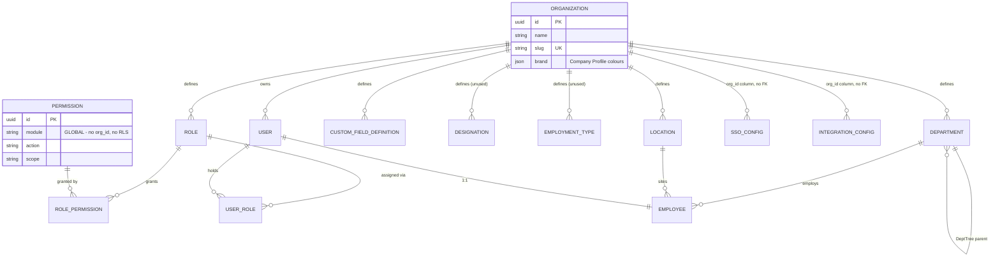

# DTA HRMS — Settings Module Specification

> **Status:** Code-verified against the working tree at commit `308f559` (branch `main`), 2026-09-22.
> Every claim below is traceable to a file path + symbol. Anything that could not be confirmed
> from source is explicitly marked **Not verified from current codebase.**
>
> This document is a *description of what exists*, not a design proposal. No application code was
> modified while producing it.
>
> **Companion document:** `docs/roles-and-permissions.md` — a deep rebuild spec for the RBAC
> subsystem (the `Settings ▸ Roles & Permissions` tab and the enforcement machinery). This
> document does not duplicate it; §5.2 and §11 here summarise and cross-reference it.

---

## 1. Executive Summary

DTA HRMS ("D-Table HRMS") has **no single `settings` module folder**. What the product calls
"Settings" is assembled at runtime from four React tab components under
`apps/web/src/pages/settings/`, served by **four separate NestJS modules** on the backend
(`organization`, `rbac`, `integration`, `admin`). A second, closely-related configuration surface —
Departments, Locations, Custom Fields — lives in the *same frontend folder* but is mounted on the
`/org` route and gated by a different permission (`org-structure`), so it is documented here as an
adjacent configuration area rather than as part of `/settings`.

**The four `/settings` tabs:**

| Tab | Route | What it configures |
|---|---|---|
| Company Profile | `/settings/company` | Org display name, 4 brand colour tokens, PNG logo, "Reset to Seed" danger zone |
| Roles & Permissions | `/settings/roles` | Custom role builder over the `(module, action, scope)` permission triple |
| Single Sign-On | `/settings/sso` | Google / Microsoft / Okta OAuth client credentials |
| Integrations | `/settings/integrations` | Tally, QuickBooks, Slack, Teams, 3 biometric device drivers |

**Headline architectural facts:**

- Settings is **super-admin-only**. The `settings` module permission appears in exactly one role in
  `packages/rbac/src/matrix.ts` — `super_admin` (lines 97–99). HR Admin does *not* see Settings.
- All settings rows are **organization-scoped** with Postgres **row-level security**, driven by
  `SET LOCAL app.current_org` issued by `PrismaService.withOrg()`
  (`apps/api/src/prisma/prisma.service.ts:76-87`). The org id comes from the JWT `orgId` claim only —
  never from a request body or query parameter.
- There is **no generic key/value settings table**. Each settings surface has its own typed model
  (`Organization.brand` JSON, `Role`/`RolePermission`, `SsoConfig`, `IntegrationConfig`).
- Three of the four tabs write configuration that **nothing in the application currently reads**
  (brand colours, SSO configs, integration configs). See §22 — this is the single most important
  finding for anyone replicating the module.

---

## 2. Settings Architecture

### 2.1 Repository shape (verified)

pnpm + Turborepo monorepo. `pnpm-workspace.yaml` globs `apps/*` and `packages/*`.

```
apps/
  api/          NestJS 10 + Fastify adapter, Prisma 5, PostgreSQL
  web/          React 18 + Vite + TypeScript, Ant Design 5
packages/
  rbac/         Shared permission model + evaluator (used by BOTH api and web)
  shared-types/ Zod schemas + inferred DTO types (used by BOTH)
  ui-tokens/    CSS custom properties + AntD theme builder
infra/ , scripts/ , docs/
```

### 2.2 Stack facts relevant to Settings

| Concern | Implementation | Evidence |
|---|---|---|
| API framework | NestJS on **Fastify** (`FastifyAdapter`), global prefix `api/v1` | `apps/api/src/main.ts:13-17,48`; prefix from `API_PREFIX` env, default `api/v1` (`config/config.schema.ts:10`) |
| ORM | Prisma 5, PostgreSQL, `pgcrypto`/`citext`/`pg_trgm` extensions | `apps/api/prisma/schema.prisma:14-23` |
| Multi-tenancy | Postgres RLS + `AsyncLocalStorage` | `common/tenancy/tenancy-context.ts`, `common/interceptors/tenancy.interceptor.ts`, `prisma/prisma.service.ts` |
| Auth | JWT access + refresh, Passport `passport-jwt` | `modules/auth/jwt.strategy.ts`, `common/guards/jwt-auth.guard.ts` |
| AuthZ | `@Permissions()` metadata + global `PermissionsGuard`, evaluator shared with web | `common/guards/permissions.guard.ts`, `packages/rbac/src/has-permission.ts` |
| Validation (backend) | Zod via custom `ZodValidationPipe` | `common/pipes/zod-validation.pipe.ts`; schemas in `packages/shared-types/src/*.ts` |
| Audit | `@Audited()` decorator + global `AuditInterceptor` → `AuditLog` table | `common/interceptors/audit.interceptor.ts` |
| Server state (web) | TanStack Query v5 | `apps/web/src/lib/query-client.ts`, all `apps/web/src/api/*.ts` |
| Client state (web) | Zustand with `persist` | `apps/web/src/stores/auth-store.ts`, `stores/ui-store.ts` |
| Routing (web) | `react-router-dom` `createBrowserRouter`, every page `React.lazy` | `apps/web/src/routes/index.tsx` |
| UI kit | Ant Design 5 (`Tabs`, `Card`, `Table`, `Drawer`, `Form`, `ColorPicker`, `Upload`, `Switch`) | all `pages/settings/*.tsx` |
| Config/env | Zod-validated env at boot | `apps/api/src/config/config.schema.ts` |

### 2.3 Request pipeline for every Settings call

```
HTTP → JwtAuthGuard (global)        verifies JWT, ActorLoader builds Actor from DB
     → PermissionsGuard (global)    reads @Permissions() metadata, ANY-OF evaluation
     → TenancyInterceptor           pushes {organizationId,userId,employeeId} into ALS
     → AuditInterceptor             reads @Audited() metadata, writes AuditLog after success
     → Controller                   @Body() through ZodValidationPipe (where applied)
     → Service                      SECOND hasPermission() check (defence in depth)
     → prisma.tx(fn)                opens txn, SET LOCAL app.current_org, RLS filters rows
```

Registration: `apps/api/src/app.module.ts:74-82` (both guards as `APP_GUARD`, both interceptors as
`APP_INTERCEPTOR`, tenancy before audit).

---

## 3. Module Inventory

Legend for **Status**: *Complete* = UI + API + DB all present and the stored value is consumed
somewhere. *Write-only* = full CRUD works but no consumer reads the stored value.
*Seed-only* = table + seed script exist, no API and no UI.

| # | Setting / Submodule | Route | Frontend | Backend | Database | Status |
|---|---|---|---|---|---|---|
| 1 | Company Profile — name | `/settings/company` | `pages/settings/CompanyProfileTab.tsx` | `organization.controller.ts` `PATCH /organization/current` | `Organization.name` | **Complete** |
| 2 | Company Profile — brand colours | `/settings/company` | same | same | `Organization.brand` (Json) | **Write-only** — see Gap G-01 |
| 3 | Company Profile — logo | `/settings/company` | same + `components/BrandLogo.tsx` | `POST/GET /organization/logo` | **None** — local file `apps/api/assets/logo.png` | **Complete** (not DB-backed) |
| 4 | Company Profile — Reset to Seed | `/settings/company` | same | `admin.controller.ts` `POST /admin/reset-dtable-seed` | all tenant tables | **Complete** (UI copy inaccurate — Gap G-02) |
| 5 | Roles & Permissions | `/settings/roles` | `pages/settings/RolesTab.tsx` | `rbac.controller.ts` | `Role`, `Permission`, `RolePermission`, `UserRole` | **Complete** |
| 6 | Single Sign-On | `/settings/sso` | `pages/settings/SsoTab.tsx` | `integration.controller.ts` (`SsoService`) | `SsoConfig` | **Write-only** — Gap G-03 |
| 7 | Integrations | `/settings/integrations` | `pages/settings/IntegrationsTab.tsx` | `integration.controller.ts` (`IntegrationService`) | `IntegrationConfig` | **Write-only** — Gap G-04 |
| 8 | Departments | `/org/departments` | `pages/settings/DepartmentsTab.tsx` | `department.controller.ts` | `Department` | **Partial** — hierarchy fields not editable in UI (Gap G-12) |
| 9 | Locations | `/org/locations` | `pages/settings/LocationsTab.tsx` | `location.controller.ts` | `Location` | **Partial** — `timezone` stored, never read (Gap G-06) |
| 10 | Employee Custom Fields | `/org/custom-fields` | `pages/settings/CustomFieldsTab.tsx` | `custom-fields.controller.ts` | `CustomFieldDefinition` | **Complete** |
| 11 | Org Chart (read-only view) | `/org/org-chart` | `pages/settings/OrgSettingsPage.tsx` (`OrgChartTab`) | `GET /organization/tree` | `Employee` | **Complete** (view only, no config) |
| 12 | Theme (light/dark) + sidebar collapse | n/a — top bar button | `stores/ui-store.ts`, `AppShell.tsx:504` | none | `localStorage` key `dtable-hrms-ui` | **Complete** (per-browser, not per-user-record) |
| 13 | Designation catalog | none | none | none | `Designation` model + `prisma/seed-designations.ts` | **Seed-only / dead** — Gap G-05 |
| 14 | Employment Type catalog | none | none | none | `EmploymentType` model + `prisma/seed-employment-types.ts` | **Seed-only / dead** — Gap G-05 |

**Explicitly NOT part of Settings in this codebase** (they are owned by their own modules and
reached from their own nav entries, each with its own module permission): leave types & holiday
calendar (`/leave`, `holiday.controller.ts`), salary components / structures / statutory configs /
pay groups (`/payroll`, `payroll` module), expense categories & policies (`/expenses`,
`expense-category.controller.ts`, `expense-policy.controller.ts`), onboarding templates
(`onboarding-template.controller.ts`), asset categories, ticket categories. Replicators should note
that DTA HRMS deliberately does **not** centralise these under Settings the way Keka does.

---

## 4. Navigation Structure

### 4.1 Sidebar entry

Defined once in `apps/web/src/layouts/nav-items.ts` (last entry in `NAV_ITEMS`):

```ts
{
  key: 'settings',
  label: 'Settings',
  path: '/settings',
  icon: SettingOutlined,          // @ant-design/icons
  group: 'admin',                 // NAV_GROUP_LABELS['admin'] === 'Admin'
  requires: [{ module: 'settings', action: 'view', scope: 'org' }],
}
```

Nav groups render in array order: `core` → `my-work` → `people-org` → `admin`. Settings is the
**last item of the last group**. `Org Structure` (`/org`, `ApartmentOutlined`) sits in `people-org`
and requires `org-structure/view/org`.

### 4.2 Other entry points to `/settings`

| Entry point | File | Gate |
|---|---|---|
| Top-bar gear icon (desktop only) | `layouts/AppShell.tsx:400-412` | **none** — rendered for every authenticated non-mobile user |
| Avatar dropdown → "Settings" | `layouts/AppShell.tsx:137,147-149` | **none** |
| Dashboard Quick-Access tile | `apps/api/src/modules/dashboard/widgets.service.ts:415-417` | `settings/edit/org` (server-side) |

The two `AppShell` entries are ungated in the UI; users without the permission are bounced by
`ProtectedRoute` back to `/` (see §11.2).

### 4.3 Hierarchy as implemented

```
Settings                                  /settings  →  redirect to /settings/company
├── Company Profile                       /settings/company
│   ├── Identity          (slug read-only, company name)
│   ├── Company Logo      (PNG upload ≤512 KB)
│   ├── Branding          (primary / primaryDark / primaryLight / accent)
│   └── Danger Zone       (Reset to Seed)
├── Roles & Permissions                   /settings/roles
│   └── Role drawer → PermissionMatrix (19 modules × 7 actions × 4 scopes)
├── Single Sign-On                        /settings/sso
│   └── Google Workspace | Microsoft Entra ID | Okta
└── Integrations                          /settings/integrations
    ├── Accounting        Tally, QuickBooks
    ├── Communication     Slack, Microsoft Teams
    └── Biometric         ZKTeco, eSSL, Realtime

Org Structure                             /org       →  redirect to /org/departments
├── Departments                           /org/departments      (hidden unless org-structure/edit/org)
├── Locations                             /org/locations        (hidden unless org-structure/edit/org)
├── Custom Fields                         /org/custom-fields    (hidden unless org-structure/edit/org)
└── Org Chart                             /org/org-chart        (always shown)
```

Tab state is **URL-driven**, not local state: `SettingsPage` reads `useParams<{tab}>()` and
`onChange` calls `navigate('/settings/' + key)` (`SettingsPage.tsx:17,29`). Same pattern in
`OrgSettingsPage.tsx:11-14,42`.

---

## 5. Settings Submodules

### 5.1 Company Profile — `/settings/company`

**Purpose.** Single screen for tenant identity (name, slug), visual branding (logo + 4 colour
tokens intended to override the `--db-*` CSS variables), and a destructive "reset this workspace to
a clean seed" operation used before onboarding a real roster.

**File:** `apps/web/src/pages/settings/CompanyProfileTab.tsx` (290 lines).

**UI structure.** One `<Form layout="vertical">` wrapping a 4-card `Row`/`Col` grid:

1. **Identity** (`Card size="small"`, `xs=24 lg=12`) — Organization Slug (disabled `Input`),
   Company Name (`Input`, required).
2. **Company Logo** (`Card`, `xs=24 lg=12`) — white preview box rendering
   `` with `onError` → `display:none`;
   `<Upload accept="image/png" showUploadList={false} beforeUpload={handleLogoUpload}>` returning
   `false` so AntD never performs its own request.
3. **Branding** (`Card`, full width, `extra` = the submit button) — four `ColorPicker showText
   format="hex"` controls in a 4-up responsive grid, each with a tooltip.
4. **Danger Zone** (`Card`, title coloured `var(--db-danger)`) — descriptive copy + `Button danger
   icon={<ReloadOutlined/>}` that opens `Modal.confirm` (width 560) containing an `Alert
   type="warning"` and four explanatory paragraphs. `onOk` returns a Promise so the modal shows a
   spinner until the mutation settles.

**Fields.**

| Field | UI Type | Required | Default | Validation | Data Source | Editable |
|---|---|---|---|---|---|---|
| Organization Slug | `Input` disabled | — | `org.slug` | none | `GET /organization/current` | **No** |
| Company Name | `Input` | Yes | `org.name` | `rules=[{required:true,message:'Name is required'}]` (client only) | same | Yes |
| Primary | `ColorPicker` hex | No | `org.brand?.primary ?? '#4338CA'` | none | same | Yes |
| Primary Dark | `ColorPicker` hex | No | `org.brand?.primaryDark ?? '#312E81'` | none | same | Yes |
| Primary Light | `ColorPicker` hex | No | `org.brand?.primaryLight ?? '#6366F1'` | none | same | Yes |
| Accent | `ColorPicker` hex | No | `org.brand?.accent ?? '#F59E0B'` | none | same | Yes |
| Logo file | `Upload` (PNG) | No | current file bytes | `file.type === 'image/png'`; `file.size <= 512*1024` (`CompanyProfileTab.tsx:36-43`) | `GET /organization/logo` | Yes |

> The four fallback colours (`#4338CA` indigo family) do **not** match the D-Table brand tokens in
> `CLAUDE.md §2.1` (`--db-primary: #02408B`) nor `packages/ui-tokens/src/tokens.css`. See Gap G-14.

**Colour serialisation.** `handleSave` runs `toHex = v => typeof v === 'string' ? v :
v?.toHexString?.() || '#4338CA'` (line 114) because AntD's `ColorPicker` yields a `Color` object,
not a string, on change but a string when set via `form.setFieldsValue`.

**Data flow.** `useEffect([org, form])` hydrates the form once the query resolves
(lines 101-111) — the form is **not** using `initialValues`, so a refetch re-seeds it.

---

### 5.2 Roles & Permissions — `/settings/roles`

**Purpose.** Let a Super Admin inspect the 9 seeded system roles and build **custom roles** by
ticking `(module, action, scope)` triples. The rows written here are the exact rows
`ActorLoader` reads on every request, so the tab is the live control surface for authorization.

**File:** `apps/web/src/pages/settings/RolesTab.tsx` (456 lines: `RolesTab` + inner
`PermissionMatrix` component).

> Full rebuild detail for this tab — including scope-precedence semantics, the seeding contract and
> the guard's ANY-OF evaluation — is in `docs/roles-and-permissions.md` (882 lines). Not repeated here.

**UI structure.**
- "New Role" primary button (`PlusOutlined`).
- `<Empty description="No roles yet"/>` when `roles.length === 0`.
- `<Table rowKey="id" pagination={false}>` — columns: Key (w200), Label, Type (`Tag` blue
  "System" / green "Custom"), Users (count), Permissions (`"{n} rules"`), Actions.
  The delete button renders **only** when `!r.isSystem` (line 200).
- `<Drawer width={720}>` with a sticky `footer` showing `"{n} permissions selected"` plus
  Cancel / Save. Header form: Key (`disabled` when editing — "Key (immutable)") and Display Label.
- `PermissionMatrix`: one collapsible bordered panel per module inside a
  `maxHeight:'52vh'; overflowY:'auto'` container. Panel header shows the module name, a blue
  `Tag "{count} / {total}"` when count > 0, and a text button whose label is
  `count === total ? 'Clear all' : count > 0 ? 'Select all' : 'Grant all'`.
  Expanded body is a CSS grid `110px repeat(4,1fr) 80px`: action label, one checkbox per scope,
  and a trailing "Row" checkbox that toggles all 4 scopes for that action.

**Client-side constant lists** (`RolesTab.tsx:27-50`) — note these are **hard-coded in the
component**, not imported from `@dtable/rbac`:

- `MODULES` (19): `employees`, `org-structure`, `onboarding`, `exits`, `attendance`, `leave`,
  `payroll`, `expenses`, `documents`, `engage`, `performance`, `hiring`, `assets`, `helpdesk`,
  `reports`, `settings`, `audit-logs`, `projects`, `planning`.
- `ACTIONS` (7): `view`, `create`, `edit`, `delete`, `approve`, `submit`, `export`.
- `SCOPES` (4): `self`, `team`, `department`, `org`.

The canonical `Module` union in `packages/rbac/src/types.ts:94-126` has **32** members and the
`Action` union has **10** — the builder cannot express `employees:compensation`,
`payroll:structure`, `helpdesk:hr|payroll|it`, `reports:*`, `settings:integrations`, `dashboard`,
`inbox`, `operations`, nor the actions `run`, `assign`, `resolve`. See Gap G-10.

**Selection state.** A `Set<string>` of `"module|action|scope"` keys
(`RolesTab.tsx:60,68,78`), split back apart on submit (line 87).

**Fields.**

| Field | UI Type | Required | Default | Validation | Data Source | Editable |
|---|---|---|---|---|---|---|
| Key | `Input` | Yes | — | `{required:true,message:'Key required'}` (client only) | — | Create only (`disabled={!!editingRole}`) |
| Display Label | `Input` | Yes | `role.label` | `{required:true,message:'Label required'}` (client only) | `GET /roles` | Yes |
| Permission checkbox (×532 in UI) | `Checkbox` | No | unchecked | none | `role.permissions[]` | Yes |

**Delete confirmation.** `Modal.confirm` with `okButtonProps={{disabled: role.userCount > 0}}` and
a message naming the assigned-user count (lines 119-135). The backend enforces the same rule
independently (`rbac.service.ts:250-254`).

---

### 5.3 Single Sign-On — `/settings/sso`

**Purpose.** Store per-tenant OAuth 2.0 client credentials for Google Workspace, Microsoft Entra ID
and Okta so users could sign in with a corporate identity.

**File:** `apps/web/src/pages/settings/SsoTab.tsx` (189 lines).

**UI structure.** An `Alert type="info"` setup guide; then a `Row` of three provider `Card`s
(`xs=24 md=12 lg=8`), each with:
- `extra` status `Tag`: green **Active** / default **Disabled** / **Not configured**;
- a description paragraph (`minHeight: 60`);
- a truncated client id preview `existing.clientId.slice(0,20) + '…'` when configured;
- one `actions` button: "Configure" (`PlusOutlined`) or "Edit configuration".

Clicking a card reveals a single inline edit `Card` (`maxWidth: 720`) below the grid.
`<Empty description="No SSO providers configured"/>` shows when `configs.length === 0 && !editing`.

**Providers** (`SsoTab.tsx:22-38`): `google` "Google Workspace", `microsoft` "Microsoft Entra ID",
`okta` "Okta".

**Fields.**

| Field | UI Type | Required | Default | Validation (client) | Validation (server) | Editable |
|---|---|---|---|---|---|---|
| Client ID | `Input` | Yes | `existing?.clientId ?? ''` | required | `z.string().min(1).max(500)` | Yes |
| Client Secret | `Input.Password` | Yes | **never prefilled** | required | `z.string().min(1).max(500)` | Yes |
| Redirect URI | `Input` | Yes | `${window.location.origin}/auth/callback/{provider}` | required | `z.string().url()` | Yes |
| Enable this provider | `Switch` | No | `existing?.active ?? true` | — | `z.boolean().default(true)` | Yes |

Secret handling: `SsoService.list()` **never returns `clientSecret`** (`sso.service.ts:157-164`),
so the field is blank on every edit and the admin must retype it — an unavoidable consequence of
`upsert` requiring `clientSecret`. The field's `extra` text claims "This is stored encrypted"; the
column is plain `String` with no encryption anywhere in the codebase (Gap G-16).

`redirectUri` default uses `window.location.origin` — i.e. the **web** origin, while the callback
route `/auth/callback/:provider` does not exist in `apps/web/src/routes/index.tsx` nor in any
controller.

---

### 5.4 Integrations — `/settings/integrations`

**Purpose.** Per-tenant credentials/endpoints for accounting exports, chat notification webhooks
and biometric attendance devices.

**File:** `apps/web/src/pages/settings/IntegrationsTab.tsx` (186 lines).

**UI structure.** `Alert type="info"`; then integrations grouped by `category` (derived at runtime
by `reduce` over `INTEGRATION_KINDS`), each group a `Typography.Title level={5}` followed by a `Row`
of title-only `Card`s with a status `Tag` and a single "Configure"/"Edit" action. Selecting one
reveals a dynamically-generated inline form `Card` below.

**Catalog** — `apps/web/src/api/settings.ts:194-202` (`INTEGRATION_KINDS`):

| kind | label | category |
|---|---|---|
| `tally` | Tally | Accounting |
| `quickbooks` | QuickBooks | Accounting |
| `slack` | Slack | Communication |
| `teams` | Microsoft Teams | Communication |
| `biometric_zkteco` | ZKTeco Biometric | Biometric |
| `biometric_essl` | eSSL Biometric | Biometric |
| `biometric_realtime` | Realtime Biometric | Biometric |

**Per-kind field map** — `IntegrationsTab.tsx:210-241` (`FIELDS`). Everything here is stored
verbatim into the `IntegrationConfig.config` JSON blob; the backend does **not** validate the inner
shape (`z.record(z.string(), z.any())`).

| kind | field key | label | input |
|---|---|---|---|
| tally | `ledgerServerUrl` | Tally Server URL | `Input type="url"` |
| tally | `companyName` | Company Name in Tally | `Input` |
| quickbooks | `clientId` | QuickBooks Client ID | `Input` |
| quickbooks | `clientSecret` | QuickBooks Client Secret | `Input.Password` |
| quickbooks | `realmId` | Realm ID | `Input` |
| slack | `webhookUrl` | Slack Incoming Webhook URL | `Input.Password` |
| slack | `defaultChannel` | Default Channel | `Input` |
| teams | `webhookUrl` | MS Teams Webhook URL | `Input.Password` |
| biometric_zkteco | `deviceIp` / `devicePort` / `commKey` | Device IP / Device Port / Communication Key | `Input` / `Input type="number"` / `Input.Password` |
| biometric_essl | `apiUrl` / `apiKey` | eSSL Cloud API URL / API Key | `Input type="url"` / `Input.Password` |
| biometric_realtime | `deviceIp` / `devicePort` / `authToken` | Device IP / Device Port / Auth Token | `Input` / `Input type="number"` / `Input.Password` |

Plus a common `active` `Switch` (default `true`).

**Inverted required rule (verified oddity):** `rules={[{ required: !f.secret, ... }]}`
(`IntegrationsTab.tsx:348`) — i.e. *secret* fields (API keys, webhook URLs, client secrets) are
**optional**, non-secret fields are required. Unlike SSO, integration configs *are* echoed back in
full by `GET /integrations` (`integration.service.ts:76-82`), so secrets round-trip to the browser.

---

### 5.5 Danger Zone — Reset to Seed

**Purpose.** Wipe every transactional record in the tenant and leave a clean, immediately usable
workspace.

**Endpoint:** `POST /api/v1/admin/reset-dtable-seed` →
`AdminController.resetDTableSeed` → `AdminService.resetDTableSeed` →
`seedDTableAnalytics(prisma)` in `apps/api/src/modules/admin/seed-dtable-analytics.ts` (311 lines).

**What the code actually does** (`seed-dtable-analytics.ts`):
- `wipeBusinessData()` deletes, leaves-first, inside one `SET LOCAL app.current_org` transaction
  (`timeout: 120_000`): timesheets → projects → engage → helpdesk → performance → hiring → assets →
  documents → exits → onboarding → payroll → expenses → leave → attendance → inbox → audit log;
  then nulls `reportingManagerId`/`managerChain`, deletes **all** `UserRole`, **all** `Employee`,
  and every `User` except `admin@dtable.local`.
- **Preserved** (per the header comment at lines 48-56 and the code): Organization, Department,
  Location, Permission, Role, LeaveType, PayGroup + SalaryComponent + SalaryStructure,
  StatutoryConfig, OnboardingTemplate, AssetCategory, TicketCategory, RecognitionBadge, ReviewCycle,
  KbArticle, CustomFieldDefinition, Holiday.
- Re-upserts the org (`slug: 'dtable-analytics'`, `name: 'D-Table Analytics'`), the permission
  catalog from `PERMISSION_MATRIX`, all 9 system roles, 5 departments
  (`MGMT`, `MOB`, `ERP`, `SCRIPT`, `AI`), a location, and **one** super-admin user
  `admin@dtableanalytics.com` with password `password` (`ADMIN_PASSWORD`, line 23; hashed with
  argon2 at line 257), employee code `DT-ADMIN`.
- Returns `{ employeesCreated: 1, projectsCreated: 0, membersCreated: 0 }` (lines 306-310).

**The UI copy contradicts this** — see Gap G-02.

---

### 5.6 Departments — `/org/departments`

**Purpose.** Maintain the department catalog. `Employee.departmentId` is a FK to it, and
department is the unit that the RBAC `department` scope resolves against.

**File:** `apps/web/src/pages/settings/DepartmentsTab.tsx` (216 lines).

**UI structure.** Secondary caption ("Departments are used as required foreign keys on Employee
records."), "New Department" button (only when `can('org-structure','edit','org')`), then
`<Table rowKey="id" pagination={false} size="middle">` with columns Code (`Tag`), Name, Employees
(right-aligned; rendered as a `Button type="link"` with `TeamOutlined` inside a `Tooltip` that
navigates to `/employees?departmentId={id}` when the viewer has `employees:view:org|team` and
count > 0), and a conditional actions column (edit / delete `Button type="text"`).
Whole rows are clickable to the same filtered employee list (`onRow`, lines 163-170).
Create/edit uses a `Drawer width={420} destroyOnClose` with Cancel/Save in `extra`.

**Fields.**

| Field | UI Type | Required | Default | Validation (client) | Validation (server) | Editable |
|---|---|---|---|---|---|---|
| Code | `Input` (CSS `textTransform:uppercase`) | Yes | — | required, `max:30`, `/^[A-Z0-9_-]+$/` | `z.string().min(1).max(30)` | Yes |
| Name | `Input` | Yes | — | required, `max:100` | `z.string().min(1).max(100)` | Yes |
| `parentId` | **not rendered** | — | — | — | `uuid.optional().nullable()` | No (Gap G-12) |
| `headEmployeeId` | **not rendered** | — | — | — | `uuid.optional().nullable()` | No (Gap G-12) |

`openEdit` *does* call `form.setFieldsValue({ parentId, headEmployeeId })` (lines 48-53) but no
`Form.Item` binds them, so `validateFields()` never returns them and a PATCH silently drops both.

---

### 5.7 Locations — `/org/locations`

**File:** `apps/web/src/pages/settings/LocationsTab.tsx` (216 lines). Structure mirrors Departments:
table (Code / Name / City / Timezone / Employees / actions) + `Drawer width={460}`.

**Fields.**

| Field | UI Type | Required | Default | Validation (client) | Validation (server) | Editable |
|---|---|---|---|---|---|---|
| Code | `Input` uppercase | Yes | — | required, `max:30`, `/^[A-Z0-9_-]+$/` | `.min(1).max(30)` | Yes |
| Name | `Input` | Yes | — | required, `max:100` | `.min(1).max(100)` | Yes |
| City | `Input` | No | — | — | `.max(100).nullable()` | Yes |
| Country | `Input` | No | — | — | `.max(100).nullable()` | Yes |
| Address | `Input.TextArea rows={2}` | No | — | — | `.max(500).nullable()` | Yes |
| Timezone | `Select showSearch` | Yes | `'Asia/Kolkata'` | `{required:true}` | `.max(60).default('Asia/Kolkata')` | Yes |

`TIMEZONES` is a hard-coded 7-item list in the component (lines 241-249): `Asia/Kolkata`,
`Asia/Dubai`, `Asia/Singapore`, `Europe/London`, `America/New_York`, `America/Los_Angeles`, `UTC`.

---

### 5.8 Employee Custom Fields — `/org/custom-fields`

**Purpose.** Admin-controlled dynamic form builder. Definitions drive extra inputs on every
employee form; values land in `Employee.customFieldValues` (jsonb) keyed by `name`.

**File:** `apps/web/src/pages/settings/CustomFieldsTab.tsx` (242 lines).
**Permission gate:** `can('employees','edit','org')` — **not** `org-structure` (Gap G-11).

**UI structure.** Explanatory caption, "New Field" button, `Table` (Order / Label / Name (key,
rendered `Typography.Text code`) / Type (`Tag`) / Required (`Tag` blue or `—`) / actions),
`Drawer width={460}`. `Form.useWatch('type', form)` conditionally reveals the Options control.
The delete confirm explicitly states existing values are **not** deleted.

**Fields.**

| Field | UI Type | Required | Default | Validation (client) | Validation (server) | Editable |
|---|---|---|---|---|---|---|
| entity | hidden `Input` | Yes | `'employee'` | — | `z.literal('employee')` | No |
| Label | `Input` | Yes | — | `{required:true, max:120}` | `.min(1).max(120)` | Yes |
| Name (key) | `Input` | Yes | — | `{required:true,max:64}`, `/^[a-z][a-z0-9_]*$/` | `.min(1).max(64).regex(/^[a-z][a-z0-9_]*$/)` | **Create only** (`disabled` when editing) |
| Type | `Select` | Yes | `'text'` | `{required:true}` | `customFieldTypeSchema` enum | Yes |
| Options | `Select mode="tags"` | Yes when type ∈ {select, multiselect} | `[]` | `{required:true,type:'array',min:1}` | `z.array(z.string()).default([])` — **no conditional requirement** | Yes |
| Required | `Switch` | No | `false` | — | `.default(false)` | Yes |
| Order | `InputNumber min={0}` | Yes | `(data?.length ?? 0) + 1` | `{required:true}` | `z.number().int().default(0)` | Yes |

Type options (`TYPES`, lines 459-467): Text `text`, Long text `textarea`, Number `number`,
Date `date`, Yes/No `boolean`, Select (single) `select`, Select (multi) `multiselect`.

Immutability of `name` is enforced in **three** places: the disabled input, the client stripping it
(`dto: { ...values, name: undefined }`, line 515), and the service simply never mapping `name` into
the update payload (`custom-fields.service.ts:63-72`, with the reasoning in a comment).

---

### 5.9 Org Chart — `/org/org-chart`

Read-only. `OrgChartTab` + `calcLayout`/`nudgeX`/`flatten`/`collectEdges` in
`apps/web/src/pages/settings/OrgSettingsPage.tsx:50-297`. Absolute-positioned cards over an SVG
bezier layer; constants `CW=172, CH=96, HG=36, VG=64, PAD=28` (lines 62-66). No charting library.
Data: `GET /organization/tree`. Included here only because it shares the settings folder and the
`/org` tab strip.

---

## 6. Frontend Architecture

### 6.1 File inventory

```
apps/web/src/
  routes/index.tsx                 route table; lazy imports for SettingsPage + OrgSettingsPage
  routes/ProtectedRoute.tsx        auth + module gate
  routes/PageLoader.tsx            Suspense fallback
  layouts/AppShell.tsx             sidebar, top bar gear, avatar menu, ThemeToggleButton
  layouts/nav-items.ts             NAV_ITEMS — the 'settings' entry + its permission requirement
  pages/settings/SettingsPage.tsx  4-tab shell
  pages/settings/CompanyProfileTab.tsx
  pages/settings/RolesTab.tsx      + inner PermissionMatrix
  pages/settings/SsoTab.tsx
  pages/settings/IntegrationsTab.tsx
  pages/settings/OrgSettingsPage.tsx  /org shell + OrgChartTab + layout engine
  pages/settings/DepartmentsTab.tsx
  pages/settings/LocationsTab.tsx
  pages/settings/CustomFieldsTab.tsx
  api/settings.ts                  org / roles / sso / integrations / admin-reset hooks + INTEGRATION_KINDS
  api/org.ts                       departments / locations / org-tree hooks
  api/employees.ts                 custom-field hooks (lines 150-190)
  hooks/use-permissions.ts         can() / seesModule() bridging @dtable/rbac
  hooks/use-me.ts                  /auth/me query feeding the auth store
  lib/api-client.ts                apiFetch + 401→refresh + apiFetchBlob
  lib/env.ts                       apiBaseUrl, default '/api/v1'
  lib/tenant.ts                    applyTenantBrand() — CSS custom property writer
  stores/auth-store.ts             tokens + me (Zustand persist)
  stores/ui-store.ts               theme + sidebarCollapsed (Zustand persist, 'dtable-hrms-ui')
  components/BrandLogo.tsx         
  App.tsx                          TenantBrand effect, AntD ConfigProvider, QueryClientProvider
```

### 6.2 Dependency flow

```
/settings/:tab
    ↓  routes/index.tsx  (ProtectedRoute requiresModules={['settings']})
SettingsPage.tsx                    ← useParams().tab drives activeKey
    ↓
CompanyProfileTab | RolesTab | SsoTab | IntegrationsTab
    ↓
api/settings.ts hooks (TanStack Query)
    ↓
lib/api-client.ts  apiFetch(path, init)   → `${env.apiBaseUrl}${path}`  = /api/v1/...
    ↓  (dev: vite proxy '/api' → http://localhost:3001, apps/web/vite.config.ts)
NestJS controller
```

### 6.3 Query keys and cache behaviour

| Hook | Key | Method | Invalidates |
|---|---|---|---|
| `useCurrentOrganization` | `['settings','organization']` | GET `/organization/current` | — |
| `useUpdateOrganization` | — | PATCH `/organization/current` | `['settings','organization']` |
| `useOrgLogoVersion` | `['settings','organization','logo-version']` | **synthetic** — `Promise.resolve(Date.now())`, `staleTime: Infinity` | — |
| `useUploadOrgLogo` | — | POST `/organization/logo` (FormData) | `qc.setQueryData(LOGO_KEY, Date.now())` — cache-buster bump, no refetch |
| `useRoles` | `['settings','roles']` | GET `/roles` | — |
| `useCreateRole` / `useUpdateRole` / `useDeleteRole` | — | POST / PATCH `/roles/:id` / DELETE `/roles/:id` | `['settings','roles']` |
| `useSsoConfigs` | `['settings','sso']` | GET `/integrations/sso` | — |
| `useUpsertSso` | — | POST `/integrations/sso` | `['settings','sso']` |
| `useIntegrations` | `['settings','integrations']` | GET `/integrations` | — |
| `useUpsertIntegration` | — | POST `/integrations` | `['settings','integrations']` |
| `useResetDTableSeed` | — | POST `/admin/reset-dtable-seed` | `qc.invalidateQueries()` — **everything** |
| `useDepartments` + 3 mutations | `['org','departments']` | `/departments*` | `['org','departments']` |
| `useLocations` + 3 mutations | `['org','locations']` | `/locations*` | `['org','locations']` |
| `useOrgTree` | `['org','tree']` | GET `/organization/tree` | — |
| `useCustomFields` + 3 mutations | see `api/employees.ts:150-190` | `/employees/custom-fields*` | custom-field key |

`useOrgLogoVersion` is not a real query — it is a Zustand-like counter smuggled into the query
cache purely so `` can be busted after an upload.

### 6.4 Auth token plumbing

`apiFetch` (`lib/api-client.ts:21-55`) attaches `Authorization: Bearer <accessToken>` from the
Zustand auth store, sets `Content-Type: application/json` **unless the body is `FormData`** (which
is what makes the multipart logo upload work), sends `credentials: 'include'`, and on a 401 performs
a single deduplicated refresh via a module-level `refreshInFlight` promise before retrying once.

---

## 7. Backend Architecture

### 7.1 Modules that serve Settings

| NestJS module | Path | Controllers | Services |
|---|---|---|---|
| `OrganizationModule` | `apps/api/src/modules/organization/` | `OrganizationController` (`organization`), `DepartmentController` (`departments`), `LocationController` (`locations`) | `OrganizationService`, `DepartmentService`, `LocationService` |
| `RbacModule` | `apps/api/src/modules/rbac/` | `RbacController` (`roles`) | `RbacService` |
| `IntegrationModule` | `apps/api/src/modules/integration/` | `IntegrationController` (`integrations`) | `SsoService`, `IntegrationService` |
| `AdminModule` | `apps/api/src/modules/admin/` | `AdminController` (`admin`) | `AdminService` + `seed-dtable-analytics.ts` |
| `EmployeesModule` (partial) | `apps/api/src/modules/employees/` | `CustomFieldsController` (`employees/custom-fields`) | `CustomFieldsService` |

There is **no repository layer** — services call `PrismaService` directly. There is **no DTO class
layer** — request shapes are Zod schemas in `@dtable/shared-types` (or bare TypeScript interfaces
where no schema exists, see §15.3).

### 7.2 Defence in depth

Every settings service repeats the permission check the guard already performed:

- `OrganizationService.saveLogo` line 144, `.update` line 212
- `RbacService.listRoles` 90, `.createRole` 119, `.updateRole` 176, `.deleteRole` 237
- `SsoService.list` 149, `.upsert` 168
- `IntegrationService.list` 68, `.upsert` 86
- `AdminService.resetDTableSeed` 19

`DepartmentService`, `LocationService` and `CustomFieldsService` rely on the guard alone.

### 7.3 Error translation

`DepartmentService` / `LocationService` map Prisma error codes to HTTP semantics
(`department.service.ts:136-158`, `location.service.ts:369-390`):

| Prisma code | Thrown | Message |
|---|---|---|
| `P2002` | `ConflictException` (409) | `Department code already in use` / `Location code already in use` |
| `P2025` | `NotFoundException` (404) | `… not found` |
| `P2003` / `P2014` | `ConflictException` (409) | `… has employees assigned. Reassign them before deleting.` |

`CustomFieldsService` maps `P2002` → "Custom field name already in use" and `P2025` → 404.
`RbacService`, `OrganizationService`, `SsoService`, `IntegrationService` do **no** Prisma error
translation — a duplicate role key surfaces as an unhandled `P2002` (Gap G-09).

---

## 8. API Reference

All paths are prefixed with `/api/v1` (`API_PREFIX`). All require `Authorization: Bearer <jwt>`
except where marked `@Public()`.

### 8.1 Endpoint table

| Method | Endpoint | Purpose | Controller | Service | Auth / Permission |
|---|---|---|---|---|---|
| GET | `/organization/current` | Org name, slug, brand | `OrganizationController.getCurrent` | `OrganizationService.getCurrent` | `settings/view/org` |
| PATCH | `/organization/current` | Update name + brand | `.update` | `.update` | `settings/edit/org` (+ in-service recheck) |
| GET | `/organization/logo` | Serve PNG bytes | `.getLogo` | `.readLogo` | **`@Public()`** — no auth |
| POST | `/organization/logo` | Upload PNG (multipart) | `.uploadLogo` | `.saveLogo` | `settings/edit/org` (+ recheck) |
| GET | `/organization/tree` | Flat node list for org chart | `.getOrgTree` | `.getOrgTree` | ANY-OF `org-structure/view/org`, `employees/view/team` |
| GET | `/roles` | List roles + perms + user counts | `RbacController.list` | `RbacService.listRoles` | `settings/view/org` (+ recheck) |
| POST | `/roles` | Create custom role | `.create` | `.createRole` | `settings/edit/org` (+ recheck) |
| PATCH | `/roles/:id` | Rename + replace permissions | `.update` | `.updateRole` | `settings/edit/org` (+ recheck) |
| DELETE | `/roles/:id` | Delete custom role | `.remove` | `.deleteRole` | `settings/edit/org` (+ recheck) |
| GET | `/integrations/sso` | List SSO configs (no secrets) | `IntegrationController.listSso` | `SsoService.list` | `settings:integrations/edit/org` |
| POST | `/integrations/sso` | Upsert one provider | `.upsertSso` | `SsoService.upsert` | `settings:integrations/edit/org` |
| GET | `/integrations` | List integration configs | `.list` | `IntegrationService.list` | `settings:integrations/edit/org` |
| POST | `/integrations` | Upsert one integration | `.upsert` | `IntegrationService.upsert` | `settings:integrations/edit/org` |
| POST | `/admin/reset-dtable-seed` | Wipe + reseed tenant | `AdminController.resetDTableSeed` | `AdminService.resetDTableSeed` | `settings/edit/org` (+ recheck) |
| GET | `/departments` | List + employeeCount | `DepartmentController.list` | `DepartmentService.list` | `org-structure/view/self` |
| GET | `/departments/:id` | One department | `.findOne` | `.findOne` | `org-structure/view/self` |
| POST | `/departments` | Create | `.create` | `.create` | `org-structure/edit/org` |
| PATCH | `/departments/:id` | Update | `.update` | `.update` | `org-structure/edit/org` |
| DELETE | `/departments/:id` | Delete (204) | `.remove` | `.remove` | `org-structure/edit/org` |
| GET | `/locations` | List + employeeCount | `LocationController.list` | `LocationService.list` | `org-structure/view/self` |
| GET | `/locations/:id` | One location | `.findOne` | `.findOne` | `org-structure/view/self` |
| POST | `/locations` | Create | `.create` | `.create` | `org-structure/edit/org` |
| PATCH | `/locations/:id` | Update | `.update` | `.update` | `org-structure/edit/org` |
| DELETE | `/locations/:id` | Delete (204) | `.remove` | `.remove` | `org-structure/edit/org` |
| GET | `/employees/custom-fields` | List definitions | `CustomFieldsController.list` | `CustomFieldsService.list` | ANY-OF `employees/view/{org,team,self}` |
| POST | `/employees/custom-fields` | Create definition | `.create` | `.create` | `employees/edit/org` |
| PATCH | `/employees/custom-fields/:id` | Update definition | `.update` | `.update` | `employees/edit/org` |
| DELETE | `/employees/custom-fields/:id` | Delete definition (204) | `.remove` | `.remove` | `employees/edit/org` |

**28 endpoints.** Every route taking an `:id` validates it with `new ParseUUIDPipe()`.

### 8.2 Contracts

Shapes below come from the actual interfaces/Zod schemas, not from example traffic.

#### GET `/api/v1/organization/current`
Source: `organization.service.ts:128-141`, `OrganizationDto` (lines 111-117).
```json
{
  "id": "0f6a…-uuid",
  "name": "D-Table Analytics",
  "slug": "dtable-analytics",
  "brand": { "primary": "#02408B", "primaryDark": "#012C61", "primaryLight": "#1E5FB8", "accent": "#4FA8FF" },
  "createdAt": "2026-07-07T10:00:00.000Z"
}
```
`brand` is `Record<string, any> | null`; its keys are whatever was last written. Errors: `404
{"message":"Organization not found"}`; `403` from the guard.

#### PATCH `/api/v1/organization/current`
Request — `UpdateOrganizationDto` (`organization.service.ts:119-122`). **No Zod pipe on this route.**
```json
{ "name": "Acme Corp", "brand": { "primary": "#4338CA", "primaryDark": "#312E81", "primaryLight": "#6366F1", "accent": "#F59E0B" } }
```
Both keys optional; `brand: null` is coerced to `{}` (`organization.service.ts:220`).
Response: the same `OrganizationDto` as above. Errors: `403 Cannot edit organization`.

#### POST `/api/v1/organization/logo`
`multipart/form-data`, single part named `file` (read via Fastify `req.file()`).
Response: **`204 No Content`**, empty body.
Errors: `400 Logo must be a PNG file` (mimetype check); `400 Logo must be under 512 KB`;
`403 Only org admins can update the logo`; bare `Error('No file uploaded')` → 500 when no part.

#### GET `/api/v1/organization/logo`
No auth. `200` `Content-Type: image/png`, `Cache-Control: no-store, no-cache, must-revalidate, max-age=0`,
raw bytes; or `404 {"message":"No logo uploaded"}`.

#### GET `/api/v1/organization/tree`
`OrgTreeNode[]` (`organization.service.ts:101-109`):
```json
[{ "id":"uuid", "displayName":"Asha R", "designation":"Engineer", "departmentName":"ERP",
   "avatarUrl":null, "reportingManagerId":"uuid|null", "status":"active" }]
```
Scoping: org-wide when the actor has `employees/view/org` **or** `org-structure/edit/org`;
otherwise filtered to `{ id: actor.employeeId } OR { managerChain has actor.employeeId }`
(lines 167-184). Always excludes `deletedAt != null`.

#### GET `/api/v1/roles`
`RoleDto[]` (`rbac.service.ts:70-77`), ordered `createdAt asc`:
```json
[{ "id":"uuid", "key":"super_admin", "label":"Super Admin", "isSystem":true, "userCount":1,
   "permissions":[{"module":"settings","action":"edit","scope":"org"}] }]
```

#### POST `/api/v1/roles` · PATCH `/api/v1/roles/:id`
Request — `UpsertRoleDto` (`rbac.service.ts:79-83`). **No Zod validation pipe.**
```json
{ "key":"regional_manager", "label":"Regional Manager",
  "permissions":[{"module":"leave","action":"approve","scope":"department"}] }
```
On PATCH, `key` is accepted in the body but **ignored** — only `label` is written
(`rbac.service.ts:187-190`). Response: a single `RoleDto`.
Errors: `403 Cannot manage roles`; `404 Role not found`; `403 System roles cannot be edited`.

#### DELETE `/api/v1/roles/:id`
`204 No Content`. Errors: `403 Cannot manage roles`; `404 Role not found`;
`403 System roles cannot be deleted`;
`403 Cannot delete role — {n} user(s) still assigned to it`.

#### GET `/api/v1/integrations/sso`
`SsoConfig[]` (`packages/shared-types/src/integration.ts:9-16`) — **`clientSecret` is never returned**:
```json
[{ "id":"uuid","provider":"google","clientId":"123.apps.googleusercontent.com",
   "redirectUri":"https://hrms.example.com/auth/callback/google","active":true,
   "createdAt":"2026-09-01T00:00:00.000Z" }]
```

#### POST `/api/v1/integrations/sso`
Request — `upsertSsoConfigSchema`:
```json
{ "provider":"google","clientId":"…","clientSecret":"…","redirectUri":"https://…","active":true }
```
Validation: `provider ∈ {google,microsoft,okta}`; `clientId`/`clientSecret` `min(1).max(500)`;
`redirectUri` must be a URL; `active` defaults `true`.
Upsert key: `organizationId_provider`. Response: `SsoConfig` (no secret).
Errors: `400` Zod issues; `403 Cannot manage SSO configuration`.

#### GET `/api/v1/integrations` · POST `/api/v1/integrations`
Response item — `IntegrationConfig`:
```json
{ "id":"uuid","kind":"slack","config":{"webhookUrl":"https://hooks.slack.com/…","defaultChannel":"#hr"},
  "active":true,"createdAt":"2026-09-01T00:00:00.000Z" }
```
Request — `upsertIntegrationConfigSchema`: `{ "kind": <enum>, "config": {…}, "active": true }`.
`config` is `z.record(z.string(), z.any()).default({})` — **no per-kind shape validation**.
Upsert key: `organizationId_kind`. Errors: `400` invalid `kind`; `403 Cannot manage integrations`.

#### POST `/api/v1/admin/reset-dtable-seed`
No request body. Response (`admin.service.ts:13-29`, `seed-dtable-analytics.ts:306-310`):
```json
{ "ok": true, "employeesCreated": 1, "projectsCreated": 0, "membersCreated": 0 }
```
Errors: `403 Only super admins can reset data`.

#### Departments / Locations
`GET /departments` → `DepartmentListItem[]`, ordered `name asc`:
```json
[{ "id":"uuid","name":"Engineering","code":"ENG","parentId":null,"headEmployeeId":null,"employeeCount":12 }]
```
`POST /departments` body — `createDepartmentSchema`:
`{ "name":"Engineering","code":"ENG","parentId":null,"headEmployeeId":null }`
(`parentId`/`headEmployeeId` optional + nullable). `PATCH` takes the same shape `.partial()`.
Single-item responses (`Department`) omit `employeeCount`. `DELETE` → `204`.

`GET /locations` → `LocationListItem[]`:
```json
[{ "id":"uuid","name":"Bangalore","code":"BLR","address":null,"city":"Bengaluru",
   "country":"India","timezone":"Asia/Kolkata","employeeCount":9 }]
```

#### Employee custom fields
`GET /employees/custom-fields` → `CustomFieldDefinition[]`, ordered `order asc, createdAt asc`,
filtered `entity = 'employee'`:
```json
[{ "id":"uuid","entity":"employee","name":"pan_number","label":"PAN Number",
   "type":"text","options":[],"required":false,"order":1 }]
```
`POST` body = the same object minus `id`. `PATCH` accepts `createCustomFieldSchema.partial()`;
`name` is accepted but never written. `DELETE` → `204`, definition only — values survive.

---

## 9. Database Schema

All in `apps/api/prisma/schema.prisma`. Convention (file header lines 1-12): UUID PKs via
`gen_random_uuid()`, `@map` to snake_case columns, `deletedAt` soft-delete on employee-facing
tables, `createdBy`/`updatedBy` on mutable HR data.

| Model / Table | Purpose | Settings Feature | Relationship |
|---|---|---|---|
| `Organization` / `organization` | Tenant root; holds `brand` JSON | Company Profile | 1→N users, employees, departments, locations, designations, employmentTypes, roles, leaveTypes, customFields |
| `Role` / `role` | Per-tenant role | Roles tab | N→1 Organization; 1→N RolePermission, UserRole |
| `Permission` / `permission` | **Global** module/action/scope catalog | Roles tab | 1→N RolePermission |
| `RolePermission` / `role_permission` | Join | Roles tab | composite PK `(roleId, permissionId)`, both `onDelete: Cascade` |
| `UserRole` / `user_role` | User↔Role join | Roles tab (userCount, delete guard) | composite PK `(userId, roleId)`, both Cascade |
| `SsoConfig` / `sso_config` | OAuth client per provider | SSO tab | org-scoped, no Prisma relation declared |
| `IntegrationConfig` / `integration_config` | Per-kind JSON config | Integrations tab | org-scoped, no Prisma relation declared |
| `Department` / `department` | Department catalog | Departments tab | N→1 Organization (`Restrict`); self-relation `DeptTree`; 1→N Employee, JobRequisition |
| `Location` / `location` | Location catalog | Locations tab | N→1 Organization (`Restrict`); 1→N Employee, JobRequisition |
| `CustomFieldDefinition` / `custom_field_definition` | Dynamic field defs | Custom Fields tab | N→1 Organization (`Cascade`) |
| `Designation` / `designation` | Job-title lookup | **none wired** | N→1 Organization |
| `EmploymentType` / `employment_type` | Employment-type lookup | **none wired** | N→1 Organization |
| `AuditLog` / `audit_log` | Written by `@Audited()` on every settings mutation | all | org-scoped |

### 9.1 Column detail

**`Organization`** (schema.prisma:29-47) — *no RLS by design*.

| Field | Type | Null | Default | Notes |
|---|---|---|---|---|
| `id` | `String @db.Uuid` | no | `gen_random_uuid()` | PK |
| `name` | `String` | no | — | |
| `slug` | `String` | no | — | **`@unique`** |
| `brand` | `Json` | no | `"{}"` | per-tenant theme override (§5.18) |
| `createdAt` / `updatedAt` | `DateTime` | no | `now()` / `@updatedAt` | |

**`Role`** (192-206): `id`, `organizationId`, `key`, `label`, `isSystem Boolean @default(false)`,
timestamps. `@@unique([organizationId, key])`, `@@index([organizationId])`, org FK `onDelete: Cascade`.

**`Permission`** (210-220): `id`, `module`, `action`, `scope` — all plain `String`, **no enums**.
`@@unique([module, action, scope])` (the `module_action_scope` compound key used by `upsert`).
**No `organizationId` and no RLS** — deliberately global (comment at schema.prisma:185-189).

**`SsoConfig`** (2149-2163): `id`, `organizationId`, `provider` (String — comment lists
`google | microsoft | okta`), `clientId`, `clientSecret` (**plaintext `String`**), `redirectUri`,
`active Boolean @default(true)`, timestamps. `@@unique([organizationId, provider])`,
`@@index([organizationId])`. No FK relation to `Organization` declared.

**`IntegrationConfig`** (2165-2178): `id`, `organizationId`, `kind` (String, comment lists the 7
kinds), `config Json @default("{}")`, `active Boolean @default(true)`, timestamps.
`@@unique([organizationId, kind])`, `@@index([organizationId])`. No FK relation declared.

**`Department`** (249-268): `id`, `organizationId`, `name`, `code`, `parentId?`, `headEmployeeId?`,
timestamps. `@@unique([organizationId, code])`. Org FK `onDelete: Restrict`. `parent`/`children`
self-relation `"DeptTree"`. `headEmployeeId` is an untyped `@db.Uuid` column with **no FK
constraint and no Prisma relation**.

**`Location`** (270-288): `id`, `organizationId`, `name`, `code`, `address?`, `city?`, `country?`,
`timezone String @default("Asia/Kolkata")`, timestamps. `@@unique([organizationId, code])`.

**`CustomFieldDefinition`** (341-361): `id`, `organizationId`, `entity` (String — only `'employee'`
used), `name`, `label`, `type` (String), `options String[] @default([])`,
`required Boolean @default(false)`, `order Int @default(0)`, timestamps.
`@@unique([organizationId, entity, name])`, `@@index([organizationId])`, org FK `Cascade`.

**`Designation`** / **`EmploymentType`** — created by migration
`20260901120000_attendance_selfie_and_lookup_tables` (untracked in git at time of writing).
`designation(id, organization_id, name, active default true, "order" default 0, timestamps)`,
unique `(organization_id, name)`. `employment_type(id, organization_id, code, label, active, "order",
timestamps)`, unique `(organization_id, code)`.

### 9.2 No soft delete, no audit columns on settings tables

None of `Organization`, `Role`, `Permission`, `RolePermission`, `UserRole`, `SsoConfig`,
`IntegrationConfig`, `Department`, `Location`, `CustomFieldDefinition` carry `deletedAt`,
`createdBy` or `updatedBy`. Deletes are **hard deletes**; attribution lives only in `AuditLog`.

### 9.3 Row-level security

`apps/api/prisma/migrations/99991231000000_rls_policies/migration.sql` enables **and FORCES** RLS on
a `scoped_tables` array. Settings-relevant members: `role`, `department`, `location`, `designation`,
`employment_type`, `custom_field_definition`, `sso_config`, `integration_config`, `audit_log`,
`user`. Policy per table:

```sql
USING       (organization_id = NULLIF(current_setting('app.current_org', true), '')::uuid)
WITH CHECK  (organization_id = NULLIF(current_setting('app.current_org', true), '')::uuid)
```

Deliberately excluded (migration comment, lines 155-158): `permission` (global lookup) and
`organization` (the tenant root itself — needed before a tenant is resolved). `user_role` and
`role_permission` have no direct policy; they inherit scope through their FK cascades.

---

## 10. Entity Relationships



Textual view of what Settings owns:

```
Organization (tenant root, no RLS)
 ├── brand (Json)                    ← Company Profile ▸ Branding
 ├── name                            ← Company Profile ▸ Identity
 ├── Role[]  ──┬── RolePermission ── Permission (GLOBAL table)
 │             └── UserRole ── User
 ├── Department[]                    ← Org Structure ▸ Departments
 ├── Location[]                      ← Org Structure ▸ Locations
 ├── CustomFieldDefinition[]         ← Org Structure ▸ Custom Fields
 ├── Designation[]        (seed-only)
 └── EmploymentType[]     (seed-only)

SsoConfig[]          (organization_id column, unique per provider)
IntegrationConfig[]  (organization_id column, unique per kind)
apps/api/assets/logo.png   ← Company Profile ▸ Logo  (filesystem, NOT per-tenant)
```

---

## 11. Authentication & Authorization

### 11.1 How an Actor is built

`JwtStrategy.validate` (`modules/auth/jwt.strategy.ts:36-41`) rejects non-`access` tokens, then
delegates to `ActorLoader.load(payload.sub, payload.orgId)`
(`modules/auth/actor-loader.ts:18-69`), which runs `prisma.withOrg(organizationId, …)` — pinning
RLS to the JWT's org — and loads `user → userRoles → role → rolePermissions → permission`,
flattening to a deduplicated `Permission[]` plus `roleKeys[]`. The resulting `Actor`
(`packages/rbac/src/types.ts:171-180`: `userId, employeeId, organizationId, departmentId,
managerChain, roleKeys, permissions`) becomes `req.user`.

Suspended users are filtered out at the query level (`status: { not: 'suspended' }`) → 401
"Session no longer valid" on the next request.

### 11.2 Frontend gating

- `ProtectedRoute` (`routes/ProtectedRoute.tsx`): no `accessToken` → `<Navigate to="/login">`
  carrying `state.from`; `meQuery.isPending` → centred `<Spin size="large">`; then
  `requiresModules.some(seesModule)` → `<Navigate to="/" replace>` if false.
- `seesModule` = `canAccessModule` = "actor has **any** permission whose `module` matches"
  (`packages/rbac/src/has-permission.ts:86-88`). So `/settings` opens for anyone holding
  `settings/*` at any action/scope.
- `usePermissions().can(module, action, scope)` (`hooks/use-permissions.ts:30-31`) calls the
  **same** `hasPermission` the backend guard calls — the stated design constraint.

### 11.3 Backend gating

`PermissionsGuard` (`common/guards/permissions.guard.ts`): `@Public()` short-circuits; no
`@Permissions()` metadata means "authenticated only"; multiple specs are **ANY-OF**
(line 60-66); on failure it throws
`ForbiddenException("Missing permission on module:action:scope, …")`.
Scope resolution for `self`/`team`/`department` needs a `ResourceContext`, loaded by
`resolveResource()` for the params `employeeId`, `id`, `leaveRequestId` only — **no settings route
uses `resourceParam`**, because every settings permission is `org`-scoped.

Scope precedence (`has-permission.ts:9-14`): `org(3) > department(2) > team(1) > self(0)`; a wider
grant satisfies a narrower requirement.

### 11.4 Permission matrix for Settings features

Verified from `packages/rbac/src/matrix.ts` and the `@Permissions()` decorators.

| Settings Feature | View | Create | Update | Delete | Roles holding it |
|---|---|---|---|---|---|
| Company Profile (read) | `settings/view/org` | — | — | — | `super_admin` |
| Company Profile (write name/brand) | — | — | `settings/edit/org` | — | `super_admin` |
| Company logo (read) | **public** | — | — | — | everyone incl. anonymous |
| Company logo (upload) | — | — | `settings/edit/org` | — | `super_admin` |
| Reset to Seed | — | — | `settings/edit/org` | — | `super_admin` |
| Roles & Permissions | `settings/view/org` | `settings/edit/org` | `settings/edit/org` | `settings/edit/org` | `super_admin` |
| SSO | `settings:integrations/edit/org` | `settings:integrations/edit/org` | same | *(no delete endpoint)* | `super_admin` |
| Integrations | `settings:integrations/edit/org` | `settings:integrations/edit/org` | same | *(no delete endpoint)* | `super_admin` |
| Departments | `org-structure/view/self` | `org-structure/edit/org` | `org-structure/edit/org` | `org-structure/edit/org` | view: everyone (in `SELF_BASELINE`); edit: `super_admin`, `hr_admin` |
| Locations | `org-structure/view/self` | `org-structure/edit/org` | same | same | same as Departments |
| Custom Fields | `employees/view/{org,team,self}` | `employees/edit/org` | `employees/edit/org` | `employees/edit/org` | view: everyone; edit: `super_admin`, `hr_admin`, `recruiter` |
| Org chart | `org-structure/view/org` **or** `employees/view/team` | — | — | — | most roles |

Note the SSO/Integrations tabs use **`edit`** as their read permission — there is no
`settings:integrations/view/*` anywhere in the codebase.

Only `super_admin` holds `settings/view/org`, `settings/edit/org`, `settings:integrations/edit/org`
(`matrix.ts:97-99`). `hr_admin` has `org-structure/edit/org` but **no** `settings` permission, so
HR Admin sees Org Structure but not Settings.

### 11.5 Seeding the permission rows

`apps/api/prisma/seed.ts:52-100`: derives the unique permission set from `PERMISSION_MATRIX`,
upserts `Permission` rows globally, then for each of `ALL_ROLES` upserts a `Role` with
`isSystem: true`, wipes its `RolePermission` rows and re-inserts them from the matrix. The comment
at `matrix.ts:6-8` states the seed must import the matrix rather than duplicate it — and it does.

---

## 12. Organization / Tenant Scoping

**Every Settings row is organization-scoped.** Nothing in Settings is global except the
`Permission` catalog. Nothing is facility-, department-, role- or user-scoped, with one exception:
theme + sidebar state, which is per-browser `localStorage`.

**How the organization id is determined — the full chain:**

1. Login issues a JWT carrying `{ sub: userId, orgId: organizationId, employeeId, type: 'access' }`
   (`auth.service.ts` `issueTokens`).
2. `JwtStrategy.validate` → `ActorLoader.load(sub, orgId)` → `Actor.organizationId`.
3. `TenancyInterceptor` copies it into `AsyncLocalStorage`
   (`common/interceptors/tenancy.interceptor.ts:24-42`), subscribing to the downstream observable
   *inside* `tenancyStorage.run()` so every `await` in the handler chain still sees it.
4. Services call `prisma.tx(fn)`, which reads ALS and delegates to
   `withOrg(organizationId, fn)`, which opens a transaction and issues
   `SET LOCAL app.current_org = '<uuid>'` (`prisma.service.ts:83-86`) after a defensive
   `UUID_RE` check.
5. Postgres RLS policies filter every row.

**It never comes from:** a request body, a query parameter, a path parameter, a header, or any
frontend selection. `OrganizationService`, `RbacService`, `SsoService`, `IntegrationService` and
`AdminService` all take `actor.organizationId` from `@CurrentUser()`.

**Two documented escape hatches:**
- `prisma.withOrg(id, fn)` — used where ALS is not yet populated (guards, `ActorLoader`,
  background jobs).
- `prisma.raw` — no tenancy; RLS being FORCED means it returns zero rows on scoped tables. Used for
  `Organization` and `Permission` only (`prisma.service.ts:104-120`).

**Frontend tenant hint:** `lib/tenant.ts` `getTenantSlug()` parses a subdomain from
`.hrms.dtable.io` / `.dtable.io` / `.dtablehrms.com`; returns `null` on localhost or bare IPs. It is
a hint for the login page only — **no settings call uses it**.

**The logo breaks tenant scoping.** `LOGO_PATH = path.resolve(__dirname, '../../../assets/logo.png')`
(`organization.service.ts:99`) is a single process-wide file with no org id in the path. In a
multi-tenant deployment every tenant would overwrite and serve the same logo (Gap G-13).

---

## 13. CRUD Behaviour Matrix

| Settings Module | Create | Read | Update | Delete | Toggle | Bulk |
|---|:--:|:--:|:--:|:--:|:--:|:--:|
| Organization profile (name, brand) | — (singleton) | ✅ | ✅ PATCH | ❌ | ❌ | ❌ |
| Company logo | ✅ upload | ✅ GET (public) | ✅ overwrite | ❌ no delete endpoint | ❌ | ❌ |
| Reset to Seed | — | — | ✅ (destructive action) | — | ❌ | n/a |
| Roles | ✅ | ✅ | ✅ (label + full permission replace) | ✅ (custom only, 0 users) | ❌ | ❌ |
| Role permissions | ✅ via role | ✅ | ✅ delete-all-then-reinsert | ✅ via role | ❌ | ✅ "Grant all"/"Clear all" per module, per-action row toggle (**client-side only**) |
| SSO configs | ✅ upsert | ✅ (secret withheld) | ✅ upsert | ❌ | ✅ `active` field | ❌ |
| Integration configs | ✅ upsert | ✅ | ✅ upsert | ❌ | ✅ `active` field | ❌ |
| Departments | ✅ | ✅ (+`employeeCount`) | ✅ | ✅ (blocked when employees assigned) | ❌ | ❌ |
| Locations | ✅ | ✅ (+`employeeCount`) | ✅ | ✅ (blocked when employees assigned) | ❌ | ❌ |
| Custom fields | ✅ | ✅ | ✅ (`name` immutable) | ✅ (definition only; values retained) | ❌ (`required` is a field, not a state toggle) | ❌ |
| Designation / EmploymentType | ❌ | ❌ | ❌ | ❌ | (`active` column exists, unused) | ❌ |

No archive/restore anywhere. No soft delete on any settings entity.

---

## 14. Business Rules

**BR-01 — Organization slug is immutable via the API.**
*Where:* `OrganizationService.update` maps only `name` and `brand` (`organization.service.ts:216-222`); UI renders slug in a `disabled` Input.
*Impact:* Tenant identity and subdomain routing stay stable; no rename path exists.

**BR-02 — Logo must be PNG and ≤ 512 KB.**
*Where:* client `CompanyProfileTab.tsx:36-43`; server `OrganizationService.saveLogo:149-154`.
*Why (in code comment):* `pdf-lib.embedPng` only handles PNG, so a non-PNG would break payslip rendering.
*Impact:* Payslip PDF generation can rely on the format unconditionally.

**BR-03 — `brand: null` is normalised to `{}`.**
*Where:* `organization.service.ts:220` — `dto.brand ?? {}`.
*Impact:* `Organization.brand` is never SQL NULL; consumers can assume an object.

**BR-04 — System roles cannot be edited.**
*Where:* `RbacService.updateRole:183-185` → `ForbiddenException('System roles cannot be edited')`.
*Impact:* The nine seeded roles stay aligned with `PERMISSION_MATRIX`; the seed can safely re-wipe and re-insert their permission rows.

**BR-05 — System roles cannot be deleted.**
*Where:* `RbacService.deleteRole:247-249`. UI additionally hides the delete button (`RolesTab.tsx:200`).

**BR-06 — A role with assigned users cannot be deleted.**
*Where:* `RbacService.deleteRole:250-254` (`_count.userRoles > 0`); UI mirrors it with `okButtonProps.disabled` and an explanatory message.
*Impact:* No user can be orphaned without a role.

**BR-07 — Role `key` is immutable after creation.**
*Where:* `updateRole` writes only `label`; UI disables the input when editing.
*Impact:* `roleKeys` in the Actor stay stable, so any code branching on a role key keeps working.

**BR-08 — Updating a role replaces its permission set wholesale.**
*Where:* `RbacService.updateRole:192-209` — `rolePermission.deleteMany({roleId})` then re-create, all inside one `prisma.tx`.
*Impact:* No merge semantics; a PATCH omitting a permission revokes it.

**BR-09 — Permission rows are created on demand and shared globally.**
*Where:* `RbacService` `permission.upsert` on the `module_action_scope` compound key (both create and update paths).
*Impact:* A custom role can mint a `(module,action,scope)` triple that no seeded role uses; the row then exists for every tenant.

**BR-10 — One SSO config per (organization, provider); one integration config per (organization, kind).**
*Where:* `@@unique([organizationId, provider])` / `@@unique([organizationId, kind])`; services use `upsert` on those compound keys.
*Impact:* No duplicate-provider state is representable, hence no "which one wins" question.

**BR-11 — SSO client secrets are never returned to the browser.**
*Where:* `SsoService.list` response mapping omits `clientSecret` (`sso.service.ts:157-164`).
*Impact:* An admin must re-enter the secret on every edit, because `upsertSsoConfigSchema` requires it.

**BR-12 — A department or location with assigned employees cannot be deleted.**
*Where:* DB FK is `Restrict` by default; services translate `P2003`/`P2014` to a 409 with an actionable message; UI disables the confirm button when `employeeCount > 0`.

**BR-13 — Department and Location `code` are unique per organization.**
*Where:* `@@unique([organizationId, code])`; `P2002` → 409 "… code already in use".

**BR-14 — Custom field `name` is immutable and unique per (org, entity).**
*Where:* `@@unique([organizationId, entity, name])`; service update never writes `name` with the explicit comment "Renaming would silently orphan every historical value"; UI disables + strips it.

**BR-15 — Deleting a custom-field definition does not delete stored values.**
*Where:* `CustomFieldsService` header comment (lines 12-14) and `remove()` deleting only the definition row. UI states it in the confirm dialog.
*Impact:* `Employee.customFieldValues` accumulates orphaned keys; the employee form only renders keys that still have a definition (`EmployeeEditPage.tsx:111-115` filters by `customKeys`).

**BR-16 — Reset to Seed preserves org configuration and the failsafe admin.**
*Where:* `wipeBusinessData()` deletes `user` `WHERE email != 'admin@dtable.local'`; departments/locations/roles/permissions/leave types/holidays and other catalogs are never touched.
*Impact:* The workspace is usable immediately after a reset. Note the *preserved* failsafe (`admin@dtable.local`) is a different account from the *created* admin (`admin@dtableanalytics.com`).

**BR-17 — Every settings mutation writes an audit row.**
*Where:* `@Audited()` on all 14 mutating settings endpoints. Actions recorded: `organization.update`,
`organization.logo.update`, `role.create|update|delete`, `sso_config.upsert`,
`integration_config.upsert`, `admin.reset_dtable_seed`, `department.create|update|delete`,
`location.create|update|delete`, `custom-field.create|update|delete`.
*Caveat:* `admin.reset_dtable_seed` deletes the `audit_log` table as part of the wipe, and the audit
row is written *after* the handler returns — so the reset's own row survives but all prior history
is gone.

---

## 15. Validation Rules

### 15.1 Consolidated table

| Module | Field | Validation | Frontend | Backend |
|---|---|---|---|---|
| Company | name | required | ✅ AntD rule | ❌ **none** (no Zod pipe on PATCH) |
| Company | brand.* | hex colour | ⚠️ `ColorPicker format="hex"` only | ❌ accepts any JSON |
| Company | logo mimetype | `image/png` | ✅ | ✅ `saveLogo` 400 |
| Company | logo size | ≤ 512 KB | ✅ | ✅ `saveLogo` 400 |
| Roles | key | required, immutable on edit | ✅ required + `disabled` | ❌ no Zod; immutability enforced by not writing it |
| Roles | label | required | ✅ | ❌ no Zod |
| Roles | permissions[] | triple shape | ⚠️ constructed from a `Set`, always well-formed | ❌ no Zod; values written straight to `permission.upsert` |
| SSO | provider | enum google/microsoft/okta | ✅ (fixed card list) | ✅ `z.enum` |
| SSO | clientId | 1–500 chars | ✅ required only | ✅ `.min(1).max(500)` |
| SSO | clientSecret | 1–500 chars | ✅ required only | ✅ `.min(1).max(500)` |
| SSO | redirectUri | valid URL | ⚠️ required only, no URL check | ✅ `.url()` |
| SSO | active | boolean | ✅ `Switch` | ✅ `.default(true)` |
| Integrations | kind | enum of 7 | ✅ (fixed catalog) | ✅ `z.enum` |
| Integrations | config.* | per-kind shape | ⚠️ required only on **non-secret** fields | ❌ `z.record(z.string(), z.any())` — any shape accepted |
| Departments | code | required, ≤30, `/^[A-Z0-9_-]+$/` | ✅ all three | ⚠️ `.min(1).max(30)` only — **no pattern** |
| Departments | name | required, ≤100 | ✅ | ✅ |
| Departments | parentId / headEmployeeId | uuid, optional, nullable | ❌ not rendered | ✅ `uuid.optional().nullable()` |
| Locations | code | required, ≤30, `/^[A-Z0-9_-]+$/` | ✅ | ⚠️ `.min(1).max(30)` — no pattern |
| Locations | name | required, ≤100 | ✅ | ✅ |
| Locations | city / country | ≤100 | ❌ | ✅ `.max(100).nullable()` |
| Locations | address | ≤500 | ❌ | ✅ `.max(500).nullable()` |
| Locations | timezone | required, ≤60 | ✅ required, `Select` from 7 | ✅ `.max(60)` — **any string accepted**, not an IANA check |
| Custom fields | name | snake_case, ≤64, immutable | ✅ regex + disabled | ✅ same regex `/^[a-z][a-z0-9_]*$/` |
| Custom fields | label | required, ≤120 | ✅ | ✅ |
| Custom fields | type | enum of 7 | ✅ `Select` | ✅ `customFieldTypeSchema` |
| Custom fields | options | ≥1 when type is select/multiselect | ✅ conditional rule | ❌ no conditional — `.default([])` |
| Custom fields | required / order | boolean / int | ✅ | ✅ |
| Custom fields | entity | literal `'employee'` | ✅ hidden field | ✅ `z.literal('employee')` |

### 15.2 Backend validation mechanism

`ZodValidationPipe` (`common/pipes/zod-validation.pipe.ts`) is applied **explicitly per parameter**
— `@Body(new ZodValidationPipe(schema))`. It is **not** a global pipe, so any controller that forgets
it accepts arbitrary JSON.

### 15.3 Routes with NO request validation (verified)

| Route | Body type | File |
|---|---|---|
| `PATCH /organization/current` | `UpdateOrganizationDto` — a bare TS interface | `organization.controller.ts:85` |
| `POST /roles` | `UpsertRoleDto` — bare TS interface | `rbac.controller.ts:37` |
| `PATCH /roles/:id` | `UpsertRoleDto` — bare TS interface | `rbac.controller.ts:48` |

These three DTOs live in the **service files** (`organization.service.ts:119-122`,
`rbac.service.ts:79-83`), not in `@dtable/shared-types`, and are duplicated verbatim in
`apps/web/src/api/settings.ts:13-24,83-96`.

### 15.4 Notable frontend/backend discrepancies

1. Department/Location `code` uppercase pattern is client-only — a direct API call can create
   `code: "eng dept!"`.
2. Custom-field `options` requirement for select types is client-only — a direct API call can create
   a `select` field with zero options; the employee form would then render an empty dropdown.
3. Company name required is client-only.
4. Role key/label required is client-only; `permissions[]` is entirely unvalidated server-side —
   arbitrary `module`/`action`/`scope` strings will be `upsert`ed into the **global** `Permission`
   table.
5. SSO `redirectUri` URL-format check is backend-only (surfaces as a 400 toast, not inline).

---

## 16. Cross-Module Dependencies

| Setting | Used By Module | File | Behaviour Controlled |
|---|---|---|---|
| `Role` + `RolePermission` rows | **Auth** (every request) | `modules/auth/actor-loader.ts:26-59` | Builds `Actor.permissions` — the basis of all authorization |
| `Role` rows | **All modules** | `common/guards/permissions.guard.ts` | Every `@Permissions()` decision |
| `Role` rows | **Web navigation** | `layouts/nav-items.ts` + `hooks/use-permissions.ts` | Which sidebar items render |
| `Role` rows | **Web routing** | `routes/ProtectedRoute.tsx` | Which routes are enterable |
| `Role` rows | **Dashboard** | `modules/dashboard/widgets.service.ts:415-417` | Whether the Settings quick-access tile appears |
| Company logo file | **Payroll** | `organization.service.ts:99` comment — "Shared with payslip-pdf.ts" | Logo embedded in generated payslip PDFs |
| Company logo file | **Login / AppShell** | `components/BrandLogo.tsx` | Sidebar + login-page mark (public endpoint so it renders pre-auth) |
| `Organization.name` | **Auth** | `auth.service.ts` `/auth/me` returns `organization {id,name,slug}` | Org name shown in the shell |
| `Organization.brand` | *(intended)* Web theming | `App.tsx:18-27` → `lib/tenant.ts:52-59` | **Currently a no-op — see Gap G-01** |
| `Department` | **Employees** | `Employee.departmentId` FK; `EmployeeFormFields.tsx`, `EmployeesPage.tsx`, `EmployeeProfilePage.tsx` | Department picker, directory filter, profile display |
| `Department` | **RBAC** | `has-permission.ts:54-58` (`department` scope), `Actor.departmentId` | Department-scoped permission evaluation |
| `Department` | **Hiring** | `JobRequisition` relation `DepartmentRequisitions` | Requisition department |
| `Department` | **Engage** | `pages/engage/AnnouncementsTab.tsx` | Audience targeting |
| `Department` | **Planning** | `pages/planning/PlanningPage.tsx` | Headcount planning dimension |
| `Location` | **Employees** | `Employee.locationId` FK, `EmployeeFormFields.tsx` | Location picker |
| `Location` | **Hiring** | `JobRequisition` relation `LocationRequisitions` | Requisition location |
| `Location.timezone` | *(intended)* Attendance | comment at `attendance.service.ts:576` | **No consumer — Gap G-06** |
| `CustomFieldDefinition` | **Employees** | `EmployeeFormFields.tsx:85,487-493`; `EmployeeFormDrawer.tsx:28,81-97`; `EmployeeEditPage.tsx:34,111-126`; `EmployeeProfilePage.tsx:404-407` | Renders extra profile inputs; filters submitted keys; renders values on the profile |
| `SsoConfig` | *(nothing)* | — | **No consumer — Gap G-03** |
| `IntegrationConfig` | *(nothing)* | — | **No consumer — Gap G-04.** The biometric webhook authenticates with the `BIOMETRIC_WEBHOOK_SECRET` env var instead (`biometric-ingest.controller.ts:11-19`) |
| Reset to Seed | **Every module** | `seed-dtable-analytics.ts:58-160` | Deletes ~60 tables; `useResetDTableSeed` then calls `qc.invalidateQueries()` with no key, refetching the entire app |

**What breaks if a setting disappears:**

- Remove `Role`/`RolePermission` → `ActorLoader` returns `permissions: []` → every `@Permissions()`
  route 403s and the sidebar renders only the three ungated `core` items. Total lockout.
- Remove `Department` rows → employee create/edit loses its department picker; `department`-scoped
  permissions degrade (with no `ownerDepartmentId`, `scopeCovers` returns `true` — see
  `has-permission.ts:56` — so a department-scoped grant becomes *broader*, not narrower).
- Remove `CustomFieldDefinition` rows → employee forms lose the custom section
  (`EmployeeFormFields.tsx:487` guards on length); stored values remain but stop rendering.
- Remove the logo file → `GET /organization/logo` 404s, `` hides the element, payslip
  PDF generation loses its logo.
- Remove `SsoConfig` / `IntegrationConfig` rows → **nothing changes** today.

---

## 17. UI/UX Patterns

Reusable patterns a replicator must match, all Ant Design 5.

| Pattern | Implementation | Example |
|---|---|---|
| Page header | `<Typography.Title level={4} style={{margin:'0 0 4px'}}>` + `<Typography.Text type="secondary">` subtitle | `SettingsPage.tsx:27-33`, `OrgSettingsPage.tsx:33-38` |
| Breadcrumbs | **None anywhere** | — |
| Tab strip | `<Tabs activeKey={tab} onChange={k => navigate('/settings/'+k)} style={{marginTop:16}} items={…}/>` | `SettingsPage.tsx:34-39` |
| Section card | `<Card size="small" title="…">`, optional `extra` holding the primary action | `CompanyProfileTab.tsx:139,156,197` |
| Form layout | `<Form layout="vertical">`; `requiredMark={false}` on the Org-Structure drawers | all tabs |
| Table | `rowKey="id"`, `pagination={false}`, `size="middle"`, `loading={isPending}`, conditional actions column appended only when `canEdit` | `DepartmentsTab.tsx:156-171`, `RolesTab.tsx:156-212` |
| Create/edit surface | **Drawer** for list-based settings (420/460/720 px, `destroyOnClose`, Save/Cancel in `extra` or `footer`) | Departments 420, Locations 460, Custom Fields 460, Roles 720 |
| Create/edit surface (alt) | **Inline card below the grid** for card-based settings | SSO + Integrations (`maxWidth: 720`) |
| Destructive confirm | `Modal.confirm` / `modal.confirm` with `okType:'danger'` or `okButtonProps:{danger:true}`, and `disabled` when a blocking dependency exists | `RolesTab.tsx:120-134`, `DepartmentsTab.tsx:74-91` |
| Status badge | `<Tag color="green">Active</Tag>` / `<Tag>Disabled</Tag>` / `<Tag>Not configured</Tag>`; System=blue, Custom=green | `SsoTab.tsx:102-108`, `RolesTab.tsx:167` |
| Toast | Two mechanisms coexist: static `import { message } from 'antd'` (Company/Roles/SSO/Integrations) and the context-aware `App.useApp()` hook (Departments/Locations/Custom Fields) | compare `RolesTab.tsx:14` vs `DepartmentsTab.tsx:30` |
| Loading | Bare `<Spin/>` returned in place of the tab body while the primary query loads | `CompanyProfileTab.tsx:132`, `RolesTab.tsx:137`, `SsoTab.tsx:77`, `IntegrationsTab.tsx:287` |
| Empty | `<Empty description="…"/>` | `RolesTab.tsx:154`, `SsoTab.tsx:185`, `OrgSettingsPage.tsx:131` |
| Colour tokens | CSS custom properties `--db-*` from `packages/ui-tokens/src/tokens.css`, switched by `document.documentElement[data-theme]` | `App.tsx:35-38` |
| Hard-coded colours | `RolesTab`'s `PermissionMatrix` uses literals `#E2E6ED`, `#F5F7FA`, `#FAFBFC`, `#9AA3B2`, `#5B6472`, `#F0F2F5` instead of tokens — it does **not** follow dark mode | `RolesTab.tsx:353-428` |

**Shared components, exact paths:** `apps/web/src/components/BrandLogo.tsx` (the only shared
presentational component used by Settings), `apps/web/src/routes/PageLoader.tsx`,
`apps/web/src/layouts/AppShell.tsx`, `packages/ui-tokens/src/{tokens.css,antd-theme.ts}`.
There is **no** shared `SettingsCard`, `PageHeader`, `FormDrawer` or `ConfirmDialog` abstraction —
each tab re-implements the pattern inline.

---

## 18. Error / Loading / Empty States

| Page | Initial loading | Refetch | Empty | Error | Saving | Deleting |
|---|---|---|---|---|---|---|
| Company Profile | `<Spin/>` replaces the whole tab (`isLoading \|\| !org`) | no distinct state | n/a | **no error UI** — a failed `useCurrentOrganization` leaves `<Spin/>` forever | `Button loading={isPending}` on "Save Changes"; `loading={isUploading}` on "Change"; `loading={isResetting}` on "Reset to Seed" | n/a |
| Roles | `<Spin/>` replaces the tab | none | `<Empty description="No roles yet"/>` | **none** — failed query renders an empty table | drawer footer `Button loading={isCreating \|\| isUpdating}` | `Modal.confirm` `onOk` promise; no row-level spinner |
| SSO | `<Spin/>` replaces the tab | none | `<Empty description="No SSO providers configured"/>` (only when not editing) | **none** | `Button loading={isPending}` | n/a |
| Integrations | `<Spin/>` replaces the tab | none | **no empty state** — the 7 catalog cards always render | **none** | `Button loading={isPending}` | n/a |
| Departments | `<Table loading={isPending}>` (skeleton overlay, header visible) | same prop | AntD default "No data" | **none** | `Button loading={create.isPending \|\| update.isPending}` | none; result only via toast |
| Locations | same as Departments | same | AntD default | **none** | same | same |
| Custom Fields | same as Departments | same | AntD default | **none** | same | same |
| Org Chart | centred `<Spin size="large">` in a 260 px box | none | `<Empty description="No employees found"/>` | **none** | n/a | n/a |
| Route level | `<Spin size="large">` in a 60vh flex box while `/auth/me` is pending | — | — | unauthenticated → `/login`; unauthorized → `/` | — | — |

**Error surfacing is entirely toast-based and mutation-only.** Every mutation passes
`onError: (e) => message.error(e.message)`; the message string comes from
`apiFetch`'s error construction (`lib/api-client.ts:45-52`), which prefers the JSON body's
`message` field — so a Nest `ForbiddenException('System roles cannot be edited')` surfaces verbatim
as a red toast. **No Settings query has an `isError` branch.**

Success toasts: "Company profile updated", "Logo updated", `Reset complete: {n} employees, {n}
projects, {n} memberships.` (5 s), "Role created/updated/deleted", "{provider} SSO configuration
saved", "{kind} integration saved", "Department/Location created/updated/deleted", "Custom field
created/updated/removed".

Departments/Locations/Custom Fields wrap `mutateAsync` in `try/catch` and fall back to
`err instanceof Error ? err.message : 'Save failed' / 'Delete failed'`.

---

## 19. End-to-End Data Flows

### 19.1 Read — opening Settings ▸ Company Profile

```
User clicks "Settings" in the sidebar (or the top-bar gear)
        ↓
react-router matches /settings → <Navigate to="/settings/company" replace>
        ↓
/settings/:tab → ProtectedRoute requiresModules={['settings']}
        ↓  accessToken present? ─ no → /login (state.from preserved)
        ↓  useMe() pending?     ─ yes → <Spin size="large">
        ↓  seesModule('settings')? ─ no → <Navigate to="/">
        ↓
React.lazy loads pages/settings/SettingsPage → Suspense fallback <PageLoader/>
        ↓
SettingsPage reads useParams().tab === 'company' → renders <CompanyProfileTab/>
        ↓
useCurrentOrganization() → apiFetch('/organization/current')
        ↓  GET /api/v1/organization/current  Authorization: Bearer …
JwtAuthGuard → JwtStrategy.validate → ActorLoader.load(sub, orgId)
        ↓  (prisma.withOrg(orgId) → SET LOCAL app.current_org → user+roles+permissions)
PermissionsGuard: settings/view/org — ANY-OF over one spec
        ↓
TenancyInterceptor pushes {organizationId,…} into AsyncLocalStorage
        ↓
OrganizationController.getCurrent(actor) → OrganizationService.getCurrent
        ↓  this.prisma.organization.findUnique({where:{id: actor.organizationId}})
           (NOTE: direct client, not prisma.tx — Organization has no RLS)
        ↓
200 { id, name, slug, brand, createdAt }
        ↓
TanStack Query caches under ['settings','organization']
        ↓
useEffect([org, form]) → form.setFieldsValue({name, primary, primaryDark, primaryLight, accent})
        ↓
Cards render;  fires a second, public request
```

### 19.2 Update — saving the Company Profile

```
User edits name / colours, clicks "Save Changes" (htmlType="submit")
        ↓
AntD Form validates: name required (client-only)
        ↓
handleSave: toHex() normalises each ColorPicker value to a hex string
        ↓
useUpdateOrganization().mutate({name, brand:{primary,primaryDark,primaryLight,accent}})
        ↓
apiFetch('/organization/current', {method:'PATCH', body: JSON.stringify(dto)})
   Content-Type: application/json (auto-set because body is not FormData)
        ↓
PATCH /api/v1/organization/current
        ↓
JwtAuthGuard → PermissionsGuard(settings/edit/org) → TenancyInterceptor → AuditInterceptor
        ↓
OrganizationController.update → OrganizationService.update
        ↓  hasPermission(actor,'settings','edit','org') re-checked → 403 'Cannot edit organization' if false
        ↓  NO Zod validation — the body is written as-is
        ↓  prisma.organization.update({where:{id: actor.organizationId}, data:{name?, brand: dto.brand ?? {}}})
        ↓
200 OrganizationDto
        ↓
AuditInterceptor (tap.next) writes AuditLog{action:'organization.update', entity:'organization',
   entityId: result.id, actorUserId, organizationId} — best-effort, failures logged not thrown
        ↓
onSuccess → qc.invalidateQueries(['settings','organization']) → refetch → form re-seeded
        ↓
message.success('Company profile updated')
        ↓
⚠ The auth store's `me` is NOT invalidated, and /auth/me does not return `brand` at all,
   so the new colours are never applied. The UI hedges: "Changes take effect on next page load."
```

### 19.3 Create — a custom role

```
"New Role" → setEditingRole(null); setDrawerOpen(true)
        ↓
useEffect clears the form and empties the selectedPerms Set
        ↓
User types key + label, expands module panels, ticks checkboxes
   (each toggle rebuilds the Set: `${mod}|${action}|${scope}`)
        ↓
Footer "Create Role" → form.submit() → onFinish=handleSave
        ↓
Set → Array.map(k => k.split('|')) → permissions[]
        ↓
POST /api/v1/roles  { key, label, permissions[] }        ← no Zod pipe
        ↓
PermissionsGuard(settings/edit/org) → RbacService.createRole (re-checks)
        ↓
prisma.tx(async tx => {                     ← one transaction, SET LOCAL app.current_org
     role.create({organizationId: actor.organizationId, key, label, isSystem:false})
     for each permission:
        permission.upsert({where:{module_action_scope:{…}}, create:{…}, update:{}})   ← GLOBAL table
        rolePermission.create({roleId, permissionId})
     role.findUnique({include:{rolePermissions:{include:{permission}}, _count:{userRoles}}})
   })
        ↓
200 RoleDto  → AuditLog{action:'role.create', entity:'role'}
        ↓
invalidateQueries(['settings','roles']) → table refetches → drawer closes → "Role created"
        ↓
The new permissions take effect for an assigned user on their NEXT request — ActorLoader
reads Role→RolePermission fresh every time (no caching), but the browser's `me` payload
(roleKeys/permissions in the Zustand store) is only refreshed by useMe().
```

### 19.4 Delete — a department

```
Trash icon → modal.confirm (App.useApp context API)
   content branches on employeeCount; okButtonProps.disabled = employeeCount > 0
        ↓
onOk → remove.mutateAsync(id) → DELETE /api/v1/departments/:id
        ↓
ParseUUIDPipe validates :id → PermissionsGuard(org-structure/edit/org)
        ↓
DepartmentService.remove → prisma.tx(tx => tx.department.delete({where:{id}}))
        ↓
   P2025 → 404 'Department not found'
   P2003/P2014 → 409 'Department has employees assigned. Reassign them before deleting.'
        ↓
204 → AuditLog{action:'department.delete', entity:'department', entityId: params.id}
        ↓
invalidateQueries(['org','departments']) → table refetches → "Department deleted"
```

### 19.5 Destructive — Reset to Seed

```
"Reset to Seed" → Modal.confirm (width 560, Alert + 4 paragraphs), okType='danger'
        ↓
onOk returns new Promise → reset() → POST /api/v1/admin/reset-dtable-seed  (no body)
        ↓
PermissionsGuard(settings/edit/org) → AdminService.resetDTableSeed (re-checks)
        ↓
logger.warn('Data reset invoked by {userId}') → seedDTableAnalytics(prisma)
        ↓
wipeBusinessData: ONE transaction, timeout 120 s, SET LOCAL app.current_org
   leaves-first deleteMany across ~60 tables → null out manager chains →
   delete all UserRole → delete all Employee → delete every User except admin@dtable.local
        ↓
re-upsert Organization, Permission catalog, 9 roles, 5 departments, location,
   admin@dtableanalytics.com (argon2, password 'password'), grant super_admin
        ↓
200 { ok:true, employeesCreated:1, projectsCreated:0, membersCreated:0 }
        ↓
AuditLog{action:'admin.reset_dtable_seed'}  (written after the wipe that cleared audit_log)
        ↓
qc.invalidateQueries()  ← NO key: every query in the app refetches
        ↓
message.success('Reset complete: 1 employees, 0 projects, 0 memberships.', 5)
        ↓
⚠ The signed-in user's own User row was probably just deleted — the next request 401s
   ('Session no longer valid' from ActorLoader) and the refresh attempt fails → forced logout.
```

---

## 20. Complete File Map

### Frontend

```
apps/web/src/routes/index.tsx                       Route table; /settings + /settings/:tab, /org + /org/:tab
apps/web/src/routes/ProtectedRoute.tsx              Auth + module gate (requiresModules)
apps/web/src/routes/PageLoader.tsx                  Suspense fallback
apps/web/src/layouts/nav-items.ts                   NAV_ITEMS — 'settings' entry, icon, group, permission
apps/web/src/layouts/AppShell.tsx                   Sidebar render, top-bar gear (400-412), avatar menu (137-149), ThemeToggleButton (504)
apps/web/src/pages/settings/SettingsPage.tsx        4-tab shell, URL-driven activeKey
apps/web/src/pages/settings/CompanyProfileTab.tsx   Identity / Logo / Branding / Danger Zone
apps/web/src/pages/settings/RolesTab.tsx            Role table + drawer + PermissionMatrix (inner component)
apps/web/src/pages/settings/SsoTab.tsx              3 provider cards + inline edit form
apps/web/src/pages/settings/IntegrationsTab.tsx     7 integration cards grouped by category + dynamic form (FIELDS map)
apps/web/src/pages/settings/OrgSettingsPage.tsx     /org shell + OrgChartTab + layout engine (calcLayout/nudgeX/flatten/collectEdges)
apps/web/src/pages/settings/DepartmentsTab.tsx      Department table + drawer
apps/web/src/pages/settings/LocationsTab.tsx        Location table + drawer, TIMEZONES list
apps/web/src/pages/settings/CustomFieldsTab.tsx     Custom field table + drawer, TYPES list
apps/web/src/api/settings.ts                        Org/Roles/SSO/Integrations/Reset hooks; OrganizationDto, RoleDto, UpsertRoleDto, INTEGRATION_KINDS
apps/web/src/api/org.ts                             Departments/Locations/OrgTree hooks; OrgTreeNode
apps/web/src/api/employees.ts                       useCustomFields/useCreate/useUpdate/useDeleteCustomField (lines 150-190)
apps/web/src/hooks/use-permissions.ts               can() / seesModule() over @dtable/rbac
apps/web/src/hooks/use-me.ts                        /auth/me query
apps/web/src/lib/api-client.ts                      apiFetch, FormData handling, 401→refresh, apiFetchBlob
apps/web/src/lib/env.ts                             apiBaseUrl (default '/api/v1')
apps/web/src/lib/tenant.ts                          getTenantSlug(), applyTenantBrand()
apps/web/src/stores/auth-store.ts                   tokens + me (persisted)
apps/web/src/stores/ui-store.ts                     theme + sidebarCollapsed (persisted 'dtable-hrms-ui')
apps/web/src/components/BrandLogo.tsx               
apps/web/src/App.tsx                                TenantBrand effect, ConfigProvider, QueryClientProvider
apps/web/vite.config.ts                             dev proxy '/api' → VITE_API_PROXY_TARGET (default :3001)
```

### Backend

```
apps/api/src/main.ts                                          Fastify bootstrap, global prefix, multipart (10 MB/5 files), helmet, rate limit 300/min, CORS
apps/api/src/app.module.ts                                    Module wiring; global guards + interceptors
apps/api/src/config/config.schema.ts                          Zod env validation
apps/api/src/common/guards/jwt-auth.guard.ts                  Global JWT gate, honours @Public()
apps/api/src/common/guards/permissions.guard.ts               @Permissions() ANY-OF evaluation + resource resolution
apps/api/src/common/decorators/permissions.decorator.ts       @Permissions(spec | spec[])
apps/api/src/common/decorators/current-user.decorator.ts      @CurrentUser() → req.user (Actor)
apps/api/src/common/decorators/public.decorator.ts            @Public()
apps/api/src/common/interceptors/tenancy.interceptor.ts       ALS tenancy push
apps/api/src/common/interceptors/audit.interceptor.ts         @Audited() + AuditLog writes
apps/api/src/common/pipes/zod-validation.pipe.ts              Per-parameter Zod validation
apps/api/src/common/tenancy/tenancy-context.ts                AsyncLocalStorage store + requireTenancy()
apps/api/src/prisma/prisma.service.ts                         tx() / withOrg() / raw; SET LOCAL app.current_org
apps/api/src/modules/auth/jwt.strategy.ts                     Token → Actor
apps/api/src/modules/auth/actor-loader.ts                     Loads roles + permissions into the Actor
apps/api/src/modules/auth/auth.service.ts                     /auth/me payload (organization {id,name,slug} — no brand)
apps/api/src/modules/organization/organization.module.ts      Registers the 3 org controllers/services
apps/api/src/modules/organization/organization.controller.ts  /organization current|logo|tree
apps/api/src/modules/organization/organization.service.ts     LOGO_PATH, getCurrent, saveLogo, readLogo, getOrgTree, update
apps/api/src/modules/organization/department.controller.ts    /departments CRUD
apps/api/src/modules/organization/department.service.ts       Prisma + error translation
apps/api/src/modules/organization/location.controller.ts      /locations CRUD
apps/api/src/modules/organization/location.service.ts         Prisma + error translation
apps/api/src/modules/rbac/rbac.module.ts                      RBAC admin module
apps/api/src/modules/rbac/rbac.controller.ts                  /roles CRUD
apps/api/src/modules/rbac/rbac.service.ts                     RoleDto/UpsertRoleDto, system-role + in-use guards
apps/api/src/modules/integration/integration.module.ts        SSO + integrations
apps/api/src/modules/integration/integration.controller.ts    /integrations, /integrations/sso
apps/api/src/modules/integration/integration.service.ts       IntegrationConfig upsert/list
apps/api/src/modules/integration/sso.service.ts               SsoConfig upsert/list + PROVIDER_ENDPOINTS + buildAuthUrl (unused)
apps/api/src/modules/admin/admin.module.ts                    Admin maintenance
apps/api/src/modules/admin/admin.controller.ts                POST /admin/reset-dtable-seed
apps/api/src/modules/admin/admin.service.ts                   Permission recheck + logging
apps/api/src/modules/admin/seed-dtable-analytics.ts           wipeBusinessData + seedDTableAnalytics (311 lines)
apps/api/src/modules/employees/custom-fields.controller.ts    /employees/custom-fields CRUD
apps/api/src/modules/employees/custom-fields.service.ts       Immutable-name enforcement, value retention on delete
apps/api/src/modules/dashboard/widgets.service.ts             Settings quick-access tile (lines 415-417)
apps/api/src/modules/attendance/biometric-ingest.controller.ts  Uses env secret, NOT IntegrationConfig
```

### Database

```
apps/api/prisma/schema.prisma
  29-47     Organization (brand Json)
  52-75     User
  192-206   Role
  210-220   Permission (global)
  222-231   RolePermission
  233-247   UserRole
  249-268   Department
  270-288   Location
  ~292-330  Designation, EmploymentType
  341-361   CustomFieldDefinition
  2149-2163 SsoConfig
  2165-2178 IntegrationConfig
apps/api/prisma/migrations/20260707110710_initial_schema/            base tables
apps/api/prisma/migrations/20260901120000_attendance_selfie_and_lookup_tables/  designation + employment_type (untracked in git)
apps/api/prisma/migrations/99991231000000_rls_policies/migration.sql  RLS FORCE + tenant_isolation policies
apps/api/prisma/seed.ts                     permissions + 9 system roles + departments/locations/leave types
apps/api/prisma/seed-designations.ts        Designation rows (no API consumes them)
apps/api/prisma/seed-employment-types.ts    EmploymentType rows (no API consumes them)
apps/api/prisma/ensure-admin.ts             failsafe admin
apps/api/prisma/fresh-reset.ts              CLI reset
apps/api/prisma/keep-only-admin.ts          CLI prune
```

### Shared

```
packages/rbac/src/types.ts               Module (32) / Action (10) / Scope (4) / Permission / RoleKey (9) / Actor / ResourceContext
packages/rbac/src/has-permission.ts      hasPermission(), scopeCovers(), isSelf(), isInTeamOf(), canAccessModule()
packages/rbac/src/matrix.ts              SELF_BASELINE + PERMISSION_MATRIX + ROLE_LABELS + ALL_ROLES
packages/rbac/src/index.ts               barrel
packages/shared-types/src/integration.ts ssoProviderSchema, ssoConfigSchema, upsertSsoConfigSchema, integrationKindSchema, integrationConfigSchema, upsertIntegrationConfigSchema
packages/shared-types/src/org.ts         department/location schemas + list-item + update variants
packages/shared-types/src/employee.ts    customFieldTypeSchema, customFieldDefinitionSchema, createCustomFieldSchema (lines ~150-176)
packages/shared-types/src/common.ts      uuid, isoDate primitives
packages/ui-tokens/src/tokens.css        --db-* custom properties (light + dark)
packages/ui-tokens/src/antd-theme.ts     buildAntdTheme(mode), `brand` export
```

### Tests

```
packages/rbac/src/has-permission.test.ts            evaluator unit tests — no 'settings' case (grep returns nothing)
apps/api/src/modules/payroll/statutory-engines/statutory-engines.test.ts
```

**There are zero tests covering any Settings controller, service, page or component.**

---

## 21. Legacy / Duplicate Code

Nothing below was modified. Items are split by confidence.

### 21.1 Verified dead / unused

| Item | File | Evidence |
|---|---|---|
| `PlaceholderPage` | `apps/web/src/pages/PlaceholderPage.tsx`; lazily imported at `routes/index.tsx:58-60` | The `PlaceholderPage` identifier appears in no route `element` — grep across `apps/web/src` returns only the definition and the lazy import |
| `SsoService.buildAuthUrl()` + `PROVIDER_ENDPOINTS` | `integration/sso.service.ts:126-142,207-220` | No caller anywhere; grep for `buildAuthUrl` outside the file returns nothing. Okta's entry is `{auth:'',token:'',userInfo:''}` with the comment "set per-tenant", and nothing sets it |
| `Designation` + `EmploymentType` models | `schema.prisma`, `seed-designations.ts`, `seed-employment-types.ts` | `tx.designation.*` / `tx.employmentType.*` appear **only** in the two seed scripts; no controller, service, API client or component reads them. The `Employee.designation` field used throughout the app is a plain `String?`, unrelated |
| `Projects` sidebar entry | `layouts/nav-items.ts` (commented block) | Explicitly commented out with a restore note; the `/projects/:tab` route still exists |
| Settings tab strip vs `/org` tab strip in one folder | `apps/web/src/pages/settings/` contains both `/settings` and `/org` tabs | Structural, not dead — but the folder name misleads: `DepartmentsTab`, `LocationsTab`, `CustomFieldsTab` are never reachable from `/settings` |

### 21.2 Duplicated definitions (both copies live)

| Concept | Copy A | Copy B | Risk |
|---|---|---|---|
| `OrganizationDto` / `UpdateOrganizationDto` | `apps/api/src/modules/organization/organization.service.ts:111-122` | `apps/web/src/api/settings.ts:13-24` | Hand-maintained; not in `@dtable/shared-types`, no Zod schema |
| `RoleDto` / `UpsertRoleDto` | `apps/api/src/modules/rbac/rbac.service.ts:70-83` | `apps/web/src/api/settings.ts:83-96` | Same |
| `OrgTreeNode` | `organization.service.ts:101-109` | `apps/web/src/api/org.ts:17-25` | Same |
| Module list | `packages/rbac/src/types.ts:94-126` (32 entries) | `RolesTab.tsx:27-47` (19 entries) | The builder silently cannot grant 13 modules |
| Action list | `packages/rbac/src/types.ts:128-138` (10) | `RolesTab.tsx:49` (7) | `run`, `assign`, `resolve` ungrantable via the UI |
| Permission seeding | `prisma/seed.ts:52-100` | `modules/admin/seed-dtable-analytics.ts:~190-250` | Both derive from `PERMISSION_MATRIX`, so they agree — but the logic is written twice |
| Brand default colours | `CompanyProfileTab.tsx:105-108` (`#4338CA` family) | `packages/ui-tokens/src/tokens.css` + `CLAUDE.md §2.1` (`#02408B` family) | Form shows indigo defaults for an org that has never saved a brand |

### 21.3 Not verified

- `packages/rbac/dist/` contains built artefacts present in the working tree
  (`dist/cjs/types.d.ts` surfaced in grep). Whether `dist` is gitignored or intentionally committed
  was **not verified from current codebase**.

---

## 22. Observed Gaps & Inconsistencies

Nothing below was fixed. Each entry carries its evidence.

**G-01 — Brand colours are saved but never applied. (High)**
`App.tsx:21` reads `(me?.organization as any)?.brand`, but `/auth/me` selects
`organization: { select: { id: true, name: true, slug: true } }`
(`apps/api/src/modules/auth/auth.service.ts:154`) — **`brand` is not in the payload**.
`applyTenantBrand` is called from nowhere else (grep across `apps/web/src`). The only endpoint that
returns `brand` is `GET /organization/current`, consumed solely by `CompanyProfileTab`.
Net effect: the Branding card is a no-op, and the UI's "Changes take effect on next page load"
hint is inaccurate. The `as any` cast at `App.tsx:21` is what hides this from the type checker.

**G-02 — Reset-to-Seed dialog copy contradicts the code. (High)**
`CompanyProfileTab.tsx:70-76` promises "Reinserted: the 6 PMs + coordinators, 13 numbered employees,
25 roster-only people, 21 real projects with member assignments" and "Password for every seeded
user: `Passw0rd!`". `seed-dtable-analytics.ts` creates **one** user
(`employeesCreated: 1, projectsCreated: 0, membersCreated: 0`, lines 306-310) with
`ADMIN_PASSWORD = 'password'` (line 23). The Danger Zone body text (lines 266-272) describes the
actual behaviour correctly but still quotes `Passw0rd!`. Two of the three copy blocks are wrong.

**G-03 — SSO configuration has no consumer. (High)**
`SsoConfig` rows are written by `POST /integrations/sso` and read back by `GET /integrations/sso`,
and that is all. No login flow references them: grep for `SsoService|ssoConfig|buildAuthUrl` across
`apps/api/src` excluding `modules/integration/` returns nothing. The default Redirect URI points at
`/auth/callback/:provider`, a route that exists in neither `routes/index.tsx` nor any controller.

**G-04 — Integration configuration has no consumer. (High)**
`IntegrationConfig` rows are never read outside `IntegrationService`. The biometric webhook — the
most plausible consumer — authenticates via the `BIOMETRIC_WEBHOOK_SECRET` env var
(`biometric-ingest.controller.ts:11-19`, `config.schema.ts:35`), not via
`biometric_zkteco`/`biometric_essl`/`biometric_realtime` rows. No Slack, Teams, Tally or QuickBooks
code exists anywhere in `apps/api/src`.

**G-05 — `Designation` and `EmploymentType` are seed-only. (Medium)**
Tables + migration + seed scripts exist; no controller, service, API client or UI. Employee
designation is stored as a free-text `String?` on `Employee`, so the catalog constrains nothing.

**G-06 — `Location.timezone` is collected but never used. (Medium)**
`LocationsTab` tells the admin "Locations set the timezone used for attendance display and shift
rosters" (line 355). Grep for `timezone` across `apps/api/src` + `apps/web/src` finds it only in
`location.service.ts` (pass-through), the seed, and a *comment* at
`attendance.service.ts:576` ("the frontend renders it in the location timezone via dayjs") —
with no code doing so.

**G-07 — Settings tabs are not individually permission-gated. (Medium)**
`SettingsPage.tsx:20-25` renders all four tabs for anyone who satisfies `seesModule('settings')`.
SSO and Integrations require `settings:integrations/edit/org`, a *different* permission. A principal
holding only `settings/view/org` sees both tabs and gets a red `Cannot view SSO configuration`
toast — or, since neither tab has an `isError` branch, an indefinite `<Spin/>`.
Compare `OrgSettingsPage.tsx:20-29`, which *does* filter its tab array by `can(...)`.

**G-08 — An unknown `:tab` value renders an empty tab body. (Low)**
`/settings/nonsense` passes `ProtectedRoute`, and `<Tabs activeKey="nonsense">` matches no item, so
the page shows a header, four tab labels and nothing below. Same for `/org/nonsense`. No redirect,
no 404.

**G-09 — Duplicate role key produces an unhandled Prisma error. (Medium)**
`Role` has `@@unique([organizationId, key])`, but `RbacService.createRole` does no `P2002`
translation (contrast `department.service.ts:191-197`). Creating a role with an existing key
surfaces as a raw 500; the toast shows `HTTP 500`.

**G-10 — The role builder cannot express 13 of the 32 modules or 3 of the 10 actions. (Medium)**
`RolesTab.tsx:27-49` hard-codes 19 modules and 7 actions. Missing modules:
`employees:compensation`, `payroll:structure`, `helpdesk:hr`, `helpdesk:payroll`, `helpdesk:it`,
`reports:payroll`, `reports:team`, `reports:hiring`, `reports:assets`, `settings:integrations`,
`dashboard`, `inbox`, `operations`. Missing actions: `run`, `assign`, `resolve`. A custom role can
therefore never be granted payroll execution (`payroll/run`), asset assignment (`assets/assign`),
ticket resolution (`helpdesk:*/resolve`) or integration management.

**G-11 — Custom Fields is gated by `employees`, not `org-structure`. (Low)**
`OrgSettingsPage.tsx:16,25` includes the Custom Fields tab in the `canEdit =
can('org-structure','edit','org')` branch, but `CustomFieldsTab.tsx:480` gates its own buttons on
`can('employees','edit','org')` and the API requires `employees/edit/org`. A principal with
`org-structure/edit/org` but not `employees/edit/org` sees the tab and the table, with all
mutation controls hidden.

**G-12 — Department hierarchy fields are unreachable from the UI. (Medium)**
`CreateDepartmentDto` supports `parentId` and `headEmployeeId`; `DepartmentService.create/update`
persist them; `Department` has a `DeptTree` self-relation. `DepartmentsTab.tsx:48-53` seeds both
into the form, but no `Form.Item` renders them, so `validateFields()` never returns them and the
request omits them. A department tree can only be built by direct DB access.

**G-13 — The company logo is a single process-wide file, not per-tenant. (High for multi-tenant)**
`LOGO_PATH = path.resolve(__dirname, '../../../assets/logo.png')`
(`organization.service.ts:99`) — no organization id in the path, no DB row. Every tenant would
overwrite and serve the same image. It also means the logo does not survive a container rebuild
unless `apps/api/assets` is on a mounted volume (**not verified from current codebase** whether it is).

**G-14 — Brand colour defaults diverge from the design system. (Low)**
`CompanyProfileTab.tsx:105-108` falls back to `#4338CA / #312E81 / #6366F1 / #F59E0B`;
`CLAUDE.md §2.1` and `packages/ui-tokens/src/tokens.css` specify `#02408B / #012C61 / #1E5FB8 /
#4FA8FF`. An org with an empty `brand` sees indigo swatches that do not match the running theme.

**G-15 — Three settings write endpoints have no request validation. (Medium)**
`PATCH /organization/current`, `POST /roles`, `PATCH /roles/:id` take bare `@Body()` with no
`ZodValidationPipe`. `POST /roles` in particular writes unvalidated `module`/`action`/`scope`
strings into the **global, un-RLS'd** `Permission` table via `upsert`, so one tenant can pollute the
catalog shared by all tenants.

**G-16 — "Stored encrypted" is not true. (Medium)**
`SsoTab.tsx:156` tells the admin "This is stored encrypted; only Super Admin can update it", and
`IntegrationsTab.tsx:294` says config "is stored per-tenant and encrypted at rest".
`SsoConfig.clientSecret` is a plain `String` column and `IntegrationConfig.config` is plain `Json`;
no encryption/decryption code exists in either service. `CLAUDE.md §8` requires field-level
encryption for sensitive data.

**G-17 — Integration secrets round-trip to the browser; the required-field rule is inverted. (Medium)**
`IntegrationService.list` returns `config` verbatim (`integration.service.ts:76-82`), so webhook
URLs, API keys and client secrets are re-sent to the client on every page load — unlike SSO, which
withholds its secret. Separately, `IntegrationsTab.tsx:348` uses `required: !f.secret`, making
secret fields optional and non-secret fields mandatory.

**G-18 — Reset-to-Seed logs the invoking user out and destroys the audit trail. (Low, by design?)**
The wipe deletes every `User` except `admin@dtable.local` and every `AuditLog` row. The invoking
super admin's own row is deleted unless they are that failsafe account, so their next request 401s.
`@Audited({action:'admin.reset_dtable_seed'})` writes *after* the handler returns, so that one row
survives — as the only entry in an otherwise empty audit log.

**G-19 — `useOrgLogoVersion` is a query that queries nothing. (Cosmetic)**
`api/settings.ts:53-60` defines a TanStack query whose `queryFn` is
`() => Promise.resolve(Date.now())` with `staleTime: Infinity` and `initialData: Date.now()`, used
purely as a cache-buster counter.

**G-20 — Two different toast mechanisms coexist. (Cosmetic)**
Company/Roles/SSO/Integrations use the static `message` import (which AntD v5 warns about because it
misses `ConfigProvider` context, so toasts there ignore the dark theme); Departments/Locations/
Custom Fields use the contextual `App.useApp()`.

**G-21 — No test coverage. (Medium)**
`find apps packages -name "*.test.ts*"` returns exactly two files
(`packages/rbac/src/has-permission.test.ts`, `apps/api/src/modules/payroll/statutory-engines/statutory-engines.test.ts`), and
`grep -n "settings" has-permission.test.ts` returns nothing.

**G-22 — `GET /organization/logo` is unauthenticated. (Informational)**
Marked `@Public()` with the stated reason "used by `<BrandLogo>` in the login page (unauth)"
(`organization.controller.ts:42-47`). Deliberate, but it means anyone who can reach the host can
download the tenant logo.

---

## 23. Replication Requirements

What another ERP/HRMS project needs to reproduce this Settings module to behavioural parity.

### 23.1 Database Requirements

Tables (Postgres; UUID PKs via `gen_random_uuid()`; `created_at`/`updated_at` on all):

1. `organization` — `id`, `name`, `slug UNIQUE`, `brand JSONB NOT NULL DEFAULT '{}'`. **No RLS**
   (it is the tenant root and must be readable before a tenant is resolved).
2. `permission` — `id`, `module`, `action`, `scope`, `UNIQUE(module, action, scope)`.
   **Global — no `organization_id`, no RLS.** All three columns are plain text, not enums, so new
   triples can be minted at runtime.
3. `role` — `id`, `organization_id`, `key`, `label`, `is_system BOOLEAN DEFAULT false`,
   `UNIQUE(organization_id, key)`, org FK `ON DELETE CASCADE`.
4. `role_permission` — composite PK `(role_id, permission_id)`, both FKs `ON DELETE CASCADE`.
5. `user_role` — composite PK `(user_id, role_id)`, both `ON DELETE CASCADE`, index on `role_id`.
6. `department` — `id`, `organization_id`, `name`, `code`, `parent_id` (self-FK),
   `head_employee_id` (bare uuid, no FK), `UNIQUE(organization_id, code)`,
   org FK `ON DELETE RESTRICT`.
7. `location` — `id`, `organization_id`, `name`, `code`, `address`, `city`, `country`,
   `timezone DEFAULT 'Asia/Kolkata'`, `UNIQUE(organization_id, code)`, org FK `RESTRICT`.
8. `custom_field_definition` — `id`, `organization_id`, `entity`, `name`, `label`, `type`,
   `options TEXT[] DEFAULT '{}'`, `required BOOLEAN DEFAULT false`, `order INT DEFAULT 0`,
   `UNIQUE(organization_id, entity, name)`, org FK `CASCADE`.
9. `sso_config` — `id`, `organization_id`, `provider`, `client_id`, `client_secret`,
   `redirect_uri`, `active BOOLEAN DEFAULT true`, `UNIQUE(organization_id, provider)`.
10. `integration_config` — `id`, `organization_id`, `kind`, `config JSONB DEFAULT '{}'`,
    `active BOOLEAN DEFAULT true`, `UNIQUE(organization_id, kind)`.
11. `audit_log` — `organization_id`, `actor_user_id`, `action`, `entity`, `entity_id`, timestamp.

Employee-side dependency: `employee.department_id`, `employee.location_id`,
`employee.custom_field_values JSONB`, `employee.manager_chain UUID[]`.

RLS: enable **and FORCE** on every table above except `organization` and `permission`, with

```sql
CREATE POLICY tenant_isolation ON <t>
  USING      (organization_id = NULLIF(current_setting('app.current_org', true), '')::uuid)
  WITH CHECK (organization_id = NULLIF(current_setting('app.current_org', true), '')::uuid);
```

Join tables (`role_permission`, `user_role`) need no policy — they inherit through cascade FKs.

Enums used only as TypeScript unions (not DB enums): `SsoProvider` (3), `IntegrationKind` (7),
custom field `type` (7), `Module` (32), `Action` (10), `Scope` (4), `RoleKey` (9).

No soft delete, no `created_by`/`updated_by` on any settings table.

### 23.2 Backend Requirements

- A **tenancy primitive**: request-scoped storage (AsyncLocalStorage or equivalent) populated from
  the verified JWT, plus a DB wrapper that opens a transaction and issues
  `SET LOCAL app.current_org = '<uuid>'` before any query. This is the single most important piece
  to port; every service below assumes it.
- **Four controllers + one shared one**, 28 endpoints total (§8.1).
- **A permission decorator + guard** with ANY-OF semantics and scope precedence
  `org > department > team > self`, sharing one evaluator function with the frontend.
- **An audit decorator + interceptor** applied to all 14 mutating endpoints, ordered *after* the
  tenancy interceptor.
- **Per-parameter schema validation** (Zod) for SSO, integrations, departments, locations and
  custom fields. (The reference implementation omits it on 3 routes — a replicator should add it.)
- **Business logic to port verbatim:** system-role immutability, role-in-use delete guard,
  full permission-set replacement inside one transaction, permission `upsert` on the
  `(module,action,scope)` compound key, custom-field `name` immutability + value retention on
  delete, `P2002/P2003/P2014/P2025` → 409/404 translation, PNG+512 KB logo validation,
  `brand ?? {}` normalisation.
- **A seed** that derives the permission catalog and system roles from the single canonical matrix
  — never a second hand-written copy.

### 23.3 Frontend Requirements

- Route table with `/settings` → redirect → `/settings/:tab`, and the same for `/org`.
- A route guard performing: token check → `me` loading state → module-access check → redirect.
- A tab shell whose `activeKey` comes from the URL and whose `onChange` navigates.
- Four tab components: a form page (Company Profile), a table + drawer + checkbox-matrix page
  (Roles), and two card-grid + inline-form pages (SSO, Integrations).
- Three more table + drawer pages for Departments, Locations, Custom Fields.
- A server-state layer with per-domain query keys and `invalidateQueries` on every mutation.
- A fetch wrapper that attaches the bearer token, skips `Content-Type` for `FormData`, and
  deduplicates 401 refreshes.
- A `can(module, action, scope)` hook backed by the **same** evaluator as the backend.
- Loading = `<Spin/>` or `Table loading`; empty = `<Empty/>`; errors = toast on mutation.
  (A replicator should add query-error states — the reference has none.)

### 23.4 Shared Requirements

- An RBAC package exporting `Module`/`Action`/`Scope`/`Permission`/`RoleKey`/`Actor`/
  `ResourceContext` types, `hasPermission`, `canAccessModule`, the permission matrix and role
  labels. **Both** apps import it; the seed imports it too.
- A shared-types package exporting Zod schemas + inferred DTOs for departments, locations, custom
  fields, SSO and integrations. (Organization and Role DTOs are *not* in it in the reference —
  a replicator should put them there to avoid the drift documented in §21.2.)
- A design-token package: CSS custom properties plus a component-library theme builder.

### 23.5 Integration Requirements

Settings **depends on**: the auth module (JWT → Actor), the employee module (employee counts for
departments/locations, custom-field consumption), the audit module.

Settings **controls**: all authorization app-wide (roles), employee form composition (custom
fields), employee reference data (departments, locations), branding surfaces (logo — sidebar, login,
payslip PDF), and the entire tenant dataset (reset).

If replicating incrementally, the dependency order is:
`organization` → `permission/role/role_permission/user_role` (unblocks everything) →
`department`/`location` (unblocks employee records) → `custom_field_definition` →
`sso_config`/`integration_config` (leaf, no consumers).

### 23.6 Authentication / Authorization Requirements

- JWT access token carrying at minimum `{ sub: userId, orgId, employeeId, type }`, plus refresh
  rotation.
- An actor loader that resolves user → roles → permissions on **every** request (no caching in the
  reference implementation).
- Permissions required by the Settings surfaces: `settings/view/org`, `settings/edit/org`,
  `settings:integrations/edit/org`, `org-structure/view/self`, `org-structure/view/org`,
  `org-structure/edit/org`, `employees/view/{org,team,self}`, `employees/edit/org` — **9 distinct
  triples**.
- Role model: 9 system roles, of which only `super_admin` holds any `settings` permission.
- Baseline permissions every authenticated user needs for Settings-adjacent reads:
  `org-structure/view/self` and `employees/view/self` (both in `SELF_BASELINE`) — without them,
  department and location names cannot be resolved on any profile screen.

---

## 24. Replication Checklist

```text
Database
[ ] organization table with brand JSONB, RLS intentionally DISABLED
[ ] permission table, global, UNIQUE(module, action, scope), RLS intentionally DISABLED
[ ] role / role_permission / user_role with cascade FKs and UNIQUE(organization_id, key)
[ ] department + location with UNIQUE(organization_id, code) and RESTRICT org FK
[ ] custom_field_definition with UNIQUE(organization_id, entity, name)
[ ] sso_config UNIQUE(organization_id, provider)
[ ] integration_config UNIQUE(organization_id, kind)
[ ] audit_log
[ ] RLS ENABLE + FORCE + tenant_isolation policy on every scoped table
[ ] employee.custom_field_values JSONB, department_id, location_id, manager_chain

Backend
[ ] Tenancy context (ALS) + SET LOCAL app.current_org transaction wrapper
[ ] JWT guard + actor loader (user -> roles -> permissions)
[ ] Permission decorator + guard with ANY-OF and scope precedence
[ ] Audit decorator + interceptor, ordered after tenancy
[ ] GET/PATCH /organization/current
[ ] GET (public) / POST /organization/logo — PNG + 512 KB limits
[ ] GET /organization/tree with org-wide vs manager-chain scoping
[ ] GET/POST/PATCH/DELETE /roles
[ ] GET/POST /integrations/sso  (secret withheld on read)
[ ] GET/POST /integrations
[ ] POST /admin/reset-dtable-seed
[ ] GET/GET:id/POST/PATCH/DELETE /departments
[ ] GET/GET:id/POST/PATCH/DELETE /locations
[ ] GET/POST/PATCH/DELETE /employees/custom-fields
[ ] Zod validation on every write route (including the 3 the reference omits)
[ ] DB error -> 409/404 translation on all settings services (not just dept/location)
[ ] Duplicate role key -> 409 (reference gap G-09)

Business rules
[ ] System roles cannot be edited or deleted
[ ] Roles with assigned users cannot be deleted (enforced client AND server)
[ ] Role key immutable after creation
[ ] Role update replaces the permission set in one transaction
[ ] Custom field name immutable; delete keeps stored values
[ ] Department/location delete blocked while employees are assigned
[ ] Logo PNG-only, <=512 KB, enforced client AND server
[ ] brand null -> {}

Frontend
[ ] /settings redirect + /settings/:tab route with module gate
[ ] /org redirect + /org/:tab route with module gate
[ ] Route guard: token -> me-loading spinner -> module check -> redirect
[ ] Settings tab shell (4 tabs), URL-driven
[ ] Company Profile: Identity / Logo / Branding / Danger Zone cards
[ ] Roles: table + drawer + collapsible module x action x scope matrix with bulk toggles
[ ] SSO: 3 provider cards + inline form, secret never prefilled
[ ] Integrations: 7 cards grouped by category + per-kind dynamic form
[ ] Departments / Locations / Custom Fields: table + drawer CRUD
[ ] Org chart renderer (or a substitute)
[ ] Query keys + invalidateQueries on every mutation
[ ] apiFetch: bearer token, FormData passthrough, deduped 401 refresh
[ ] can() hook sharing the backend's evaluator
[ ] Sidebar nav entry gated on settings/view/org, in the Admin group

States
[ ] Loading: Spin for form/card tabs, Table loading for list tabs
[ ] Empty: Empty component for roles, SSO, org chart
[ ] Error: toast on mutation failure with the server message  (ADD query-error states — reference has none)
[ ] Saving: loading prop on every submit button
[ ] Deleting: confirm modal with a disabled OK when a dependency blocks the delete

Cross-module wiring
[ ] Role rows feed the actor loader, guard, nav filter, route guard and dashboard tile
[ ] Logo feeds sidebar, login page and payslip PDF
[ ] Departments feed employee forms, directory filter, department-scoped RBAC, hiring, planning, engage
[ ] Locations feed employee forms and hiring
[ ] Custom fields feed the employee create/edit forms and the profile view
[ ] Decide deliberately whether brand, SSO and integrations get real consumers (reference: they do not)

Verification
[ ] Seed derives permissions + system roles from the single canonical matrix
[ ] Tests for at least: scope precedence, system-role guard, role-in-use guard, code uniqueness
```

---

## 25. Verification Notes

### 25.1 Method

Phase 1 discovery: workspace layout, `apps/`/`packages/` trees, all 68 `@Controller()` declarations.
Phase 2 frontend trace: routes → `SettingsPage`/`OrgSettingsPage` → 7 tab components → `api/settings.ts`,
`api/org.ts`, `api/employees.ts` → `lib/api-client.ts`.
Phase 3 backend trace: 5 modules, 8 controllers, 9 services, guards, interceptors, pipes, Prisma service.
Phase 4 database trace: `schema.prisma` (2331 lines) targeted reads, the RLS migration's
`scoped_tables` array, the untracked lookup-table migration, all seed scripts.
Phase 5 dependency trace: greps for `brand`, `organization/logo`, `timezone`, `designation`,
`customField`, `useDepartments|useLocations`, `IntegrationService|SsoService|buildAuthUrl`.
Phase 6 permission trace: `PERMISSION_MATRIX`, every `@Permissions()` decorator, `nav-items.ts`,
`ProtectedRoute`, `use-permissions`.
Phase 7/8: re-greps for `'settings'`/`settings:` across `apps/api/src` and `packages/`, and for
`settings` across `apps/web/src` (15 files, all accounted for in §20).

### 25.2 Counts

| Metric | Count |
|---|---|
| Settings submodules inventoried | 14 (4 under `/settings`, 4 under `/org`, 1 danger-zone action, 1 client-only preference, 2 seed-only, +2 sub-features of Company Profile) |
| Frontend routes documented | 4 route definitions (`/settings`, `/settings/:tab`, `/org`, `/org/:tab`) covering 8 tab values |
| Backend endpoints documented | 28 |
| Database models involved | 13 |
| Distinct permission triples used by Settings | 9 |
| Cross-module dependency edges | 20 |
| Gaps / inconsistencies | 22 |
| Tests covering Settings | 0 |

### 25.3 Explicitly not verified

- Whether `apps/api/assets/` is on a persistent volume in any deployment (affects logo durability).
- Whether `packages/rbac/dist/` is intentionally committed or a stale build artefact.
- Runtime behaviour: nothing in this document was confirmed by running the application, only by
  reading source. Claims about *what the code does* are verified; claims about what a user *sees*
  are inferred from the JSX.
- `CLAUDE.md §5.18` also lists "Leave/attendance/payroll policy configuration" and "data
  export/backup tools" under Settings. Neither is reachable from `/settings` in the current code;
  policy configuration lives in the Leave/Payroll/Expense modules and no export/backup tool was found.

### 25.4 Provenance

Working tree at `main` @ `308f559`, with the uncommitted changes listed in `git status` at the start
of the session (notably the untracked migration
`20260901120000_attendance_selfie_and_lookup_tables/`, which is the sole source of the
`designation` and `employment_type` tables, and `docs/`, which contains
`roles-and-permissions.md`). No file outside `docs/` was created or modified.
